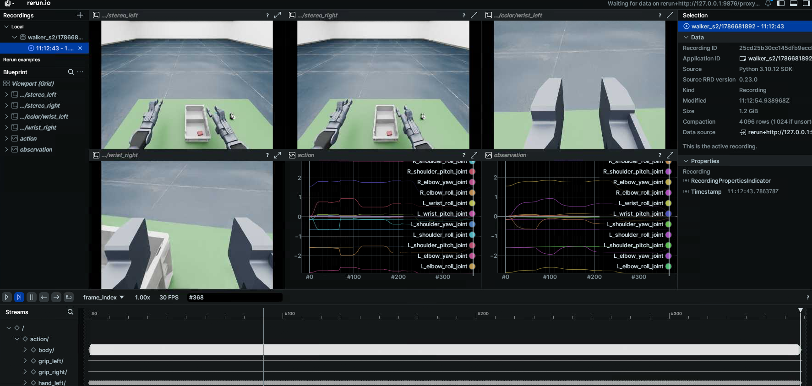

# 数据可视化与回放（Playback）

读取 `ubt_sim/dataset/{walker_s2,tienkung_pro}/<时间戳>/trajectory.hdf5`，支持两种模式：

| 模式 | 作用 | 依赖 |
| --- | --- | --- |
| **预览**（`--mode preview`） | Rerun 查看采集的相机画面 + 关节/手/夹爪曲线，时间轴 scrub/逐帧步进/循环为内置功能 | `rerun-sdk`（控制 Python） |
| **控制**（`--mode control`） | 把录制动作按原始频率直发到仿真或真机执行 | ROS2（rclpy + 机器人消息包） |

脚本位于 `ubt_sim/teleoperation/tools/`：

- `playback_walker_s2.py` - Walker S2（17 身体关节 + 7+7 V4 手 + 2 夹爪 + 4 相机）
- `playback_tienkung_pro.py` - 天工 Pro（7+7 臂 + 6+6 手 + 1 相机含深度）

架构：共用核心 `common.py`（HDF5 加载、节奏、CLI、Rerun 预览）+ 机器人适配层 `robots/`（schema + ROS2 发布器 + 首帧对齐）。

## 环境准备（容器内）

```bash
# rerun-sdk 已加入 Dockerfile 控制环境；旧容器免重建安装：
# （锁 0.23.0：0.24+ 要求 numpy>=2，与本容器 numpy<2 约束冲突）
docker exec -it ubt-sim /usr/bin/python3 -m pip install "numpy<2" "rerun-sdk==0.23.0" -i https://pypi.tuna.tsinghua.edu.cn/simple

# 控制模式额外需要（walker 需要 SDK 消息包，天工仅需 ROS2）：
source /opt/ros/humble/setup.bash
source /opt/ubt_sim/walker_sdk_ros2_msgs/install/setup.bash   # 仅 walker

# 统一用系统 Python：
/usr/bin/python3
```

## 预览模式

> ⚠️ **容器内请用 web viewer（浏览器）**：Rerun 原生 viewer 是 wgpu/egui 应用，容器里只有 NVIDIA vendor GL（无 Mesa、无 vulkan surface），wgpu 拿不到 adapter 会静默启动失败。本地弹窗模式仅在有正常 GL/Vulkan 窗口环境的主机上可用。

```bash
cd /ubt_sim

# ① 浏览器预览（推荐，容器内可用）
python3 teleoperation/tools/playback_walker_s2.py \
    --episode dataset/walker_s2/1786681892 --mode preview --web-port 9070

# ② 保存 .rrd（无 viewer），拷贝到宿主机后用 rerun viewer 打开
python3 teleoperation/tools/playback_walker_s2.py \
    --episode dataset/walker_s2/1786681892 --mode preview --save-rrd /tmp/walker_ep.rrd

# ③ 本地弹窗（仅 GPU 窗口环境可用：工作站/宿主机直接跑时）
python3 teleoperation/tools/playback_walker_s2.py \
    --episode dataset/walker_s2/1786681892 --mode preview
```

- 天工 Pro 同理，脚本换成 `playback_tienkung_pro.py`。
- 启动 web viewer 后脚本会打印**完整 URL**（形如 `http://localhost:9070/?url=rerun%2Bhttp%3A%2F%2F127.0.0.1%3A9876%2Fproxy`），照它打开即可。⚠️ 末尾 `?url=` 参数是数据源地址，**不能省**。远程浏览器需同时转发 web 端口与 9876 两个端口（`ssh -L 9070:localhost:9070 -L 9876:localhost:9876`）。
- `--episode` 缺省 = `dataset/<robot>/` 下最新（时间戳目录名最大）episode；`--max-frames N` 只记录前 N 帧。
- Rerun 面板：`cameras/color/<相机名>`（图像）、`cameras/depth/...`（天工深度）、`action/<组>/<通道名>`（指令曲线）、`observation|puppet/...`（观测曲线），均随 `frame_index` / `timestamp` 两条时间轴同步。



## 控制模式

回放**直发录制帧原始值**（最忠实）。仿真（bridge 转发）与真机话题完全一致，同一脚本通吃，仅 `ROS_DOMAIN_ID` 不同。

```bash
# 第一步永远先 dry-run（不初始化 ROS2、不发布，只打印每帧摘要）
python3 teleoperation/tools/playback_walker_s2.py \
    --episode dataset/walker_s2/1786681892 --mode control --dry-run --end 3

# 回放（仿真与真机同命令，靠 ROS_DOMAIN_ID 区分：真机 0 / 仿真 146，以实际为准）
# 仿真：先 start_sim.sh 起仿真+桥接，确认 echo $ROS_DOMAIN_ID 与桥接一致
python3 teleoperation/tools/playback_walker_s2.py \
    --episode dataset/walker_s2/1786681892 --mode control --align-first --end 200

# 真机：ROS_DOMAIN_ID=0 后直接同一条命令
ROS_DOMAIN_ID=0 python3 teleoperation/tools/playback_tienkung_pro.py \
    --episode dataset/tienkung_pro/1786638182 --mode control --align-first
```

常用参数（`--help` 查看全部）：

| 参数 | 默认 | 说明 |
| --- | --- | --- |
| `--start/--end` | `0`/末帧 | 帧索引或 `"5s"`（第 5 秒）；`--end` **不含**末帧 |
| `--rate` | 数据集 fps | 发布频率（walker 仿真桥接身体限 100Hz，>100 会被静默限速） |
| `--loop` | 关 | 循环播放直到 Ctrl-C |
| `--align-first` | 关 | 播放前平滑移动到首帧位姿（walker: quintic 插值 3s；天工: 关节空间 ramp ~2s） |
| `--dry-run` | 关 | 只打印不发布 |
| `--interp` | 关 | 【walker】记录帧间线性插值到 `--rate`（更平滑，偏离原始记录） |
| `--spd/--cur` | `0.2/5.0` | 【天工】电机默认速度/电流 |
| `--arm-clamp-lo/hi` | `±2.5` | 【天工】臂限位（teleoperation 侧无臂限位常量，保守假设） |

### 安全须知

- 限位裁剪默认开启（walker 用硬件限位表，天工手 [0,1]/臂保守限位）；数据含 NaN/inf 直接拒绝。
- `--align-first` 在回放前先对齐首帧位姿，避免从任意当前位姿直接跳变。
- Ctrl-C 停止后机器人**保持最后指令**（仿真侧 HoldTargetManager 保持；真机需自行复位）。
- 回放前务必先 `--dry-run`，并确认 `ROS_DOMAIN_ID` 与目标一致、机器人处于安全位置。
