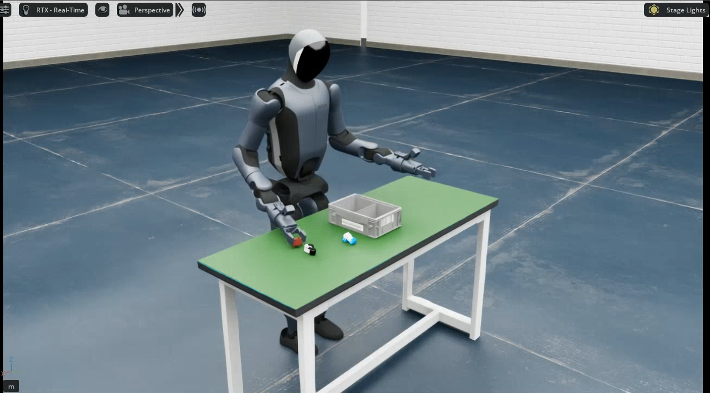

# 仿真平台

`ubt_sim` 是基于 [NVIDIA Isaac Sim](https://developer.nvidia.com/isaac-sim)（Isaac Lab 2.2.0）构建的机器人仿真平台，目前支持天工行者 与 Walker S2 EDU 探索者 两款机型仿真。平台通过 ROS2-ZMQ 桥接对外发布仿真状态与图像，话题与真机**完全一致**——遥操作与数据采集脚本无需修改即可在仿真、真机之间切换，实现 sim-to-real 无缝迁移。主要用途：

- **仿真数据采集**：批量生成 HDF5 训练数据，不占用真机
- **算法验证**：模仿学习等控制算法在真机部署前的低风险测试

## 平台架构

三进程架构，**Python 不可混用**：

```
Isaac Sim (Py3.11)  ──ZMQ──►  ROS2-ZMQ Bridge (Py3.10)  ──ROS2──►  遥操作/采集脚本
```

- **仿真** `/isaac-sim/python.sh`：按 `UBT_SIM_TASK` 加载任务场景（任务名同时决定机器人类型），相机图像直发 ZMQ。
- **桥接** `/usr/bin/python3`：ZMQ↔ROS2 双向转发，`start_sim.sh` 自动拉起。
- **采集** `/usr/bin/python3`：发布指令、录制 15Hz HDF5。

## 界面预览

| 天工行者 | Walker S2 EDU 探索者 |
|----------|-----------|
|  |  |

## 文档导航

| 子模块 | 说明 |
|--------|------|
| [容器构建与使用](docker.md) | 各机型一致的容器构建、启动与 `run.sh` 命令 |
| [天工行者](../tienkung/sim-setup.md) | 客厅抓苹果场景、启动仿真、批量采集、相机测试、数据预览 |
| [Walker S2 EDU 探索者](../walker-s2/sim-setup.md) | 零件分拣场景、批量采集、机器人控制器工具 |

采集完成后进入 [模仿学习平台](../il/index.md)；数据预览与回放的完整参数见 [数据可视化与回放](../common/playback.md)。
