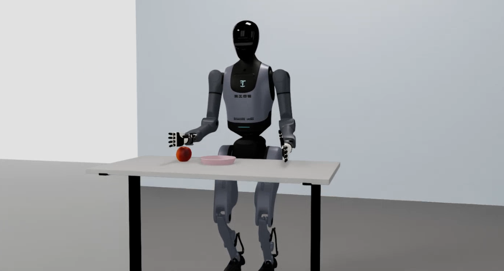

# 天工行者（无疆）

天工行者 人形机器人，50 DOF，双手为 12×2 五指灵巧手。

## 机型规格

| 项目 | 规格 |
|------|------|
| DOF | 50 |
| 末端执行器 | 12×2 五指灵巧手 |
| 常用训练维度 | 26D（双臂 7+7 + 双手 6+6）/ 13D（右臂 7 + 右手 6，单臂） |
| LeRobot 插件 | `ubt_IL/tienkung/lerobot_robot_tienkung` |
| USD 模型 | `ubt_sim/assets/robots/tienkung_pro/tienkung_pro_v2.usd` |
| state/action 顺序（26D） | `[左臂7 | 右臂7 | 左手6 | 右手6]` |

> 单臂数据（如仅右手采集）中锁死的维度是常量，会引发训练归一化炸裂（QUANTILES NaN/Inf）。此类数据请用 13D 配置转换，剔除死维度。

## 仿真任务场景

| 任务 ID | 场景 | 说明 |
|---------|------|------|
| `UBTSim-TienkungPro-Parlor-v0` | 客厅 | 抓苹果遥操作 + 数据采集（默认任务） |

## 文档线

平台入口（通用架构与命令见平台概览页）：

- [仿真平台 · 天工行者](sim-setup.md) - 容器构建、启动仿真、批量采集 HDF5、相机测试、数据预览（[平台概览](../sim/index.md)）
- [模仿学习平台 · 天工行者](convert-train.md) - HDF5 -> LeRobot 转换、ACT 训练、离线评估（[平台概览](../il/index.md)）

按使用顺序：

1. [仿真全流程](sim-workflow.md) - 端到端：仿真采集 -> 转换 -> 训练 -> 评估 -> 回注仿真部署
2. [真机全流程](real-workflow.md) - 端到端：真机采集 -> 转换 -> 训练 -> 评估 -> 真机部署
3. [ARM 板端部署](arm-deploy.md) - Jetson AGX Orin 板内无 Docker 部署（双 Python 栈）

## 部署效果

**仿真部署**

<video src="../assets/tienkung仿真部署效果.mp4" controls muted width="100%"></video>

**真机部署**

<video src="../assets/tienkung真机部署效果.mp4" controls muted width="100%"></video>
