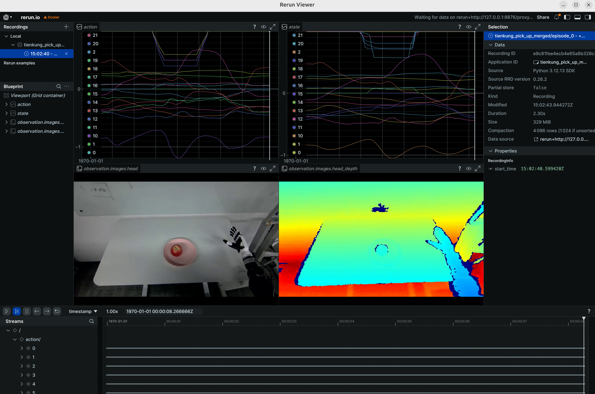
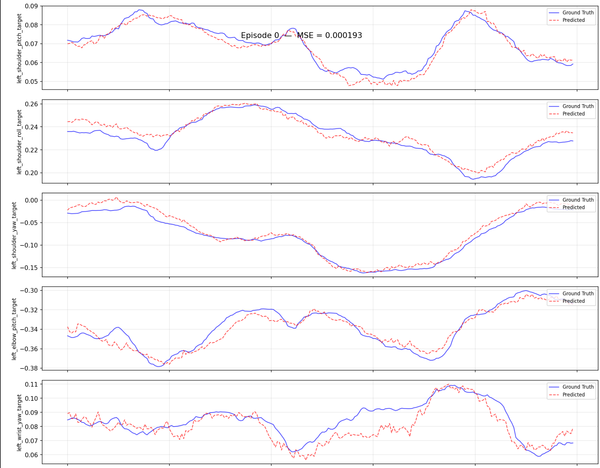

# 天工 Pro：真机工作流（端到端）

> 适用：**真机采集 -> 转换 -> 训练 -> 评估 -> 真机部署** 完整闭环。转换/训练/评估在 `ubt_IL` 容器内执行，真机部署提供「远程容器版」与「Jetson 板内版」两种方案。

## 0. 工作流总览

```
真机数据采集(hdf5) -> 数据转换(LeRobot 数据集) -> 模型训练(ACT) -> 策略评估(离线 MSE) -> 模型部署(rollout.sh -> 机器人本体)
```

## 1. 前置：真机数据采集

目前使用 [Thinker Studio](https://thinkercosmos.ubtrobot.com/#/studio) 遥操数采平台进行数据采集，可直接导出 LeRobot v3.0 数据集（跳过转换）。也可把采集到的真机 HDF5 放到 `/ubt_IL/dataset/hdf5/`（或任意 `SRC_ROOT` 指定目录）后进入转换。

## 2. 启动容器（ubt_IL）

```bash
cd ubt_IL/docker
bash run.sh build      # 首次
bash run.sh start
bash run.sh bash       # 进入容器，后续转换/训练/评估命令均在容器内执行
```

## 3. 数据转换（HDF5 -> LeRobot）

```bash
# 真机数据转换（26D 双臂，仅 RGB）
SRC_ROOT=/ubt_IL/dataset/hdf5 \
TGT_PATH=/ubt_IL/dataset \
CONFIG=/ubt_IL/scripts/convert/tienkung_pro/configs/tienkung_pro_26d_1RGB_real.json \
REPO_ID=real_pick_place \
FPS=15 \
ROBOT_TYPE=tienkung \
TASK_NAME=real_pick_place \
bash /ubt_IL/scripts/convert/tienkung_pro/convert.sh

# 静止帧裁剪版本（去除抓取等待期的静止段，避免推理陷入局部静止）
TRIM_STATIONARY=1 \
SRC_ROOT=/ubt_IL/dataset/hdf5 \
TGT_PATH=/ubt_IL/dataset \
CONFIG=/ubt_IL/scripts/convert/tienkung_pro/configs/tienkung_pro_26d_1RGB_real.json \
REPO_ID=real_pick_place \
FPS=15 \
ROBOT_TYPE=tienkung \
TASK_NAME=real_pick_place \
bash /ubt_IL/scripts/convert/tienkung_pro/convert.sh
```

> 多批真机数据可转换到同一 `REPO_ID` 再合并（如 `tienkung_pick_up_merged` 即为合并场景）；13D 真机模型用 `tienkung_pro_13d_1RGB.json`。

转换完成后可视化检查：

```bash
HF_HUB_OFFLINE=1 lerobot-dataset-viz \
  --repo-id tienkung_pick_up_merged \
  --episode-index 0 \
  --root /ubt_IL/dataset/tienkung_pick_up_merged
```



> `--root` 须指向包含 `meta/` 的数据集目录本身。完整环境变量见 [数据转换与训练](convert-train.md#2-数据转换hdf5---lerobot)。

## 4. 模型训练

> ⚠️ `train.sh` 默认 `CONFIG_PATH` 指向**仿真配置**，真机训练必须显式指定真机配置。

```bash
CONFIG_PATH=/ubt_IL/scripts/train/tienkung_pro/configs/train_config_tienkung_pro_real_pick_place.json \
DATASET_REPO_ID=tienkung_pick_up_merged \
DATASET_ROOT=/ubt_IL/dataset/tienkung_pick_up_merged \
OUTPUT_DIR=/ubt_IL/model/tienkung_pick_up_merged \
bash /ubt_IL/scripts/train/tienkung_pro/train.sh

# 断点续训（CONFIG_PATH 指向 checkpoint 内 train_config.json）
CONFIG_PATH=/ubt_IL/model/tienkung_pick_up_merged/checkpoints/last/pretrained_model/train_config.json \
RESUME=true \
bash /ubt_IL/scripts/train/tienkung_pro/train.sh
```

## 5. 策略评估（离线 MSE）

```bash
/lerobot/.venv/bin/python /ubt_IL/scripts/eval/eval_policy.py \
  --policy-path /ubt_IL/model/tienkung_pick_up_act/checkpoints/last/pretrained_model \
  --dataset-path /ubt_IL/dataset/tienkung_pick_up_merged \
  --episodes 5 \
  --inference-freq 1 \
  --plot \
  --plot-dir /ubt_IL/scripts/eval/output/eval_tienkung_real \
  --output /ubt_IL/scripts/eval/output/eval_tienkung_real/results.json \
  --device cuda
```



## 6. 模型部署（真机）

### 前置条件

- 真机已上电并进入**半身运控模式**。
- 操作流程：机器人开机后按 A 质检 -> 按 D 回零 -> 机器人落地扶稳长按 A 进入站立模式 -> F 下拨长按 A 进入半身运控模式 -> E 上拨后开始下一步。遥控器详细操作参考 [天工行者操作文档](https://docs.ubtrobot.com/walker-tienkung/docs/user-guide/8)。
- 建议先在 [仿真工作流 §6](sim-workflow.md#6-模型部署仿真) 验证模型效果，避免 DOF 配置不匹配造成意料之外的动作。

### 方案 A：远程设备部署容器（x86 工作站 -> 真机）

**准备工作**：

- 确认设备和机器人同网段（如 `192.168.41.x`），`ROS_DOMAIN_ID=0`，部署机能订阅正常机器人 ROS 话题。
- 机器人端启动 ImageServer 提供 JPEG 流。

```bash
# 0. 容器网络配置：编辑 ubt_IL/docker/fastdds_no_shm.xml 的 interfaceWhiteList，
#    新增/修改 <address> 为本机 IP（如 192.168.41.99），保证与机器人在同一网段，随后重启容器
#    注意：原第二条 192.168.11.3 是 Walker S2 直连网段，如需保留请另加一行，勿直接替换
cd ubt_IL/docker
bash run.sh restart

# 1. 机器人端启动相机服务（仅真机部署需要）
scp ubt_IL/scripts/deploy/tienkung_pro/image_server.py nvidia@192.168.41.2:~
ssh nvidia@192.168.41.2 'python3 image_server.py'
python3 /ubt_IL/scripts/deploy/tienkung_pro/image_client.py --server 192.168.41.2   # 测试相机通路

# 若机器人端未安装 pyorbbec 相机驱动请安装相关依赖包（仅一次）
python3 -m pip install evdev
python3 -m pip install pyorbbecsdk2
```

**部署推理**（脚本：`/ubt_IL/scripts/deploy/tienkung_pro/rollout.sh`）：

```bash
# 1. 初始化动作（抬起手臂到桌面上）--推理容器内，使用/usr/bin/python3可使用ROS环境
/usr/bin/python3 /ubt_IL/scripts/deploy/tienkung_pro/reset.py

# 2. 真机部署：ZMQ_HOST 指向真机地址（rollout.sh 默认 127.0.0.1 仿真地址，必须显式覆盖）
POLICY_PATH=/ubt_IL/model/tienkung_pick_up_act/checkpoints/last/pretrained_model \
JOINT_CONFIG=tienkung_26 \
ZMQ_HOST=192.168.41.2 \
TASK="pick and place" \
FPS=15 \
DURATION=60 \
bash /ubt_IL/scripts/deploy/tienkung_pro/rollout.sh

# （可选）真机回放数据集动作
/usr/bin/python3 /ubt_IL/scripts/deploy/tienkung_pro/replay.py \
  --dataset /ubt_IL/dataset/tienkung_pick_up_merged --episode 0 --rate 30
```

**环境变量**：

| 变量 | 真机建议值 | 说明 |
|------|-----------|------|
| `POLICY_PATH` | `/ubt_IL/model/tienkung_pick_up_act/checkpoints/last/pretrained_model` | 训练的 ACT checkpoint |
| `JOINT_CONFIG` | `tienkung_26` | 26D；13D 模型用 `tienkung_13`，**须与训练 DOF 一致** |
| `STRATEGY` | `base` | 自主执行 |
| `ZMQ_HOST` | `192.168.41.2` | **真机地址**（脚本默认 `127.0.0.1` 为仿真地址，真机必须显式覆盖） |
| `FPS` | `15` | 控制频率（与训练 fps 对齐） |
| `DURATION` | `60` | 运行时长（秒） |
| `TASK` | `pick and place` | 任务描述 |

**部署效果演示**（真机部署运行效果）：

<video src="../assets/tienkung真机部署效果.mp4" controls muted width="100%"></video>

### 方案 B：机器人本体 Jetson AGX Orin 板内部署

自包含部署包 `ubt_IL/scripts/deploy/tienkung_pro/arm_64/`，不依赖 Docker，详见 [ARM 板端部署](arm-deploy.md)。

## 7. 常见问题

| 现象 | 可能原因 / 处理 |
|------|-----------------|
| 转换报缺深度流 | 真机 HDF5 无深度是正常的：必须用 `tienkung_pro_26d_1RGB_real.json`（仅 RGB）；误用 sim 配置会报缺 `camera_head_depth` |
| 转换后动作维度异常 | 真机 `master` 夹爪经 invert/repeat/pad 变换到 6 维；确认用 real 配置而非 sim 配置 |
| 训练时归一化炸裂（QUANTILES NaN/Inf） | 数据含恒定维度：双臂 26D 中左臂锁死（commanded-but-frozen）等维度 std=0 致归一化除零；用 13D 配置转换，剔除死维度 |
| 轨迹含长静止段（前缀/尾巴） | 静止帧使模型陷入局部静止，数据转换时加 `TRIM_STATIONARY=1` 裁剪 |
| 训练报 `FileExistsError` | `OUTPUT_DIR` 已存在且 `RESUME=false`；换新目录或删旧目录 |
| 真机部署无响应 | `ZMQ_HOST` 是否指向真机 `192.168.41.2`（脚本默认 127.0.0.1）；Bridge2 是否启动（`pgrep -f ros2_deploy_bridge`）；真机主控上电联网 |
| 真机部署动作异常 | `JOINT_CONFIG` 与训练 DOF 不一致（26D↔13D）；相机通路未验证（先 `image_client.py`） |
| 真机部署动作停止 | 是否陷入局部循环，优化数据集减少停顿 |
