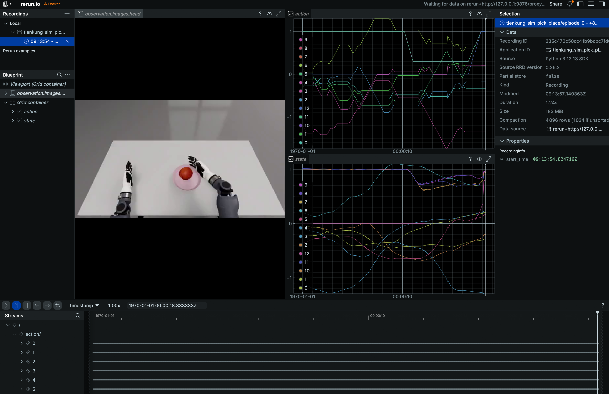
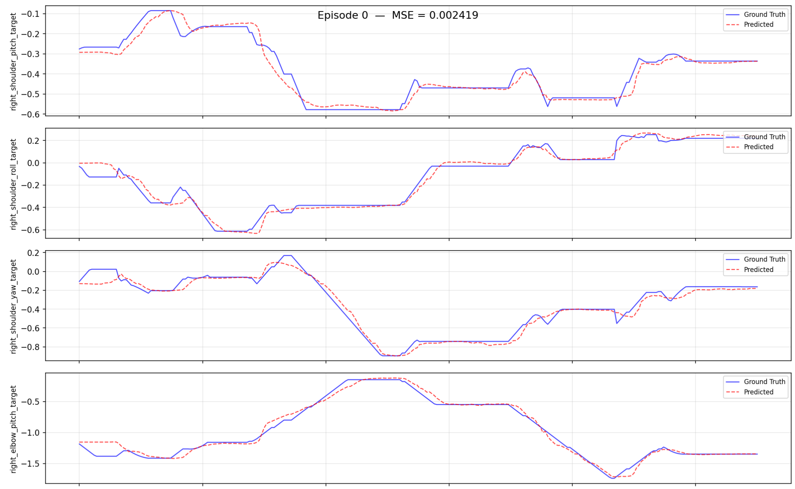

# 天工 Pro：仿真工作流（端到端）

> 适用：**Isaac Sim 仿真采集 -> 转换 -> 训练 -> 评估 -> 回注仿真部署** 完整闭环，可快速复现。全部转换/训练/评估/部署脚本在 `ubt_IL` 容器内执行。

## 0. 工作流总览

```
仿真数据采集(hdf5) -> 数据转换(LeRobot 数据集) -> 模型训练(ACT) -> 策略评估(离线 MSE) -> 模型部署(rollout.sh 回注仿真器)
```

## 1. 前置：仿真数据采集（ubt_sim）

仿真 HDF5 数据由 `ubt_sim` 项目采集，完整步骤见 [仿真平台（ubt_sim）](sim-setup.md)。要点：

```bash
# ① 在 ubt_sim 容器内启动仿真（自动拉起 ROS2-ZMQ 桥接）
bash /ubt_sim/scripts/start_sim.sh          # 可加 --headless 提速采集

# ② 数据采集（系统 Python 3.10）
/usr/bin/python3 /ubt_sim/teleoperation/control/tienkung_pro/reset.py                  # 复位
bash /ubt_sim/teleoperation/control/tienkung_pro/save_data.sh                          # 批量循环采集（默认 400 次）
```

- 每次成功抓放（苹果入盘，距离 < 0.12m）才落盘，失败丢弃。
- 产物：`/ubt_sim/dataset/tienkung_pro/<时间戳>/trajectory.hdf5`。

采集完成后，把 HDF5 数据放到容器能访问的位置（如 `/ubt_IL/dataset/tienkung_pro/`，即下文 `SRC_ROOT` 默认目录）。

## 2. 启动容器（ubt_IL）

```bash
cd ubt_IL/docker
bash run.sh build      # 首次
bash run.sh start
bash run.sh bash       # 进入容器，后续命令均在容器内执行
```

## 3. 数据转换（HDF5 -> LeRobot）

```bash
CONFIG=/ubt_IL/scripts/convert/tienkung_pro/configs/Tien_Kung_13_1RGB_sim.json \
SRC_ROOT=/ubt_IL/dataset/tienkung_pro \
TGT_PATH=/ubt_IL/dataset \
REPO_ID=tienkung_sim_pick_place \
TASK_NAME=tienkung_sim_pick_place \
bash /ubt_IL/scripts/convert/tienkung_pro/convert.sh

# 静止帧裁剪版本（去除抓取等待期的静止段，避免推理陷入局部静止）
TRIM_STATIONARY=1 \
CONFIG=/ubt_IL/scripts/convert/tienkung_pro/configs/Tien_Kung_13_1RGB_sim.json \
SRC_ROOT=/ubt_IL/dataset/tienkung_pro \
TGT_PATH=/ubt_IL/dataset \
REPO_ID=tienkung_sim_pick_place \
TASK_NAME=tienkung_sim_pick_place \
bash /ubt_IL/scripts/convert/tienkung_pro/convert.sh
```

转换配置选择、完整环境变量与可视化检查见 [模仿学习平台（`ubt_IL`） §2-3](convert-train.md#2-数据转换hdf5---lerobot)。



## 4. 模型训练

```bash
# 使用默认配置训练
bash /ubt_IL/scripts/train/tienkung_pro/train.sh

# 覆盖常用参数
CONFIG_PATH=/ubt_IL/scripts/train/tienkung_pro/configs/train_config_tienkung_pro_sim_pick_place.json \
OUTPUT_DIR=/ubt_IL/model/tienkung_sim_pick_place_act \
STEPS=80000 SAVE_FREQ=20000 BATCH_SIZE=8 \
bash /ubt_IL/scripts/train/tienkung_pro/train.sh
```

完整参数说明见 [模仿学习平台（`ubt_IL`） §4](convert-train.md#4-模型训练)。

## 5. 策略评估（离线 MSE）

```bash
/lerobot/.venv/bin/python /ubt_IL/scripts/eval/eval_policy.py \
  --policy-path /ubt_IL/model/tienkung_sim_pick_place_act/checkpoints/last/pretrained_model \
  --dataset-path /ubt_IL/dataset/tienkung_sim_pick_place \
  --episodes 5 \
  --inference-freq 1 \
  --plot \
  --plot-dir /ubt_IL/scripts/eval/output/eval_tienkung_sim \
  --output /ubt_IL/scripts/eval/output/eval_tienkung_sim/results.json \
  --device cuda
```



参数说明见 [模仿学习平台（`ubt_IL`） §5](convert-train.md#5-策略评估离线-mse)。

## 6. 模型部署（仿真）

脚本：`/ubt_IL/scripts/deploy/tienkung_pro/rollout.sh`。仿真部署使用 ubt_sim 代替机器人真机进行测试——该仿真环境与真机 ROS 话题部署和通信方法一致，可用于真机部署前的验证工作，避免真机动作错误造成损坏等严重后果。仿真模块容器独立运行，与模型训练推理容器在同一主机通过本地回环 `127.0.0.1` 网段进行 ROS 通信。

**部署步骤**（仿真容器与推理容器分别操作）：

```bash
# 1. 启动仿真（已启动可跳过）--宿主机进仿真容器
cd ubt_sim/docker
bash run.sh start
bash run.sh bash
bash /ubt_sim/scripts/start_sim.sh      # 容器内：启动仿真，自动拉起 ROS2-ZMQ 桥接

# 2. 启动推理容器--宿主机
cd ubt_IL/docker
bash run.sh start
bash run.sh bash

# 3. 初始化动作（抬起手臂到桌面上）--推理容器内，使用/usr/bin/python3可使用ROS环境
/usr/bin/python3 /ubt_IL/scripts/deploy/tienkung_pro/reset.py

# 部署 13-DOF 模型（右臂7+右手6，与数据转换时配置一致）
POLICY_PATH=/ubt_IL/model/tienkung_sim_pick_place_act/checkpoints/last/pretrained_model \
  JOINT_CONFIG=tienkung_13 bash /ubt_IL/scripts/deploy/tienkung_pro/rollout.sh

# （可选）验证相机通路
python /ubt_IL/scripts/deploy/tienkung_pro/image_client.py --count 60

# （可选）仿真中回放数据集动作
/usr/bin/python3 /ubt_IL/scripts/deploy/tienkung_pro/replay.py \
  --dataset /ubt_IL/dataset/tienkung_sim_pick_place --episode 0 --rate 30
```

**环境变量**：

| 变量 | 仿真建议值 | 说明 |
|------|-----------|------|
| `POLICY_PATH` | `/ubt_IL/model/tienkung_sim_pick_place_act/checkpoints/last/pretrained_model` | 训练的 ACT checkpoint |
| `JOINT_CONFIG` | `tienkung_13` | 13D 模型；26D 模型用 `tienkung_26`，**须与训练 DOF 一致** |
| `STRATEGY` | `base` | 自主执行 |
| `ZMQ_HOST` | `127.0.0.1` | **仿真器地址**（真机为 `192.168.41.2`） |
| `FPS` | `15` | 控制频率（与训练 fps 对齐） |
| `DURATION` | `60` | 运行时长（秒） |
| `TASK` | `sim pick and place` | 任务描述 |

部署后观察仿真器中机器人按策略执行抓放；可用 `reset.py` 复位、`replay.py` 回放验证。

部署效果演示：

<video controls muted loop width="100%" src="../../assets/tienkung仿真部署效果.mp4"></video>

## 7. 常见问题

| 阶段 | 现象 | 可能原因 / 处理 |
|------|------|-----------------|
| 采集 | 视频大量重复帧、帧率不足 | 减少渲染窗口摄像头数量，使用无头模式运行采集，或使用高性能多 GPU 设备 |
| 采集 | 训练时归一化炸裂（QUANTILES NaN/Inf） | 数据含恒定维度：双臂 26D 中左臂锁死（commanded-but-frozen）、左夹爪恒 1.0，std=0 致归一化除零；用 13D 单臂配置转换，剔除死维度 |
| 采集 | 轨迹含长静止段（前缀/尾巴） | 静止帧使模型陷入局部静止，数据转换时加 `TRIM_STATIONARY=1` 裁剪 |
| 转换 | 报 `FileNotFoundError`（HDF5） | `SRC_ROOT` 路径错误；确认 HDF5 已从 ubt_sim 同步到容器可访问目录 |
| 训练 | 偶发不收敛 | 仿真数据集量不足；适当增加 `save_data.sh` 采集次数；确认 `image_transforms` 已开启以增强泛化 |
| 部署 | 无相机图像 | 仿真器未运行/相机流未起；用 `image_client.py` 单独验证 5558 通路 |
| 部署 | 动作卡顿 | 尝试异步推理，进行 RTC 轨迹融合 |
| 部署 | 动作停止 | 是否陷入局部循环，优化数据集减少停顿 |
| 部署 | 仿真器无响应 | 检查桥接是否运行，网络使用本地回环，是否连通 |
