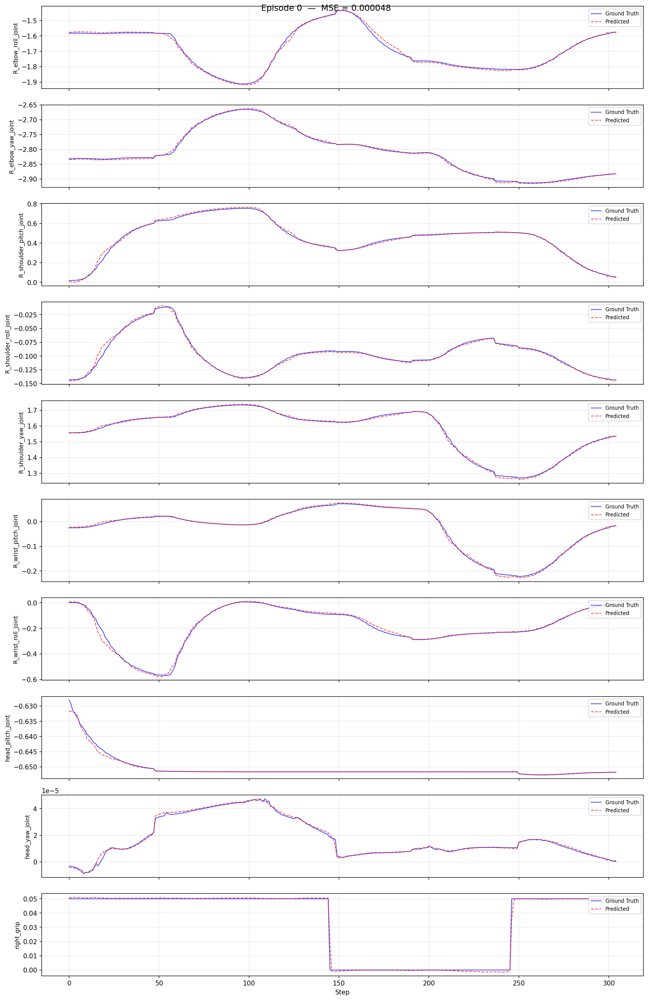

# Walker S2：模仿学习平台（`ubt_IL`）

> 对应代码：`ubt_IL/scripts/{convert,train,eval}`（容器内执行）
> 前置：HDF5 数据已就绪（[仿真采集](sim-setup.md)或真机采集）

## 1. 构建环境（ubt_IL 容器）

```bash
cd ubt_IL/docker
bash run.sh build      # 构建容器镜像（首次；自动按平台选择 Dockerfile：x86 -> humble，arm64 -> humble-arm64）
bash run.sh start      # 启动容器 lerobot-tienkung
bash run.sh bash       # 进入容器，后续命令均在容器内执行
```

- 宿主机项目挂载于容器 `/ubt_IL`。
- 容器内双 Python 环境：ROS 相关使用 `/usr/bin/python3`，LeRobot 相关脚本使用 `/lerobot/.venv/bin/python`（默认）。
- 真机部署时容器在**机器人 Vision 板（Jetson）**上构建，构建脚本自动识别主板类型构建 arm 容器。

## 2. 数据转换（HDF5 -> LeRobot）

脚本：`/ubt_IL/scripts/convert/walker_s2/convert.sh`（核心转换器 `ubt_IL/scripts/convert/common/convert_to_lerobot.py`）。

!!! warning "convert.sh 默认配置仓库未提供"
    `convert.sh` 默认 `CONFIG=configs/walker_s2_real_19d_1RGBD.json` **仓库未提供**，必须显式指定 `configs/` 下实际存在的配置：

| 配置文件 | 维度 | 场景 |
|----------|------|------|
| `walker_s2_sim_10d_2RGB.json` | 10D（右臂 7 + 头 2 + 右夹爪 1） | 仿真（**推荐**） |
| `walker_s2_sim_33d_4RGB.json` | 33D（含深度） | 仿真 |
| `walker_s2_real_10d_2RGB.json` | 10D | 真机（**推荐**，规避恒定维度归一化炸裂） |

```bash
# 仿真数据转换示例
CONFIG=/ubt_IL/scripts/convert/walker_s2/configs/walker_s2_sim_10d_2RGB.json \
SRC_ROOT=/ubt_IL/dataset/Walker-s2-pick-part-sim \
HDF5_REL_PATH=trajectory.hdf5 \
TGT_PATH=/ubt_IL/dataset \
REPO_ID=Walker_S2_sim_10_2RGB \
TASK_NAME=walker_s2_sim_pick_part \
bash /ubt_IL/scripts/convert/walker_s2/convert.sh

# 真机 10D 数据转换示例（右臂 + 头 + 右夹爪，2 RGB）
CONFIG=/ubt_IL/scripts/convert/walker_s2/configs/walker_s2_real_10d_2RGB.json \
SRC_ROOT=/ubt_IL/dataset/walker-s2-pick-part-real-hdf5 \
TGT_PATH=/ubt_IL/dataset \
REPO_ID=Walker_S2_pick_part_real_10_2RGB \
TASK_NAME=walker_s2_pick_part \
bash /ubt_IL/scripts/convert/walker_s2/convert.sh
```

**常用环境变量**（完整列表 `bash convert.sh -h`，通用说明见 [数据转换详解](../common/data-conversion.md)）：

| 变量 | 默认值 | 说明 |
|------|--------|------|
| `SRC_ROOT` | `/ubt_IL/dataset/walker-s2-real-data` | HDF5 源目录（仿真数据请改为 sim 数据目录） |
| `TGT_PATH` | `/ubt_IL/dataset` | LeRobot 数据集输出根目录 |
| `CONFIG` | （须显式指定） | 转换配置 JSON |
| `REPO_ID` | - | 输出数据集 repo_id（训练时保持一致） |
| `FPS` | `13`（sim）/ `15`（real） | 数据集帧率（`auto` 取源 HDF5 频率） |
| `ROBOT_TYPE` | `walker_s2` | 机器人类型（写入 meta） |
| `TASK_NAME` | - | 任务名（写入 meta，训练时作为语言条件） |
| `HDF5_REL_PATH` | `hdf5/metadata_aligned.hdf5` | 源 HDF5 相对路径（仿真数据为 `trajectory.hdf5`） |
| `VCODEC` | `h264` | 视频编码（`h264`/`jpeg`/`png`） |
| `RESAMPLE_FPS` | 空 | 非空则重采样到目标帧率 |
| `TRIM_STATIONARY` | 空 | `1` 开启静止帧裁剪（见下） |

!!! tip "静止帧裁剪"
    数据集静止帧会使模型推理陷入局部静止，可在转换命令前加 `TRIM_STATIONARY=1 \` 裁剪（判定阈值/窗口/cap 等参数见 [数据转换详解](../common/data-conversion.md#静止帧裁剪)）。

> 19D 真机数据：仓库仅提供 10D 真机转换配置；19D 需参考 `walker_s2_gripper_19d.json` 关节顺序自行编写配置。

## 3. 数据可视化

转换完成后用 `lerobot-dataset-viz` 检查数据集质量：

```bash
HF_HUB_OFFLINE=1 lerobot-dataset-viz \
  --repo-id Walker_S2_sim_10_2RGB \
  --episode-index 0 \
  --root /ubt_IL/dataset/Walker_S2_sim_10_2RGB
```


> 重点检查：图像分辨率、视频帧率、state/action 维度与顺序、grip 量程、是否存在空 episode。仿真 RGB 为 [3,240,320]（10D）或 [3,480,640]（33D），真机为 [256,320] 等；模型输入需与训练数据一致，勿混用。

## 4. 模型训练（ACT）

训练脚本：`/ubt_IL/scripts/train/walker_s2/train.sh`；训练配置在 `/ubt_IL/scripts/train/walker_s2/configs/` 下。

> ⚠️ `train.sh` 默认 `CONFIG` 指向**仿真配置**（ACT 10D 2RGB），真机训练必须显式指定真机配置（如 `train_config_pick_part_real_10d_2RGB.json`）。

```bash
# 使用默认配置训练（仿真 ACT）
bash /ubt_IL/scripts/train/walker_s2/train.sh

# 显式指定配置 + 覆盖常用参数
CONFIG=/ubt_IL/scripts/train/walker_s2/configs/train_config_walker_s2_sim_act_10_2RGB.json \
OUTPUT_DIR=/ubt_IL/model/Walker_S2_sim_10_2RGB_act \
STEPS=50000 SAVE_FREQ=5000 BATCH_SIZE=8 \
bash /ubt_IL/scripts/train/walker_s2/train.sh

# 真机训练（显式指定 real 配置 + 对应数据集）
CONFIG=/ubt_IL/scripts/train/walker_s2/configs/train_config_pick_part_real_10d_2RGB.json \
DATASET_REPO_ID=Wlaker_Pick_part_real_10d_2RGB \
OUTPUT_DIR=/ubt_IL/model/Wlaker_Pick_part_real_10d_2RGB_act \
STEPS=50000 SAVE_FREQ=5000 BATCH_SIZE=8 \
bash /ubt_IL/scripts/train/walker_s2/train.sh

# 断点续训（CONFIG 指向 checkpoint 内 train_config.json）
CONFIG=/ubt_IL/model/Walker_S2_sim_10_2RGB_act/checkpoints/last/pretrained_model/train_config.json \
RESUME=true \
bash /ubt_IL/scripts/train/walker_s2/train.sh
```

**直接调用 `lerobot-train`**（需在 `/ubt_IL/lerobot` 目录下执行）：

```bash
# Smoke Test（训练前快速验证，2 步不落盘）
cd /ubt_IL/lerobot
HF_HUB_OFFLINE=1 /lerobot/.venv/bin/lerobot-train \
  --config_path=/ubt_IL/scripts/train/walker_s2/configs/train_config_walker_s2_sim_act_10_2RGB.json \
  --steps=2 --save_checkpoint=false \
  --output_dir=/ubt_IL/model/Walker_S2_sim_act_smoke

# 继续训练 + 调参
HF_HUB_OFFLINE=1 /lerobot/.venv/bin/lerobot-train \
  --config_path=/ubt_IL/model/Walker_S2_sim_act/checkpoints/last/pretrained_model/train_config.json \
  --resume=true \
  --steps=150000 \
  --dataset.image_transforms.enable=true      # 开启图像增强

HF_HUB_OFFLINE=1 /lerobot/.venv/bin/lerobot-train \
  --config_path=/ubt_IL/model/Walker_S2_sim_act/checkpoints/last/pretrained_model/train_config.json \
  --resume=true \
  --steps=100000 \
  --optimizer.lr=5e-06                        # 降低学习率微调
```

**常用覆盖参数**（仅当环境变量**显式设置**时覆盖 config 中的值；`HF_HUB_OFFLINE=1` 默认开启）：

| 变量 | 默认值（config） | 说明 |
|------|--------|------|
| `CONFIG` | `configs/train_config_walker_s2_sim_act_10_2RGB.json` | 训练配置 JSON |
| `DATASET_REPO_ID` / `DATASET_ROOT` | `Walker_S2_sim_10_2RGB` / `/ubt_IL/dataset` | 数据集 repo_id / 根目录 |
| `OUTPUT_DIR` | `/ubt_IL/model/Walker_S2_sim_10_2RGB_act` | 模型输出目录 |
| `STEPS` | `50000` | 总训练步数 |
| `SAVE_FREQ` | `5000` | checkpoint 保存频率 |
| `BATCH_SIZE` | `8` | 批大小 |
| `SEED` | `1000` | 随机种子 |
| `DEVICE` | `cuda` | 训练设备 |
| `RESUME` | `false` | `true` 则从 checkpoint 恢复训练 |
| `WANDB_ENABLE` | `false` | wandb 日志开关 |

## 5. 模型训练（Pi0.5 VLA）

Pi0.5 是 Physical Intelligence 的 ~4B 参数视觉-语言-动作（VLA）模型，基于 PaliGemma-2B 视觉语言骨干 + Gemma-300M 动作专家，使用 flow matching 生成动作。

> **硬件要求**：需要 ≥24GB 显存的 GPU（如 RTX 4090）；bf16 精度下约需 16-20GB 显存（开 gradient checkpointing）。
> **预训练模型**：Pi0.5 必须从 `lerobot/pi05_base` 预训练权重初始化，无法从头训练，首次使用前需下载。

```bash
cd /ubt_IL/lerobot

# 首次训练
HF_HUB_OFFLINE=1 /lerobot/.venv/bin/lerobot-train \
  --config_path=/ubt_IL/scripts/train/walker_s2/configs/train_config_walker_s2_sim_pi05.json

# 继续训练 + 调参
HF_HUB_OFFLINE=1 /lerobot/.venv/bin/lerobot-train \
  --config_path=/ubt_IL/model/Walker_S2_sim_pi05/checkpoints/last/pretrained_model/train_config.json \
  --resume=true --steps=10000 \
  --policy.freeze_vision_encoder=false       # 解冻 vision encoder

HF_HUB_OFFLINE=1 /lerobot/.venv/bin/lerobot-train \
  --config_path=/ubt_IL/model/Walker_S2_sim_pi05/checkpoints/last/pretrained_model/train_config.json \
  --resume=true --steps=5000 \
  --policy.train_expert_only=true            # 仅训练 action expert（冻结 VLM）
```

关键配置（vs ACT）：

| 配置项 | ACT | Pi0.5 |
|--------|-----|-------|
| 模型规模 | ~30M | ~4B |
| 架构 | ResNet18 + Transformer | PaliGemma-2B + Gemma-300M |
| 归一化 | MEAN_STD（全部） | QUANTILES（state/action）+ IDENTITY（visual） |
| 图像尺寸 | 原始（360×640 等） | resize 到 224×224 |
| 动作预测 | VAE + absolute | Flow matching |
| 语言输入 | 无 | task 描述（需数据有 `task` 字段） |
| batch_size | 8 | 4 |
| 训练步数 | 50,000 | 5,000 |
| optimizer | AdamW (1e-5) | AdamW (2.5e-5, cosine decay + warmup) |

## 6. 策略评估（离线 MSE）

脚本（与天工共用）：`/ubt_IL/scripts/eval/eval_policy.py`，在 LeRobot 数据集上离线推理，逐帧对比预测 vs 真值 MSE 并生成对比图：

```bash
cd /ubt_IL/lerobot
/lerobot/.venv/bin/python /ubt_IL/scripts/eval/eval_policy.py \
  --policy-path /ubt_IL/model/Walker_S2_sim_10_2RGB_act/checkpoints/last/pretrained_model \
  --dataset-path /ubt_IL/dataset/Walker_S2_sim_10_2RGB \
  --episodes 10 \
  --inference-freq 1 \
  --plot \
  --plot-dir /ubt_IL/scripts/eval/output/eval_Walker_S2_sim \
  --output /ubt_IL/scripts/eval/output/eval_Walker_S2_sim/results.json \
  --device cuda
```



| 参数 | 说明 |
|------|------|
| `--policy-path` | pretrained_model 目录（含 `config.json` + `model.safetensors`） |
| `--dataset-path` | LeRobot 数据集根目录（含 `meta/info.json`） |
| `--episodes` | 评估 episode 数（默认全部） |
| `--inference-freq` | 每 N 步推理一次，中间复用预测 chunk（模拟真机部署；`1`=逐步推理） |
| `--plot` / `--plot-dir` | 逐 episode 预测-vs-真值图及输出目录 |
| `--output` | 结果 JSON 保存路径 |
| `--device` | `cuda` 或 `cpu`（默认 `cuda`，不可用自动回退） |

## 常见问题

| 现象 | 处理 |
|------|------|
| 转换报"配置不存在" | `convert.sh` 默认 `CONFIG` 仓库未提供；显式指定 `configs/` 下实际存在的配置 |
| 真机 19D 数据无法转换 | 仓库仅提供 10D 真机转换配置；19D 需参考 `walker_s2_gripper_19d.json` 关节顺序自行编写配置 |
| 数据集帧率与预期不符 | 采集 15Hz，转换默认 `FPS=13`（真机配置为 15）；保留原频率用 `FPS=auto`，或 `RESAMPLE_FPS` 重采样 |
| 训练时归一化炸裂（QUANTILES NaN/Inf） | 真机 19D 数据 9 维恒定所致；用 10D 配置（右臂+头+右夹爪）转换，剔除死维度 |
| 轨迹含长静止段，部署时动作停止 | 转换时加 `TRIM_STATIONARY=1` 裁剪静止帧 |
| 偶发不收敛 | 数据集量不足；增加采集次数；确认 `image_transforms` 已开启 |
