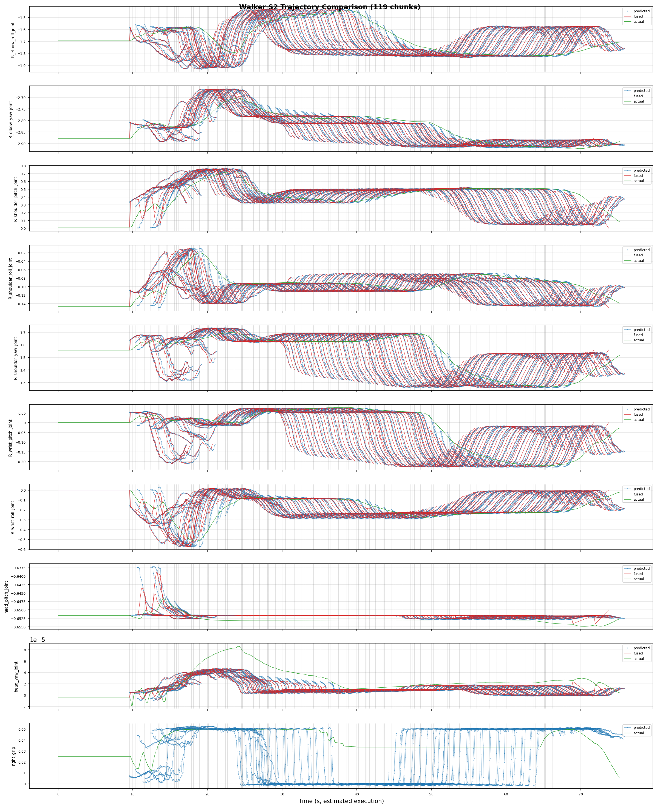

# Walker S2 EDU 探索者：真机部署（Rollout）

> 部署脚本：`ubt_IL/scripts/deploy/walker_s2/rollout.sh`，仿真部署与真机部署共用（差异见各工作流页）。本页给出完整参数、安全预检与在线评估说明。

## 前置条件

- 真机**上电站立**并进入**开发者模式**。
- 开机流程：机器人开机后打开伺服按 `D` 启动内部运控 -> 机器人落地扶稳按 `A` 进入站立模式。遥控器详细操作参考[《Walker S2 EDU 探索者 二次开发文档》](cc-api.md)。
- Walker 真机部署在机器人 **Vision 板**上运行，需将项目和模型拷贝到 Vision 板上并构建、启动容器；构建脚本会自动识别当前主板类型构建相应的 arm 容器。

## 部署形态速查

| 场景 | 命令要点 |
|------|----------|
| 19D 仿真模型 -> 19D PGC 夹爪真机 | `ROBOT_MODEL=walker_s2_19d` |
| 10D 仿真模型 -> 真机部署（act_async） | `ROBOT_MODEL=walker_s2_10d INFERENCE_TYPE=act_async` |
| 回注仿真验证 | `ZMQ_HOST=127.0.0.1`（仿真容器先起任务与桥接） |
| 长时间常驻部署 | 用 [推理服务器](inference-server.md)（免冷启动） |

## 部署步骤（真机）

```bash
# 0. 进入开发者模式——机器人主控 PC 的 ubt 容器
ssh -p 2222 ubt@192.168.11.2    # 输入密码：Ubtubt@9880
# 向 service 请求进入开发者模式，true 为进入，false 为退出
ros2 service call /sys/task/developer_mode std_srvs/srv/SetBool "{data: true}"
# true 为开发者模式，false 则为普通模式
ros2 topic echo /sys/state/walker_mode

# 1. 构建并启动推理容器——机器人 Vision 板
# 1.1 拷贝项目（代码 + 模型）到 Vision 板
scp 项目代码和模型 /home/walker/
# 1.2 登录 Vision 板并构建容器
ssh walker@192.168.11.3          # 密码 aa
cd 项目路径/ubt_IL/docker
bash run.sh build
# 1.3 启动容器
bash run.sh start
bash run.sh bash

# 2. 初始化动作（抬起手臂到桌面上，回零用 --home）
bash /ubt_IL/scripts/deploy/walker_s2/robot_ready.sh

# 3. 部署真机 10D 模型异步推理
ROBOT_MODEL=walker_s2_10d \
POLICY_PATH=/ubt_IL/model/walker_pick_part_real_10d_2RGB_act/checkpoints/080000/pretrained_model \
INFERENCE_TYPE=act_async INFERENCE_HZ=1 \
FPS=13 DURATION=60 \
bash /ubt_IL/scripts/deploy/walker_s2/rollout.sh

# 4.（可选）验证相机通路，可指定相机话题/机器人配置
/usr/bin/python3 scripts/deploy/walker_s2/preview_camera.py --robot walker_s2_10d
```

> **注意区分两台机器**：
> - **Jetson `192.168.11.3`**（SSH `walker`，密码 `aa`）：跑容器 `lerobot-tienkung`、做推理。
> - **机器人主控 PC `192.168.11.2`**（SSH `ubt`，端口 2222）：切开发者模式 / ROS2，**不跑推理容器**。

## 部署效果演示

<video src="../../assets/walker真机部署效果.mp4" controls muted width="100%"></video>

## 初始化/回零（robot_ready.sh）

| 命令 | 作用 |
|------|------|
| `robot_ready.sh` | 预备姿态（`--init`，分 3 步安全到位，默认 13s） |
| `robot_ready.sh --home` | 回零（分 3 步，默认 15s），推理结束后归位用 |
| `robot_ready.sh --legacy-init` / `--legacy-home` | 旧 4 段流程回退 |
| 其余参数 | 原样透传给 `robot_control.py`（如 `--init-duration 20`） |

## 安全预检

部署前自动做 **action 维度匹配预检**：policy `output_features.action.shape[0]` 必须与 robot config `action_order` 维度一致，不通过则**拒绝部署**。

- `ROBOT_MODEL` 必须与训练 DOF 一致（见下表）。
- 策略无 action names 时需 `ALLOW_DIM_ONLY_POLICY=1`（默认开）。

## 环境变量

| 变量 | 默认值 | 说明 |
|------|--------|------|
| `POLICY_PATH` | **必填，无默认值** | checkpoint 目录（含 `config.json`） |
| `ROBOT_MODEL` | `walker_s2_31d` | ROBOT_MODELS 注册表键（见下表） |
| `ROBOT_CONFIG` | `configs/<ROBOT_MODEL>.json` | 机器人配置文件完整路径（自定义时覆盖） |
| `ALLOW_DIM_ONLY_POLICY` | `1` | 策略无 action names 时允许仅按维度匹配 |
| `STRATEGY` | `base` | rollout 策略类型 |
| `FPS` | `13` | 控制频率 |
| `DURATION` | `30` | 运行时长（秒） |
| `TASK` | `walker s2 rollout` | 任务描述 |
| `PREVIEW_CAMERA` | `1` | 是否显示相机预览窗口 |
| `RECORD_ACTIONS` | `1` | 是否记录 rollout 动作（`RECORD_OUTPUT_DIR` 指定输出） |
| `INFERENCE_TYPE` | `sync` | 推理引擎类型（`sync` / `act_async`） |
| `INFERENCE_HZ` | `0.6` | act_async 重规划频率 |
| `EXECUTION_HORIZON` | `0` | chunk 截断步数（0=不截断） |
| `ZMQ_HOST` | `127.0.0.1` | 桥接地址（回注仿真为本地；跨机部署改为机器人侧 IP） |

> 导出参数：`BLEND_HORIZON=10`、`BODY_PUBLISH_HZ=300`、`BODY_V_MAX=2.0`（桥接动作块融合与发布限速）。

## 机器人配置（ROBOT_MODELS 注册表）

| 注册表键 | 维度 | 末端执行器 | 对应配置文件 |
|----------|------|-----------|--------------|
| `walker_s2_10d` | 10D（右臂 7 + 头 2 + 右夹爪 1） | PGC 右夹爪 | `walker_s2_gripper_19d.json`（10D 用其子集） |
| `walker_s2_19d` | 19D（17 body + 2 gripper） | PGC 1DOF 夹爪 | `walker_s2_gripper_19d.json` |
| `walker_s2_31d` | 31D（17 body + 14 hands） | V4 灵巧手 7DOF | `walker_s2_v4_hand_31d.json` |

## 在线评估（记录推理轨迹）

模型部署时，`RECORD_ACTIONS=1`（默认开）记录 rollout 动作，用于分析模型预测轨迹、机器人执行轨迹、ACT 融合轨迹。记录文件保存于 `ubt_IL/scripts/deploy/output`。



## 离线策略评估

部署前建议先跑离线 MSE 评估（`ubt_IL/scripts/eval/eval_policy.py`，与天工共用），见 [模仿学习平台 §6](convert-train.md#6-策略评估离线-mse)。

## 推理服务器（常驻预热）

长时间/多任务常驻部署用推理服务器，免每次冷启动（真机验证 2026-08-09：预热 ~6s 到 READY，`start`/`stop`/`home`/`shutdown` 全通过），支持 `start/stop/home/status/shutdown` 指令与 `load` 热切换模型、远程拉起，详见 [推理服务器](inference-server.md)。

> `start`/`home`/`shutdown` 会让机器人运动，请在机旁执行。

## 常见问题

| 现象 | 处理 |
|------|------|
| 部署时报维度不匹配 | 安全预检拒绝：确认 `ROBOT_MODEL` 与策略维度对应（10D->`walker_s2_10d`、19D->`walker_s2_19d`、31D->`walker_s2_31d`） |
| 部署时机器人不动 | 真机确认 Bridge2 已启动（5561/5562）、相机中继已启动（5563）、已进入开发者模式；仿真确认 `ZMQ_HOST=127.0.0.1` 且仿真任务已启动 |
| 推理服务器 `start` 报错 | `start/stop` 需 `INFERENCE_TYPE=act_async`；`sync` 引擎无 pause/resume 语义 |
| `launch --remote` 失败 | 确认 `--host` 是 **Jetson `192.168.11.3`**（SSH `walker`）而非主控 PC；SSH 用户需对 `sudo docker exec` 有权限 |
| 重复拉起推理服务器失败 | 单例 pid 文件 `/tmp/walker_inference_server.pid` 存在；`shutdown` 正常退出或手动清理后再拉 |
| 仿真相机与真机相机尺寸不同 | 仿真 RGB 为 [3,240,320]（10D）或 [3,480,640]（33D），真机为 [256,320] 等；模型输入需与训练数据一致，勿混用 |
