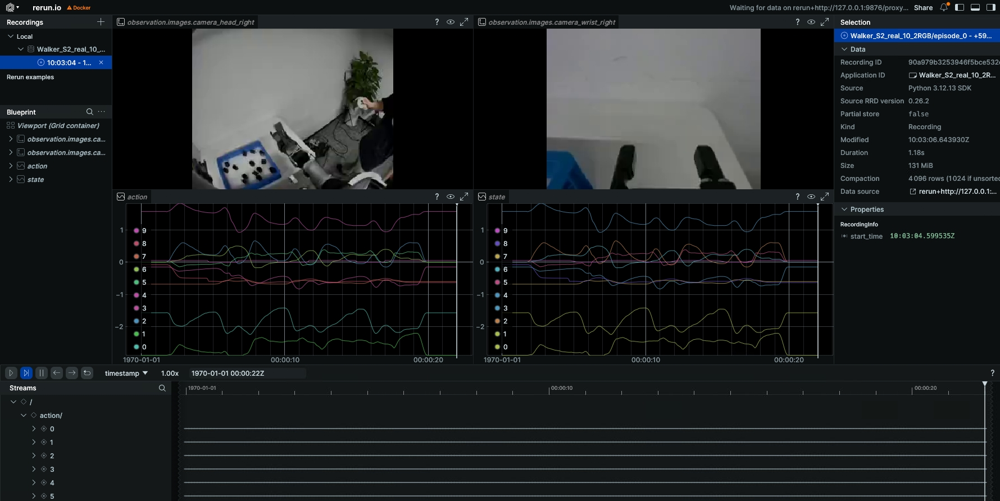
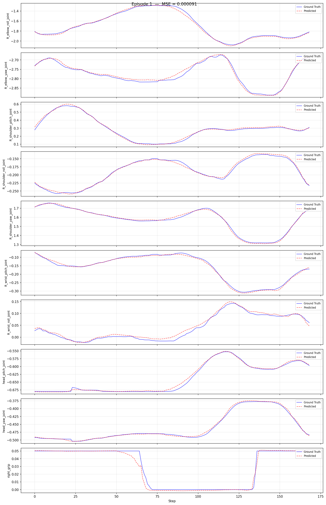

# Walker S2：真机工作流（端到端）

> 适用：**真机采集 -> 转换 -> 训练 -> 评估 -> 真机部署** 完整闭环。

## 0. 工作流总览

```
真机遥操作采集 -> HDF5 数据转换 -> 模型训练(ACT) -> 离线 MSE 评估 -> 真机部署 / 推理服务器 -> 真机任务验证
```

## 1. 前置：真机数据采集

目前使用 [Thinker Studio](https://thinkercosmos.ubtrobot.com/#/studio) 遥操数采平台进行数据采集，可直接导出 LeRobot v3.0 数据集（跳过转换）。也可把采集到的真机 HDF5 放到 `/ubt_IL/dataset/hdf5/`（或任意 `SRC_ROOT` 指定目录）后进入转换。

## 2. 启动容器（ubt_IL）

```bash
cd ubt_IL/docker
bash run.sh build      # 首次
bash run.sh start
bash run.sh bash       # 进入容器，后续转换/训练/评估命令均在容器内执行
```

> 真机部署时容器在**机器人 Jetson 板**上构建，构建脚本会自动识别当前主板类型构建相应的 arm 容器。

## 3. 数据转换（HDF5 -> LeRobot）

**真机 10D（右臂 + 头 + 右夹爪，2 RGB）示例：**

```bash
CONFIG=/ubt_IL/scripts/convert/walker_s2/configs/walker_s2_real_10d_2RGB.json \
SRC_ROOT=/ubt_IL/dataset/walker-s2-pick-part-real-hdf5 \
TGT_PATH=/ubt_IL/dataset \
REPO_ID=Walker_S2_pick_part_real_10_2RGB \
TASK_NAME=walker_s2_pick_part \
bash /ubt_IL/scripts/convert/walker_s2/convert.sh

# 静止帧裁剪版本（去除抓取等待期的静止段，避免推理陷入局部静止）
TRIM_STATIONARY=1 \
CONFIG=/ubt_IL/scripts/convert/walker_s2/configs/walker_s2_real_10d_2RGB.json \
SRC_ROOT=/ubt_IL/dataset/walker-s2-pick-part-real-hdf5 \
TGT_PATH=/ubt_IL/dataset \
REPO_ID=Walker_S2_pick_part_real_10_2RGB \
TASK_NAME=walker_s2_pick_part \
bash /ubt_IL/scripts/convert/walker_s2/convert.sh
```

> ⚠️ 真机 19D 数据中 9 维恒定会引发归一化炸裂，推荐降维到 10D 转换（见 [机型概览](index.md)）。19D 需参考 `walker_s2_gripper_19d.json` 关节顺序自行编写配置。

转换完成后可视化检查：

```bash
HF_HUB_OFFLINE=1 lerobot-dataset-viz \
  --repo-id Walker_S2_real_10_2RGB \
  --episode-index 0 \
  --root /ubt_IL/dataset/Walker_S2_real_10_2RGB
```



> 重点检查：图像分辨率、state/action 维度与顺序、grip 量程、是否存在空 episode。完整环境变量见 [模仿学习平台（`ubt_IL`）](convert-train.md#2-数据转换hdf5---lerobot)。

## 4. 模型训练

> ⚠️ `train.sh` 默认 `CONFIG` 为**仿真配置**，真机训练必须显式指定 real 配置。

```bash
# 单零件抓取策略：使用 pick_part 配置 + 对应数据集
CONFIG=/ubt_IL/scripts/train/walker_s2/configs/train_config_pick_part_real_10d_2RGB.json \
DATASET_REPO_ID=Wlaker_Pick_part_real_10d_2RGB \
OUTPUT_DIR=/ubt_IL/model/Wlaker_Pick_part_real_10d_2RGB_act \
STEPS=50000 SAVE_FREQ=5000 BATCH_SIZE=8 \
bash /ubt_IL/scripts/train/walker_s2/train.sh

# 断点续训（CONFIG 指向 checkpoint 内 train_config.json）
CONFIG=/ubt_IL/model/Wlaker_Pick_part_real_10d_2RGB_act/checkpoints/last/pretrained_model/train_config.json \
RESUME=true \
bash /ubt_IL/scripts/train/walker_s2/train.sh
```

## 5. 策略评估（离线 MSE）

```bash
cd /ubt_IL/lerobot
/lerobot/.venv/bin/python /ubt_IL/scripts/eval/eval_policy.py \
  --policy-path /ubt_IL/model/walker_pick_part_real_10d_2RGB_act/checkpoints/last/pretrained_model \
  --dataset-path /ubt_IL/dataset/Wlaker_Pick_part_real_10d_2RGB \
  --episodes 10 \
  --inference-freq 1 \
  --plot \
  --plot-dir /ubt_IL/scripts/eval/output/eval_walker_real \
  --output /ubt_IL/scripts/eval/output/eval_walker_real/results.json \
  --device cuda
```



## 6. 模型部署（真机）

### 前置条件

- 真机上电站立并进入**开发者模式**。
- 操作流程：机器人开机后打开伺服按 D 启动内部运控 -> 机器人落地扶稳按 A 进入站立模式。遥控器详细操作参考《Walker S2 SDK 二次开发文档》（见仓库 `ubt_IL/docs/walker_s2/sdk-guide.md`）。
- Walker 真机部署在机器人 **Vision 板**上运行，需将项目和模型拷贝到 Vision 板上并构建/启动容器。
- 建议先在 [仿真工作流 §6](sim-workflow.md#6-模型部署回注仿真) 验证模型效果，避免 DOF 配置不匹配造成意料之外的动作。

### 6.1 推理部署（rollout.sh）

```bash
# 1. 启动推理容器--机器人 Vision 板
ssh walker@192.168.11.3           # 登陆机器人 Vision 板
cd 项目路径/ubt_IL/docker
bash run.sh start
bash run.sh bash

# 2. 初始化动作（抬起手臂到桌面上）
bash /ubt_IL/scripts/deploy/walker_s2/robot_ready.sh

# 3. 部署真机 10D 模型异步推理
ROBOT_MODEL=walker_s2_10d \
POLICY_PATH=/ubt_IL/model/walker_pick_part_real_10d_2RGB_act/checkpoints/last/pretrained_model \
INFERENCE_TYPE=act_async INFERENCE_HZ=1 \
FPS=13 DURATION=60 \
bash /ubt_IL/scripts/deploy/walker_s2/rollout.sh

# （可选）验证相机通路，可指定相机话题/机器人配置
/usr/bin/python3 scripts/deploy/walker_s2/preview_camera.py --robot walker_s2_10d
```

**部署效果演示**（真机部署运行效果）：

<video src="../../assets/walker真机部署效果.mp4" controls muted width="100%"></video>

完整环境变量、安全预检、ROBOT_MODELS 注册表与在线评估（记录推理轨迹）见 [真机部署](deploy.md)。

### 6.2 推理服务器（常驻预热/外部调用）

`rollout.sh` 每次冷启动（policy 加载到 CUDA + 桥接拉起）耗时长。推理服务器**常驻**预热，外部经 ZMQ 指令 `start/stop/home/status/shutdown`，并可 `load` 热切换模型。

> ✅ **真机已验证（2026-08-09）**：预热 ~6s 到 READY；`start`->RUNNING；`stop`/`home`（无抖动）/`shutdown` 全通过。

```bash
cd /ubt_IL/scripts/deploy/walker_s2
ROBOT_MODEL=walker_s2_10d \
POLICY_PATH=/ubt_IL/model/walker_pick_part_real_10d_2RGB_act/checkpoints/last/pretrained_model \
INFERENCE_TYPE=act_async INFERENCE_HZ=1 FPS=15 \
bash inference_server.sh

bash inference_client.sh status
bash inference_client.sh start      # 动！请在机旁执行
bash inference_client.sh stop
bash inference_client.sh home
bash inference_client.sh shutdown
```

远程拉起与完整指令说明见 [推理服务器](inference-server.md)。

## 7. 常见问题

| 问题 | 原因 / 解决 |
|------|-------------|
| 转换报"配置不存在" | `convert.sh` 默认 `CONFIG` 在仓库中未提供；请显式指定 `configs/` 下实际存在的配置 |
| 19D 真机数据无法转换 | 仓库仅提供 10D 真机转换配置；19D 需参考 `walker_s2_gripper_19d.json` 关节顺序自行编写 |
| 数据集帧率与预期不符 | 采集 15Hz，转换默认 `FPS=15`；如需其他频率用 `FPS=auto` 取源频率，或 `RESAMPLE_FPS` 重采样 |
| 部署时报维度不匹配 | 安全预检拒绝：确认 `ROBOT_MODEL` 与策略维度对应；无 action names 的策略需 `ALLOW_DIM_ONLY_POLICY=1` |
| 推理服务器 `start` 报错 | `start/stop` 依赖 act_async 的 pause/resume；`sync` 引擎无此语义，需 `INFERENCE_TYPE=act_async` |
| `launch --remote` 失败 | 确认 `--host` 是 **Jetson `192.168.11.3`**（SSH `walker`）而非主控 PC；SSH 用户需对 `sudo docker exec` 有权限 |
| 部署时机器人不动 | 确认 Bridge2 已启动（5561/5562/5563）；`dev_mode.sh` 已切开发者模式；`status` 检查桥接连接状态 |
| 重复拉起推理服务器失败 | 单例 pid 文件 `/tmp/walker_inference_server.pid` 存在；`shutdown` 正常退出或手动清理后再拉 |
