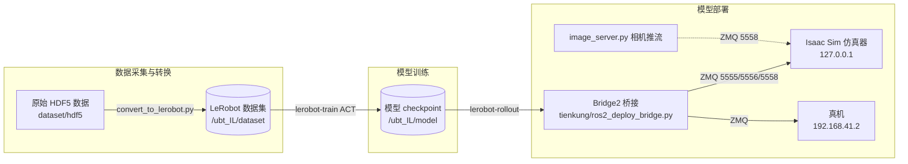

# 天工 Pro（Tienkung Pro）模仿学习快速开始

> 对应代码：`ubt_IL/tienkung/`（LeRobot 插件 `lerobot_robot_tienkung`）
> 全流程：**数据转换 → 模型训练 → 模型部署（Rollout）**

本文档覆盖天工 Pro 机器人从 HDF5 原始数据到 LeRobot 数据集，再到 ACT 模型训练与真机/仿真器部署的完整闭环。所有脚本均在 `lerobot-tienkung` 容器内执行。

> **工作流专项文档**：
> - 仿真数据：→ [sim-workflow.md](./sim-workflow.md)（仿真采集 → 转换 → 训练 → 回注仿真器部署）
> - 真机数据：→ [real-workflow.md](./real-workflow.md)（真机采集 → 转换 → 训练 → 真机部署，含 Jetson host 方案）

---

## 系统架构



- **容器**：`lerobot-tienkung`（由 `docker/run.sh` 构建/启动，项目挂载于 `/ubt_IL`）。
- **通信**：LeRobot 与机器人/仿真器之间走 **ZMQ**。Tienkung 端口约定：`5555`/`5556`（状态/指令）、`5558`（相机 image_server）。
- **DOF 配置**（`tienkung/lerobot_robot_tienkung/.../constants.py` 中 `JOINT_INDEX_ENUMS` 注册表）：

| 配置名 | 维度 | 组成 |
|--------|------|------|
| `tienkung_26` | 26D（默认） | 左臂 7 + 右臂 7 + 左手 6 + 右手 6 |
| `tienkung_13` | 13D | 右臂 7 + 右手 6 |

---

## 快速开始

### 1. 启动容器

```bash
cd /ubt_IL/docker

# 构建（自动按平台选择 Dockerfile：x86 → humble，arm64 → humble-arm64）
./run.sh build

# 启动容器
./run.sh start

# 进入容器
./run.sh bash
```

> 容器内工作目录为 `/ubt_IL`，下述脚本均在容器内执行。

### 2. 数据转换（HDF5 → LeRobot）

脚本：`/ubt_IL/scripts/convert/tienkung_pro/convert.sh`

```bash
# 默认转换：26D 单 RGB，源数据 /ubt_IL/dataset/hdf5，输出数据集 real_pick_place
bash /ubt_IL/scripts/convert/tienkung_pro/convert.sh

# 自定义（环境变量覆盖）
SRC_ROOT=/ubt_IL/dataset/hdf5 \
TGT_PATH=/ubt_IL/dataset \
CONFIG=/ubt_IL/scripts/convert/tienkung_pro/configs/tienkung_pro_26d_1RGB.json \
REPO_ID=real_pick_place \
FPS=15 \
ROBOT_TYPE=tienkung \
TASK_NAME=real_pick_place \
bash /ubt_IL/scripts/convert/tienkung_pro/convert.sh
```

**可用转换配置**（`scripts/convert/tienkung_pro/configs/`）：

| 配置文件 | 说明 |
|----------|------|
| `tienkung_pro_26d_1RGB.json` | 26D 双臂+头，单 RGB 相机（仿真/真机通用） |
| `tienkung_pro_26d_1RGB_real.json` | 26D，真机采集配置 |
| `tienkung_pro_13d_1RGB.json` | 13D 右臂+右手，单 RGB |
| `tienkung_pro_gello_16d_1RGB.json` | GELLO 遥操作 16D，单 RGB |

**环境变量**：

| 变量 | 默认值 | 说明 |
|------|--------|------|
| `SRC_ROOT` | `/ubt_IL/dataset/hdf5` | HDF5 源数据根目录 |
| `TGT_PATH` | `/ubt_IL/dataset` | LeRobot 数据集输出根目录 |
| `CONFIG` | `configs/tienkung_pro_26d_1RGB.json` | JSON 维度/相机映射配置 |
| `REPO_ID` | `real_pick_place` | 输出数据集名称 |
| `FPS` | `15` | 目标帧率 |
| `ROBOT_TYPE` | `tienkung` | 机器人类型 |
| `TASK_NAME` | `real_pick_place` | 任务名称 |
| `VCODEC` | `h264` | 视频编码器 |

### 3. 模型训练（ACT）

脚本：`/ubt_IL/scripts/train/tienkung_pro/train.sh`

```bash
# 从头训练（务必换一个新的 OUTPUT_DIR）
OUTPUT_DIR=/ubt_IL/model/sim_pick_place_act_v2 bash \
  /ubt_IL/scripts/train/tienkung_pro/train.sh

# 断点续训（CONFIG_PATH 指向 checkpoint 内的 train_config.json）
CONFIG_PATH=/ubt_IL/model/sim_pick_place_act/checkpoints/last/pretrained_model/train_config.json \
RESUME=true \
bash /ubt_IL/scripts/train/tienkung_pro/train.sh
```

**环境变量**：

| 变量 | 默认值 | 说明 |
|------|--------|------|
| `CONFIG_PATH` | `.../train_config_sim_act.json` | ACT 完整训练配置（含 input_features、网络、归一化） |
| `DATASET_ROOT` | `/ubt_IL/dataset/real_merged` | 数据集根目录 |
| `DATASET_REPO_ID` | `real_pick_place` | 数据集名称 |
| `OUTPUT_DIR` | `/ubt_IL/model/real_pick_place_act` | 模型输出目录 |
| `STEPS` | `50000` | 训练步数 |
| `SAVE_FREQ` | `10000` | checkpoint 保存间隔（步） |
| `BATCH_SIZE` | `8` | 批大小 |
| `SEED` | `10000` | 随机种子 |
| `RESUME` | `false` | 是否断点续训 |

**可用训练配置**（`scripts/train/tienkung_pro/`）：

| 配置文件 | 说明 |
|----------|------|
| `train_config_sim_act.json` | 仿真 ACT 训练 |
| `train_config_sim_act_right13.json` | 仿真 ACT 13D（右臂） |
| `train_config_real_act.json` | 真机 ACT 训练 |

> 注意：`input_features` 固定为 RGB 头部图像 + 状态（不含 head_depth），以便与 rollout 部署（仅提供 head RGB 相机）保持一致。

### 4. 模型部署（Rollout）

脚本：`/ubt_IL/scripts/deploy/tienkung_pro/rollout.sh`

前置条件：Bridge2 已启动（由 `TienKungRobot.connect()` 自动启动，或手动 `/usr/bin/python3 /ubt_IL/tienkung/ros2_deploy_bridge.py`）。

```bash
# 仿真器部署（默认 ZMQ_HOST=127.0.0.1）
POLICY_PATH=/ubt_IL/model/real_pick_place_act/checkpoints/last/pretrained_model \
bash /ubt_IL/scripts/deploy/tienkung_pro/rollout.sh

# 真机部署（指定真机地址 + 13D 配置）
POLICY_PATH=/ubt_IL/model/real_pick_place_act/checkpoints/last/pretrained_model \
JOINT_CONFIG=tienkung_13 \
ZMQ_HOST=192.168.41.2 \
TASK="pick and place" \
DURATION=60 \
bash /ubt_IL/scripts/deploy/tienkung_pro/rollout.sh
```

**环境变量**：

| 变量 | 默认值 | 说明 |
|------|--------|------|
| `POLICY_PATH` | `/ubt_IL/model/real_pick_place_act/checkpoints/last/pretrained_model` | checkpoint 目录 |
| `STRATEGY` | `base` | rollout 策略类型 |
| `FPS` | `15` | 控制频率 |
| `DURATION` | `60` | 运行时长（秒） |
| `TASK` | `pick and place` | 任务描述 |
| `JOINT_CONFIG` | `tienkung_26` | 关节 DOF 配置（`tienkung_26`/`tienkung_13`） |
| `ZMQ_HOST` | `127.0.0.1` | 仿真器地址；真机改为 `192.168.41.2` |

### 5. 辅助工具

`scripts/deploy/tienkung_pro/` 下：

| 脚本 | 用途 |
|------|------|
| `reset.py` | 机器人复位到初始位姿 |
| `replay.py` | 回放演示轨迹 |
| `image_server.py` | 相机图像推流服务（ZMQ，端口 5558） |
| `image_client.py` | 相机图像接收端（调试预览） |

---

## 常见问题

| 现象 | 可能原因 / 处理 |
|------|-----------------|
| 容器启动卡住 | `docker/run.sh start` 首次启动需构建镜像并拉取基础依赖，耐心等待；`docker/run.sh check` 查看状态 |
| 无相机图像 | 确认仿真器/真机相机已开启；image_server 端口 `5558` 未被占用；`image_client.py` 可单独验证推流 |
| action 维度不匹配 | 训练用 DOF 配置与部署 `JOINT_CONFIG` 不一致；核对 `train_config_*` 的 `output_features.action.shape` 与 `tienkung_26`/`tienkung_13` 维度 |
| 真机无响应 | `ZMQ_HOST` 是否指向真机 `192.168.41.2`；Bridge2 是否启动（`ros2_deploy_bridge.py`）；确认机器人主控已上电并连接网络 |
| 训练报 `FileExistsError` | 从头训练时 `OUTPUT_DIR` 已存在且 `RESUME=false`；换新目录或删除旧目录 |
