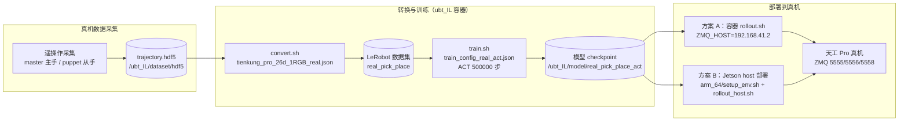

# 天工 Pro 真机数据「转换 → 训练 → 部署」工作流

> 适用机器人：**天工 Pro（Tienkung Pro）真机**
> 数据来源：**真机遥操作采集**（主从 / master-puppet）
> 容器：`lerobot-tienkung`（x86 工作站）；真机侧可选 **Jetson AGX Orin 免 Docker 部署**（`arm_64/`）

本文档给出从**真机 HDF5 原始数据**到 **LeRobot 数据集**、**ACT 模型训练**、最终**部署到真机**的完整可复制命令。转换/训练在 `ubt_IL` 容器内执行，真机部署提供「容器版」与「Jetson host 版」两种方案。

---

## 0. 工作流总览



**核心差异（相对仿真）**：真机转换配置**仅含头部 RGB（无 depth）**，且动作取自 `master`（主手）并做夹爪 invert/repeat/pad 处理；训练配置**关闭图像增强**、步数更长（500000）；部署时 `ZMQ_HOST` 指向真机地址。

---

## 1. 前置：真机数据采集

真机数据通过**主从遥操作**采集：主手（master）产生动作，从手（puppet）执行。HDF5 内部结构（真机）：

- `puppet/*_position_align/data` → 状态（observation.state）
- `master/*_position_align/data` → 动作（action，夹爪经 invert+repeat+pad 变换到 6 维手部）
- `camera_observations/color_images/camera_head`（JPEG，**仅 RGB，无深度**）
- `observations/timestamp`

把采集到的真机 HDF5 放到 `/ubt_IL/dataset/hdf5/`（或任意 `SRC_ROOT` 指定目录）后进入转换。

---

## 2. 启动容器（ubt_IL）

```bash
cd /ubt_IL/docker
./run.sh build      # 首次
./run.sh start
./run.sh bash       # 进入容器，后续转换/训练命令均在容器内执行
```

---

## 3. 数据转换（HDF5 → LeRobot）

脚本：`/ubt_IL/scripts/convert/tienkung_pro/convert.sh`
转换配置：**`tienkung_pro_26d_1RGB_real.json`**（真机专用：仅 RGB、master 动作映射）

```bash
# 真机数据转换
SRC_ROOT=/ubt_IL/dataset/hdf5 \
TGT_PATH=/ubt_IL/dataset \
CONFIG=/ubt_IL/scripts/convert/tienkung_pro/configs/tienkung_pro_26d_1RGB_real.json \
REPO_ID=real_pick_place \
FPS=15 \
ROBOT_TYPE=tienkung \
TASK_NAME=real_pick_place \
bash /ubt_IL/scripts/convert/tienkung_pro/convert.sh
```

**环境变量**：

| 变量 | 真机建议值 | 说明 |
|------|-----------|------|
| `SRC_ROOT` | `/ubt_IL/dataset/hdf5` | 真机 HDF5 存放根目录 |
| `TGT_PATH` | `/ubt_IL/dataset` | LeRobot 数据集输出根目录 |
| `CONFIG` | `configs/tienkung_pro_26d_1RGB_real.json` | 26D，仅头部 RGB，action 映射 `master`（夹爪 invert/repeat/pad） |
| `REPO_ID` | `real_pick_place` | 输出数据集名称（训练时保持一致） |
| `FPS` | `15` | 目标帧率 |
| `ROBOT_TYPE` | `tienkung` | 机器人类型 |
| `TASK_NAME` | `real_pick_place` | 任务名称 |

> 多批真机数据可转换到同一 `REPO_ID` 再合并（train 侧 `DATASET_ROOT=/ubt_IL/dataset/real_merged` 即为合并场景）；13D 真机模型用 `tienkung_pro_13d_1RGB.json`。

**转换产物**：`/ubt_IL/dataset/<REPO_ID>/` 下生成 LeRobot v3 数据集。

---

## 4. 模型训练（ACT）

脚本：`/ubt_IL/scripts/train/tienkung_pro/train.sh`
训练配置：**`train_config_real_act.json`**（真机，关闭图像增强、长训练）

```bash
# 从头训练（务必换一个新的 OUTPUT_DIR）
CONFIG_PATH=/ubt_IL/scripts/train/tienkung_pro/train_config_real_act.json \
DATASET_ROOT=/ubt_IL/dataset \
DATASET_REPO_ID=real_pick_place \
OUTPUT_DIR=/ubt_IL/model/real_pick_place_act \
STEPS=500000 \
SAVE_FREQ=100000 \
BATCH_SIZE=8 \
bash /ubt_IL/scripts/train/tienkung_pro/train.sh

# 断点续训
CONFIG_PATH=/ubt_IL/model/real_pick_place_act/checkpoints/last/pretrained_model/train_config.json \
RESUME=true \
bash /ubt_IL/scripts/train/tienkung_pro/train.sh
```

**`train_config_real_act.json` 关键参数**：

| 参数 | 值 | 说明 |
|------|-----|------|
| `policy.type` | `act` | ACT 策略 |
| `policy.chunk_size` | `100` | 动作块长度 |
| `policy.n_action_steps` | `100` | 每步执行动作数（真机比仿真长） |
| `policy.input_features` | `observation.images.head`(RGB) + `observation.state`(26) | 仅 RGB |
| `policy.output_features.action.shape` | `[26]` | 26 维动作 |
| `policy.vision_backbone` | `resnet18` | 视觉骨干 |
| `dataset.image_transforms.enable` | `false` | **真机关闭图像增强**（保持数据保真） |
| `steps` / `save_freq` | `500000` / `100000` | 长训练 |

> 若多批数据合并训练（如 `real_merged`），保持 `DATASET_REPO_ID` 与合并后数据集名一致。

---

## 5. 模型部署（真机）

### 方案 A：容器内 rollout（x86 工作站 → 真机）

脚本：`/ubt_IL/scripts/deploy/tienkung_pro/rollout.sh`

前置条件：
- 真机已上电并接入网络（默认 `192.168.41.2`）。
- 真机相机推流（image_server）可访问。
- Bridge2 已启动（`TienKungRobot.connect()` 自动拉起，或手动 `/usr/bin/python3 /ubt_IL/tienkung/ros2_deploy_bridge.py`）。

```bash
# 真机部署：ZMQ_HOST 指向真机地址
POLICY_PATH=/ubt_IL/model/real_pick_place_act/checkpoints/last/pretrained_model \
JOINT_CONFIG=tienkung_26 \
ZMQ_HOST=192.168.41.2 \
TASK="pick and place" \
FPS=15 \
DURATION=60 \
bash /ubt_IL/scripts/deploy/tienkung_pro/rollout.sh
```

**环境变量**：

| 变量 | 真机建议值 | 说明 |
|------|-----------|------|
| `POLICY_PATH` | `/ubt_IL/model/real_pick_place_act/checkpoints/last/pretrained_model` | 训练的 ACT checkpoint |
| `JOINT_CONFIG` | `tienkung_26` | 26D；13D 模型用 `tienkung_13`，须与训练 DOF 一致 |
| `STRATEGY` | `base` | 自主执行 |
| `ZMQ_HOST` | `192.168.41.2` | **真机地址**（仿真为 `127.0.0.1`） |
| `FPS` | `15` | 控制频率（与训练 fps 对齐） |
| `DURATION` | `60` | 运行时长（秒） |
| `TASK` | `pick and place` | 任务描述 |

### 方案 B：Jetson AGX Orin 免 Docker 部署（真机本体）

脚本：`/ubt_IL/scripts/deploy/tienkung_pro/arm_64/`（自包含部署包，详见该目录 `README.md`）

> 目标设备：Jetson AGX Orin（JetPack 6 / CUDA 12.6），conda 环境 `env_vla`（Python 3.12）跑 LeRobot，系统 python3.10 跑相机/ROS2，两者 ZMQ 解耦。

```bash
# ① 前置：改 fastdds 配置，把 192.168.41.99 改为本机与机器人网线直连网卡 IP
#    （ubt_IL/docker/fastdds_no_shm.xml，127.0.0.1 保留）

# ② 首次构建环境（Jetson 上）
cd /home/nvidia/vla/TienKung-IL-LAB/ubt_IL/scripts/deploy/tienkung_pro/arm_64
bash setup_env.sh                       # 创建 conda env_vla (python=3.12) + 本地 wheel + LeRobot + 插件

# ③ 标准部署顺序：先相机服务 → 再推理
bash image_server_host.sh               # 相机服务（系统 python3.10，常驻）
bash robot_ready.sh                     # （可选）机器人复位

# ④ 策略推理（env_vla 3.12）
conda activate env_vla
POLICY_PATH=/home/nvidia/vla/TienKung-IL-LAB/ubt_IL/model/real_pick_place_act/checkpoints/last/pretrained_model \
ZMQ_HOST=127.0.0.1 \
FPS=15 DURATION=60 \
bash rollout_host.sh

# 13D 模型部署
JOINT_CONFIG=tienkung_13 \
POLICY_PATH=/home/nvidia/vla/TienKung-IL-LAB/ubt_IL/model/sim_pick_place_right13_act/checkpoints/last/pretrained_model \
DURATION=60 bash rollout_host.sh
```

**`rollout_host.sh` 常用变量**：

| 变量 | 默认值 | 说明 |
|------|--------|------|
| `POLICY_PATH` | `$PROJECT_ROOT/model/Pick_up_tiangong_all_act/checkpoints/last/pretrained_model` | ACT checkpoint |
| `JOINT_CONFIG` | `tienkung_26` | 26D；13D 用 `tienkung_13`，须与训练 DOF 一致 |
| `STRATEGY` | `base` | 自主执行 |
| `TASK` | `sim_pick_place` | 任务描述 |
| `ZMQ_HOST` | `127.0.0.1` | image_server 地址（本机相机） |
| `FPS` | `30` | 控制环频率（与训练 fps 对齐） |
| `DURATION` | `60` | 运行时长（秒） |
| `DISPLAY_CAM` | `true` | SSH 无 X 时设 `false` |

> Jetson 侧运行栈区分：`image_server_host.sh`、`robot_ready.sh` 用**系统 python3.10**（不需 activate env_vla）；`rollout_host.sh`、`train_host.sh`、`image_client_host.sh` 用 **env_vla (3.12)**，需先 `conda activate env_vla`。numpy 必须 <2（本地 torch 按 numpy 1.x 编译）。

---

## 6. 验证与辅助工具

| 脚本 | 用途 |
|------|------|
| `scripts/deploy/tienkung_pro/image_client.py` | 验证相机通路（连 5558 收帧） |
| `scripts/deploy/tienkung_pro/reset.py` | 机器人复位 |
| `scripts/deploy/tienkung_pro/replay.py` | 数据集回放 |
| `arm_64/image_client_host.sh` | Jetson 侧相机通路验证（`--count 60` / `--show` / `--address 192.168.41.2`） |
| `arm_64/train_host.sh` | Jetson 侧可选训练 |

---

## 7. 常见问题

| 现象 | 可能原因 / 处理 |
|------|-----------------|
| 转换报缺深度流 | 真机 HDF5 无深度是正常的：必须用 `tienkung_pro_26d_1RGB_real.json`（仅 RGB）；误用 sim 配置会报缺 `camera_head_depth` |
| 转换后动作维度异常 | 真机 `master` 夹爪经 invert/repeat/pad 变换到 6 维；确认用 real 配置而非 sim 配置 |
| 训练报 `FileExistsError` | `OUTPUT_DIR` 已存在且 `RESUME=false`；换新目录或删旧目录 |
| 真机部署无响应 | `ZMQ_HOST` 是否指向真机 `192.168.41.2`；Bridge2 是否启动（`pgrep -f ros2_deploy_bridge`）；真机主控上电联网 |
| 真机部署动作异常 | `JOINT_CONFIG` 与训练 DOF 不一致（26D↔13D）；相机通路未验证（先 `image_client.py`） |
| Jetson 推理崩溃（numpy 相关） | numpy 被升到 2.x；重新执行 `setup_env.sh` 并保持 `numpy==1.26.4` |
| Jetson conda activate 失效 | 非交互 shell 先 `source $CONDA_BASE/etc/profile.d/conda.sh` 再 activate（脚本已内置处理） |
