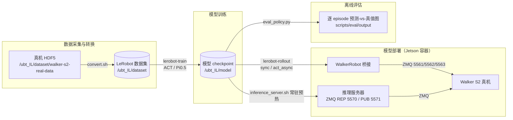

# Walker S2 模仿学习快速开始

> 对应代码：`ubt_IL/walker/`（LeRobot 插件 `lerobot_robot_walker`）
> 全流程：**数据转换 → 模型训练 → 模型部署（Rollout / 推理服务器）→ 离线评估**

本文档覆盖 Walker S2 人形机器人从真机 HDF5 数据到 LeRobot 数据集，再到 ACT / Pi0.5 模型训练、真机部署与离线评估的完整闭环。脚本在 `lerobot-tienkung` 容器内执行。

---

## 系统架构



- **容器**：`lerobot-tienkung`（Jetson 上运行，`--network=host`）。
- **通信**：Walker 桥接端口约定：`5561`（body 指令/状态）、`5562`/`5563`（相机）；推理服务器指令 `5570`（ZMQ REP）、状态 `5571`（ZMQ PUB）。
- **DOF 配置**（`walker/lerobot_robot_walker/.../constants.py` 中 `ROBOT_MODELS` 注册表）：

| 注册表键 | 维度 | 组成 | 相机 |
|----------|------|------|------|
| `walker_s2_31d` | 31D | body 17 + V4 灵巧手 14（左 7 + 右 7） | 5 相机 |
| `walker_s2_19d` | 19D | body 17 + PGC 夹爪 2（左右各 1） | 4 相机 |
| `walker_s2_10d` | 10D | 右臂 7 + 头 2 + 右夹爪 1 | 2 相机 |

**机器人配置文件**（`scripts/deploy/walker_s2/configs/`，旧版 rollout 兼容）：

| 配置文件 | 维度 | 末端执行器 |
|----------|------|-----------|
| `walker_s2_gripper_19d.json` | 19D（17 body + 2 gripper） | PGC 1DOF 夹爪 |
| `walker_s2_v4_hand_31d.json` | 31D（17 body + 14 hands） | V4 灵巧手 7DOF |

---

## 快速开始

### 1. 启动容器

```bash
cd /ubt_IL/docker
./run.sh build   # 自动按平台选择 Dockerfile
./run.sh start
./run.sh bash
```

### 2. 数据转换（HDF5 → LeRobot v3.0）

脚本：`/ubt_IL/scripts/convert/walker_s2/convert.sh`

```bash
# 默认转换：19D 真机数据，1 RGBD 相机
bash /ubt_IL/scripts/convert/walker_s2/convert.sh

# 常用自定义
CONFIG=/ubt_IL/scripts/convert/walker_s2/configs/walker_s2_real_10d_2RGB.json \
SRC_ROOT=/ubt_IL/dataset/walker-s2-real-data \
REPO_ID=Walker_S2_real_10_2RGB \
FPS=13 \
bash /ubt_IL/scripts/convert/walker_s2/convert.sh

# 透传参数
bash /ubt_IL/scripts/convert/walker_s2/convert.sh --overwrite --save_one true   # 覆盖 / 只转第一条
RESAMPLE_FPS=30 bash /ubt_IL/scripts/convert/walker_s2/convert.sh               # 重采样到 30fps
TRIM_STATIONARY=1 bash /ubt_IL/scripts/convert/walker_s2/convert.sh             # 裁剪静止帧
```

**可用转换配置**（`scripts/convert/walker_s2/configs/`）：

| 配置文件 | 说明 |
|----------|------|
| `walker_s2_real_19d_1RGBD.json` | 真机 19D，1 RGBD（默认） |
| `walker_s2_real_10d_2RGB.json` | 真机 10D，2 RGB |
| `walker_s2_sim_10d_2RGB.json` | 仿真 10D，2 RGB |
| `walker_s2_sim_33d_4RGB.json` | 仿真 33D（17 body + 14 V4 手 + 2 夹爪），4 RGB |

**环境变量**：

| 变量 | 默认值 | 说明 |
|------|--------|------|
| `SRC_ROOT` | `/ubt_IL/dataset/walker-s2-real-data` | 真机 HDF5 源目录 |
| `TGT_PATH` | `/ubt_IL/dataset` | 输出根目录 |
| `CONFIG` | `configs/walker_s2_real_19d_1RGBD.json` | 维度/相机映射配置 |
| `REPO_ID` | `Walker_S2_real_19_1RGBD` | 输出数据集名称 |
| `FPS` | `13` | 目标帧率 |
| `ROBOT_TYPE` | `walker_s2` | 机器人类型 |
| `TASK_NAME` | `walker_s2_real` | 任务名称 |
| `HDF5_REL_PATH` | `hdf5/metadata_aligned.hdf5` | HDF5 相对路径 |
| `RESAMPLE_FPS` | 空 | 目标帧率（启用重采样） |
| `LABEL_ROOT` | 空 | label.json 父目录（按标注分段） |
| `TRIM_STATIONARY` | 空 | `1` = 开启静止帧裁剪 |
| `STATIONARY_*` | — | 静止裁剪参数（阈值/窗口/游程等） |

### 3. 模型训练

**ACT（推荐）**：配置见 `scripts/train/walker_s2/configs/`，例如 `train_config_walker_s2_sim_act_10_2RGB.json`（10D + 2 RGB：`camera_head_right` + `camera_wrist_right`，resnet18，chunk 100，50000 步）。

```bash
cd /ubt_IL/lerobot

HF_HUB_OFFLINE=1 /lerobot/.venv/bin/lerobot-train \
  --config_path=/ubt_IL/scripts/train/walker_s2/configs/train_config_walker_s2_sim_act_10_2RGB.json
```

**Pi0.5**（需 **≥24GB 显存**，从 `lerobot/pi05_base` 初始化）：

```bash
HF_HUB_OFFLINE=1 /lerobot/.venv/bin/lerobot-train \
  --config_path=/ubt_IL/scripts/train/walker_s2/configs/train_config_walker_s2_sim_pi05.json
```

### 4. 模型部署（Rollout）

脚本：`/ubt_IL/scripts/deploy/walker_s2/rollout.sh`

前置条件：Bridge2 已由容器 entrypoint 自动启动。

```bash
cd /ubt_IL/lerobot

# 19D 仿真模型 -> 19D PGC 夹爪真机
POLICY_PATH=/ubt_IL/model/Walker_S2_sim_act/checkpoints/last/pretrained_model \
ROBOT_MODEL=walker_s2_gripper_19d \
FPS=15 DURATION=30 ALLOW_DIM_ONLY_POLICY=1 \
bash /ubt_IL/scripts/deploy/walker_s2/rollout.sh

# 10D 仿真模型 -> 真机部署（act_async 异步 chunk 推理）
ROBOT_MODEL=walker_s2_10d \
POLICY_PATH=/ubt_IL/model/Walker_S2_sim_10_2RGB_act/checkpoints/020000/pretrained_model \
INFERENCE_TYPE=act_async INFERENCE_HZ=2 \
FPS=20 DURATION=60 \
bash /ubt_IL/scripts/deploy/walker_s2/rollout.sh
```

**环境变量**：

| 变量 | 默认值 | 说明 |
|------|--------|------|
| `POLICY_PATH` | **必填，无默认值** | checkpoint 目录（含 `config.json`） |
| `ROBOT_MODEL` | `walker_s2_v4_hand_31d` | 机器人配置文件名前缀（不含 `.json`） |
| `ROBOT_CONFIG` | `configs/<ROBOT_MODEL>.json` | 机器人配置完整路径 |
| `STRATEGY` | `base` | rollout 策略类型 |
| `INFERENCE_TYPE` | `sync` | 推理类型：`sync` / `act_async` |
| `INFERENCE_HZ` | `0.6` | act_async 重规划频率（常用 `2`） |
| `FPS` | `15` | 控制频率 |
| `DURATION` | `30` | 运行时长（秒） |
| `BLEND_HORIZON` | `10` | 桥接动作块融合重叠点数 |
| `BODY_PUBLISH_HZ` | `300` | 桥接 body 发布频率 |
| `BODY_V_MAX` | `2.0` | 桥接 rate_limit 单关节最大速度 |
| `ALLOW_DIM_ONLY_POLICY` | `0` | 策略无 action names 时允许仅按维度匹配（设 `1` 开启） |

**安全预检**：脚本启动后自动执行 action 维度匹配检查，不通过则拒绝部署：

1. 读取 robot config 的 `action_order`，计算期望维度；
2. 读取 policy `config.json` 的 `output_features.action.shape`，获取实际维度；
3. 维度不匹配 → 报错退出；
4. 维度匹配但有 action names → 校验 names 顺序一致性；
5. 维度匹配但无 action names → 需 `ALLOW_DIM_ONLY_POLICY=1` 才放行。

**安全参数**（robot config 中 `safety` 段）：`max_relative_target: 0.02`（单步相对目标限幅）、`disable_torque_on_disconnect: true`（断开连接自动卸力）。

### 5. 推理服务器（常驻预热，免重复冷启动）

`rollout.sh` 每次重跑冷启动（policy 加载到 CUDA + 桥接拉起）耗时长；推理服务器**常驻**一个进程，一次性预热加载模型 + 连机器人，之后经 ZMQ 指令随时 `start/stop/home/status/shutdown`，并可 `load` 热切换模型。

> ✅ 真机已验证（2026-08-09）：预热 ~6s 到 READY；`start`→RUNNING（chunk_id 0→211，loop_hz≈fps=15）；`stop`/`home`（无抖动）/`shutdown` 全通过。未测 `load` 热切换。

```bash
# 1. 拉起服务（后台预热 ~6s 到 READY；引擎 paused，不动机器人）
ROBOT_MODEL=walker_s2_10d \
POLICY_PATH=/ubt_IL/model/Pick_part_real_10d_2RGB_act/checkpoints/100000/pretrained_model \
INFERENCE_TYPE=act_async INFERENCE_HZ=2 FPS=15 \
bash /ubt_IL/scripts/deploy/walker_s2/inference_server.sh

# 2. 轮询状态到 READY
bash /ubt_IL/scripts/deploy/walker_s2/inference_client.sh status

# 3. 开始 / 停止推理（动！）
bash /ubt_IL/scripts/deploy/walker_s2/inference_client.sh start
bash /ubt_IL/scripts/deploy/walker_s2/inference_client.sh stop

# 4. 回原点 / 关停（均回 home_position）
bash /ubt_IL/scripts/deploy/walker_s2/inference_client.sh home
bash /ubt_IL/scripts/deploy/walker_s2/inference_client.sh shutdown
```

**客户端指令**：`status` / `start` / `stop` / `home` / `load --policy-path ... --robot-model ...`（热切换）/ `shutdown` / `watch`（订阅状态流）。`start`/`stop` 仅 `act_async` 引擎支持；`sync` 引擎无 pause/resume 语义，`start` 会报错。

**状态机**：`LOADING`（预热/重建）→ `READY`（空闲）⇄ `RUNNING`（执行）；`home` → `RETURNING_HOME` → `READY`；`load` → `LOADING` → `READY`；致命错误 → `ERROR`；关机 → `SHUTTING_DOWN`。

**远程拉起**（从另一台机器）：`bash inference_client.sh launch --policy-path ... --robot-model walker_s2_10d --inference-hz 2 --fps 15 --remote --host 192.168.11.3 --ssh-user walker`。

> 注意区分两台机器：**Jetson `192.168.11.3`**（SSH `walker`）跑容器做推理；**机器人主控 PC `192.168.11.2`**（SSH `ubt`）切开发者模式 / ROS2，不跑推理容器。

**推理服务器环境变量**（`inference_server.sh`）：

| 变量 | 默认值 | 说明 |
|------|--------|------|
| `POLICY_PATH` | **必填** | pretrained_model 目录 |
| `ROBOT_MODEL` | `walker_s2_31d` | ROBOT_MODELS 注册表键 |
| `INFERENCE_TYPE` | `act_async` | 推理引擎类型 |
| `INFERENCE_HZ` | `0.6` | act_async 重规划频率 |
| `FPS` | `13` | 控制环 FPS |
| `SERVER_CMD_PORT` | `5570` | ZMQ REP 指令端口 |
| `SERVER_STATUS_PORT` | `5571` | ZMQ PUB 状态端口 |
| `PREVIEW_CAMERA` | `0` | 默认不开预览窗口 |

> 单例：`/tmp/walker_inference_server.pid` 在跑则拒绝重复拉起；日志：`/tmp/walker_inference_server.log`。

### 6. 离线策略评估

不连机器人，对训练好的策略在 LeRobot 数据集上做离线 MSE 评估（预测 vs 真值），并生成逐 episode 对比图。部署到真机前先量化策略质量。

```bash
/lerobot/.venv/bin/python /ubt_IL/scripts/eval/eval_policy.py \
  --policy-path /ubt_IL/model/Walker_S2_sim_10_2RGB_act/checkpoints/015000/pretrained_model \
  --dataset-path /ubt_IL/dataset/Walker_S2_sim_10_2RGB \
  --episodes 10 \
  --inference-freq 1 \
  --plot \
  --plot-dir /ubt_IL/scripts/eval/output/eval_Walker_S2_sim_10_2RGB_act_60k \
  --output /ubt_IL/scripts/eval/output/eval_Walker_S2_sim_10_2RGB_act_60k/results.json \
  --device cuda
```

**参数**：`--policy-path`（pretrained_model 目录）、`--dataset-path`（LeRobot 数据集根目录）、`--episodes`（评估数，默认全部）、`--inference-freq`（每 N 步推理一次，模拟真机部署）、`--plot`/`--plot-dir`（逐 episode 预测-vs-真值图）、`--output`（结果 JSON）、`--device`（`cuda`/`cpu`，默认 `cuda`，不可用时自动回退 `cpu`）。

### 7. 其他工具

`scripts/deploy/walker_s2/` 下：

| 脚本 | 用途 |
|------|------|
| `preview_camera.py` | 相机预览（验证桥接相机流） |
| `robot_ready.sh` | 机器人就绪检查 |
| `dev_mode.sh` | 真机主控切开发者模式 / ROS2（在 `192.168.11.2` 上执行） |

---

## 常见问题

| 现象 | 可能原因 / 处理 |
|------|-----------------|
| 部署被安全预检拒绝 | 维度不匹配：核对模型 `output_features.action.shape` 与 `ROBOT_MODEL` 对应维度；无 action names 时设 `ALLOW_DIM_ONLY_POLICY=1` |
| `start` 报错 | `sync` 引擎不支持 start/stop，需 `INFERENCE_TYPE=act_async` |
| 推理服务器重复拉起失败 | 已存在单例 `/tmp/walker_inference_server.pid`；`cat /tmp/walker_inference_server.log` 查日志 |
| Pi0.5 训练 OOM | 需 ≥24GB 显存；从 `lerobot/pi05_base` 初始化权重 |
| 真机无响应 | 确认在 Jetson `192.168.11.3` 容器内执行；Bridge2 已启动；机器人主控上电联网 |
| `stop` 后机器人保持姿态 | 正常，`stop` 为 engine pause（hold 当前位姿），`home` 才回原点 |
