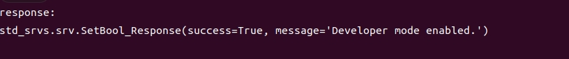
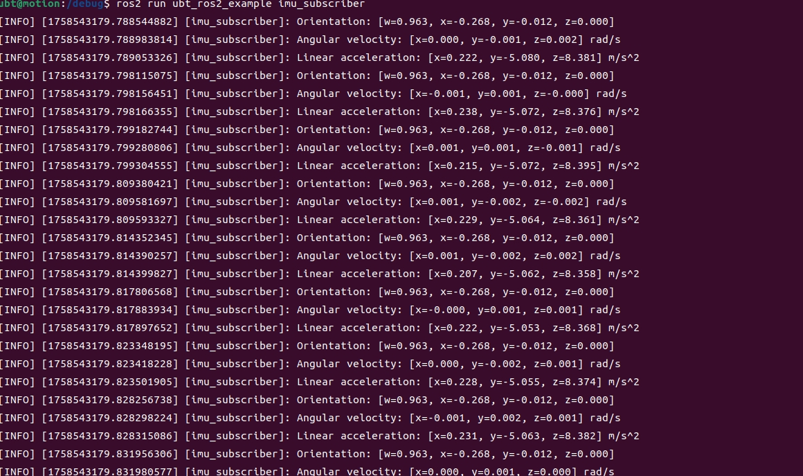
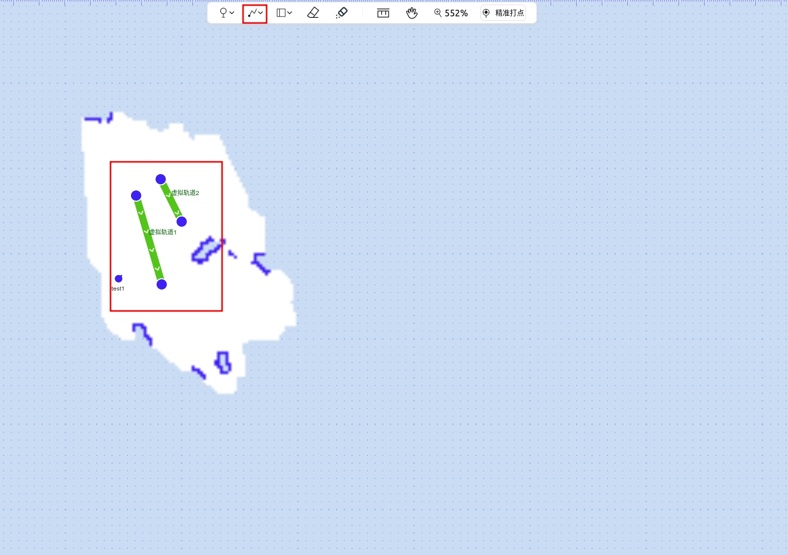

# 【CC\-API】Walker S2 Edu 探索者优必选SDK二次开发文档

**【二次开发责任与品牌形象保护条款】**

- 【供应商】对【客户】的二次开发计划及其实际结果不承担任何责任，开发结果完全取决于【客户】自身的技术能力与实施过程。【客户】应自行评估并承担二次开发所需的全部技术风险与责任。

- 在进行任何二次开发时，【客户】必须确保开发内容及成果不得损害【供应商】或其机器人的品牌形象，并避免任何可能损害【供应商】声誉、商誉等情形。

- 【客户】的二次开发内容及其成果应避免涉及低俗、暴力、歧视、违法或其他有悖公序良俗的内容，并应符合所有适用的法律法规及社会伦理标准。

- 若因【客户】的二次开发内容或成果引发任何第三方投诉、争议、法律行动或行政处罚，【客户】应承担全部法律责任及相关损失，并使【供应商】免受损害。如因此给【供应商】造成任何损失，【客户】应全额赔偿

> **注意！注意！注意！**
> 
> **做SDK二开的前提是需要刷对应的定制开发包，配置好对应的开发环境；定制开发包的获取和刷包指引，详见模块【3\.3】；**
> 
> 

# 版本管理

|**修订记录**|||||
|---|---|---|---|---|
|No\.|**日期**|**修订版本**|**修改描述**|**撰写人**|
|1|2025/10/22|V1\.0|第一版对外公开文档|SDK项目组|
|2|2025/11/4|v1\.1|添加麦克风PCM数据获取demo|李子恒|
|3|2025/11/14|v1\.2|系统环境配置中系统版本修改|胡楠杰|
|4|2025/12/4|v1\.3|新增S2\-二期功能|SDK项目组|
|5|2025/12/8|v1\.4|新增RGBD深度获取描述|李子恒|
|6|2025/12/11|v1\.5|添加开发者模式描述，asr唤醒词描述|李子恒|
|7|2025/12/16|v1\.6|添加ros2加载以及环境变量加载|李子恒|
|8|2025/1/8|v1\.7|修复帐号密码歧义描述|李子恒|
|9|2025/1/14|v1\.8|针对客户使用过程中的常见问题做补充说明|李勇康|
|10|2026/2/10|v1\.9|基于CC框架拟写应用侧的API|李春君\+赵辉|
|11|2026/4/2|v2\.0|添加对于外部跨板通信说明,增加控制权限说明增加cc api python支持|李子恒|
|12|2026/4/9|v2\.1|相机信息msg描述|李子恒|
|13|2026/4/29|v2\.2|新增：运动学逆解使用方法描述修改\+【模块7\-场景demo案例】|SDK项目组|


# 关于优必选 Walker S2 Edu 探索者

Walker S2 Edu 探索者是优必选推出的工业版人形机器人，它集成了多项具身智能技术，具备高负载、自主导航和多场景适配的核心能力。

Walker S2 Edu 探索者机器人整机共42个自由度，由42个一体化关节电机驱动，实现精确运动控制。其结构包括：头部2个自由度，单臂7个自由度（肩、肘、腕），腰部2个自由度，单手6个自由度（三代手），单腿6个自由度（髋、膝、踝）。

## 总体规格参数

|**参数类别**|**具体参数**|
|---|---|
|身高|176cm|
|臂展|177cm（不含灵巧手）|
|重量|70kg（不含灵巧手）|
|单腿自由度|6|
|腰部自由度|2|
|单手自由度（不含灵巧手）|7|
|头部自由度|2|
|负载能力|双臂最大负载15kg|
|算力配置|X86 \+ NVIDIA Jetson Orin|
|传感器配置|深度相机、六维力传感器、IMU、鱼眼相机|
|显示交互|4寸圆形交互屏、电池状态指示灯、麦克风阵列、扬声器|
|供电方式|锂电池 DC 48V|
|电池充电电压/电流|电压：DC 54V 电流：8A|
|综合续航|2\.5h|
|智能OTA升级|有|
|操作系统|Ubuntu \+ ROSA 2\.0|

## 关节参数


**补充说明：文档中关于关节、电机描述中的 left==可等价理解为==L，都是左的意思；right==R同理；**

|所属部位 |名称|运动范围（rad）|额定转速（rpm）|最大转速（rpm）|额定力矩（Nm）|峰值力矩（Nm）|
|---|---|---|---|---|---|---|
|头部|头部俯仰电机<br>head\_pitch\_joint|lower: \-0\.6807<br>upper: 0\.5061|30|50|3|4\.5|
||头部偏航电机<br>head\_yaw\_joint|lower: \-1\.6406<br>upper: 1\.6406|30|50|3|4\.5|
|左臂<br>|左肩俯仰电机<br>L\_shoulder\_pitch\_joint|lower: \-2\.8274<br>upper: 2\.8274|20|30|27|80|
||左肩横滚电机<br>L\_shoulder\_roll\_joint|lower: \-1\.85<br>upper: 0\.0873|20|30|27|80|
||左肩偏航电机<br>L\_shoulder\_yaw\_joint|lower: \-2\.8972<br>upper: 2\.8972|20|30|17|45|
||左肘横滚电机<br>L\_elbow\_roll\_joint|lower: \-2\.6180<br>upper: 0\.0|20|30|17|45|
||左肘偏航电机<br>L\_elbow\_yaw\_joint|lower: \-2\.9147<br>upper: 2\.9147|20|30|17|20|
||左腕俯仰电机<br>L\_wrist\_pitch\_joint|lower: \-1\.5882<br>upper: 1\.5882|20|30|17|20|
||左腕横滚电机<br>L\_wrist\_roll\_joint|lower: \-1\.9897<br>upper: 1\.9897|20|30|17|20|
|右臂<br>|右肩俯仰电机<br>R\_shoulder\_pitch\_joint|lower: \-2\.8274<br>upper: 2\.8274|20|30|27|80|
||右肩横滚电机<br>R\_shoulder\_roll\_joint|lower: \-1\.85<br>upper: 0\.0873|20|30|27|80|
||右肩偏航电机<br>R\_shoulder\_yaw\_joint|lower: \-2\.8972<br>upper: 2\.8972|20|30|17|45|
||右肘横滚电机<br>R\_elbow\_roll\_joint|lower: \-2\.6180<br>upper: 0\.0|20|30|17|45|
||右肘偏航电机<br>R\_elbow\_yaw\_joint|lower: \-2\.9147<br>upper: 2\.9147|20|30|17|20|
||右腕俯仰电机<br>R\_wrist\_pitch\_joint|lower: \-1\.5882<br>upper: 1\.5882|20|30|17|20|
||右腕横滚电机<br>R\_wrist\_roll\_joint|lower: \-1\.9897<br>upper: 1\.9897|20|30|17|20|
|<br>腰<br>|腰部俯仰电机<br>waist\_pitch\_motor|lower: \-1\.5533<br>upper: 0\.6109|15|20|79|265|
||腰部偏航电机<br>waist\_yaw\_motor|lower: \-2\.7925<br>upper: 2\.7925|20|37<br>|35|85|
|左腿|左髋关节横滚电机<br>L\_hip\_roll\_joint|lower: \-0\.4014<br>upper: 0\.7679|50|80|75|225|
||左髋关节偏航电机<br>L\_hip\_yaw\_joint|lower: \-1\.0472<br>upper: 0\.7854|50|80|22|65|
||左髋关节俯仰电机<br>L\_hip\_pitch\_joint|lower: \-0\.5236<br>upper: 1\.9024|50|80|75|225|
||左膝关节驱动电机<br>L\_knee\_pitch\_joint|lower: \-2\.2515<br>upper: 0\.0524|50|80|75|225|
||左踝关节内侧驱动电机<br>L\_ankle\_driver\_inside\_joint|lower: \-1\.1868<br>upper: 0\.6632|50|80|22|65|
||左踝关节外侧驱动电机<br>L\_ankle\_driver\_outside\_joint|lower: \-0\.6632<br>upper: 1\.1868|50|80|22|65|
|右腿|右髋关节横滚电机<br>R\_hip\_roll\_joint|lower: \-0\.7679<br>upper: 0\.4014|50|80|75|225|
||右髋关节偏航电机<br>R\_hip\_yaw\_joint|lower: \-0\.7854<br>upper: 1\.0472|50|80|22|65|
||右髋关节俯仰电机<br>R\_hip\_pitch\_joint|lower: \-0\.5236<br>upper: 1\.9024|50|80|75|225|
||右膝关节驱动电机<br>R\_knee\_pitch\_joint|lower: \-2\.2515<br>upper: 0\.0524|50|80|75|225|
||右踝关节内侧驱动电机<br>R\_ankle\_driver\_inside\_joint|lower: \-1\.1868<br>upper: 0\.6632|50|80|22|65|
||右踝关节外侧驱动电机<br>R\_ankle\_driver\_outside\_joint|lower: \-0\.6632<br>upper: 1\.1868|50|80|22|65|
|<br>**【三代灵巧手】**<br>（注1：左右手相同<br>指尖是被动关节无电机）<br>（注2：驱动是直线，转速和力矩\-分别对应直线速度和推力）<br>**【四代灵巧手】**<br>（均为旋转输出）|四指指腹弯曲电机<br>L\_index\_mcp\_joint<br>L\_middle\_mcp\_joint<br>L\_ring\_mcp\_joint<br>L\_little\_mcp\_joint|【三代手】<br>lower: 0\.0<br>upper: 1\.46<br>【四代手】<br>lower: 0\.0<br>upper: 1\.71|【三代手】25mm/s<br>【四代手】<br>18\.9r/min<br>|【三代手】<br>39mm/s<br>【四代手】<br>24r/min<br>|【三代手】<br>额定扭矩下推杆推力为45\.53N<br>【四代手】<br>额定扭矩0\.46N·m|【三代手】<br>峰值扭矩下推杆推力为100N<br>【四代手】<br>峰值扭矩<br>1\.38N·m|
||大拇指弯曲电机<br>L\_thumb\_mcp\_joint|【三代手】<br>lower: 0\.0<br>upper: 1\.04<br>【四代手】<br>指腹\-\-<br>lower: 0\.0<br>upper: 1\.85<br>指尖\-\-<br>lower: 0\.0<br>upper: 1\.09|||||
||大拇指旋转电机<br>L\_thumb\_swing\_joint<br>|【三代手】<br>lower: 0\.0<br>upper: 0\.96<br>【四代手】<br>lower: 0\.0<br>upper: 2\.11|||||

|关节部位（三代灵巧手）|运动范围（°）|图例说明|
|---|---|---|
|小拇指<br>无名指<br>中指<br>食指|**【三代手】**<br>指腹旋转角度88\.92°（1\.52 rad），指尖被动旋转93\.06°（1\.62 rad）<br>**【四代手】**<br>指腹旋转角度 98°（1\.71rad），指尖被动旋转100\.94°（1\.76rad）<br>|<br>|
|大拇指弯曲角度|**【三代手】**<br>拇指指腹角度58°（1\.01 rad），指尖被动旋转60°（1\.05 rad）<br>**【四代手】**<br>拇指指腹角度106°（1\.85 rad），指尖角度旋转62\.5°（1\.09 rad）<br>|<br>|
|大拇指旋转角度|**【三代手】**<br>大拇指侧摆角度65\.34°（1\.14 rad）<br>**【四代手】**<br>大拇指侧摆角度121°（2\.11rad）|<br>|

## 坐标系，关节旋转轴与关节零点

当各个关节均为零度时，各坐标系如下图。红色为x轴，绿色为y轴，蓝色为z轴。


## 模型与标定参数

### 模型参数

#### 刚度阻尼参数

|**电机**|**id**|**pos\_kp**|**pos\_ki**|**pos\_kd**|**vel\_kp**|**vel\_ki**|**vel\_kd**|
|---|---|---|---|---|---|---|---|
|`head_pitch_motor`|1002|600|0|0|800|50000|0|
|`head_yaw_motor`|1001|600|0|0|800|50000|0|
|`waist_pitch_motor`|11001|600|0|0|400|50000|0|
|`waist_yaw_motor`|11002|600|0|0|400|50000|0|
|`left_hip_roll_motor`|2001|1100|0|0|550|50000|0|
|`left_hip_yaw_motor`|2002|1100|0|0|550|50000|0|
|`left_hip_pitch_motor`|2003|1500|0|0|650|50000|0|
|`left_knee_pitch_motor`|2004|1500|0|0|650|50000|0|
|`left_ankle_driver_outside_motor`|2005|1600|0|0|700|50000|0|
|`left_ankle_driver_inside_motor`|2006|1600|0|0|700|50000|0|
|`right_hip_roll_motor`|3001|1100|0|0|550|50000|0|
|`right_hip_yaw_motor`|3002|1100|0|0|550|50000|0|
|`right_hip_pitch_motor`|3003|1500|0|0|650|50000|0|
|`right_knee_pitch_motor`|3004|1500|0|0|650|50000|0|
|`right_ankle_driver_outside_motor`|3005|1600|0|0|700|50000|0|
|`right_ankle_driver_inside_motor`|3006|1600|0|0|700|50000|0|
|`left_shoulder_pitch_motor`|4001|600|0|0|400|50000|0|
|`left_shoulder_roll_motor`|4002|500|0|0|400|50000|0|
|`left_shoulder_yaw_motor`|4003|600|0|0|400|50000|0|
|`left_elbow_roll_motor`|4004|500|0|0|400|50000|0|
|`left_elbow_yaw_motor`|4005|600|0|0|400|50000|0|
|`left_wrist_pitch_motor`|4006|600|0|0|400|50000|0|
|`left_wrist_roll_motor`|4007|600|0|0|400|50000|0|
|`right_shoulder_pitch_motor`|5001|600|0|0|400|50000|0|
|`right_shoulder_roll_motor`|5002|500|0|0|400|50000|0|
|`right_shoulder_yaw_motor`|5003|600|0|0|400|50000|0|
|`right_elbow_roll_motor`|5004|500|0|0|400|50000|0|
|`right_elbow_yaw_motor`|5005|600|0|0|400|50000|0|
|`right_wrist_pitch_motor`|5006|600|0|0|400|50000|0|
|`right_wrist_roll_motor`|5007|600|0|0|400|50000|0|

### 传感器标定参数

#### 传感器外参

|**传感器名称**|**parent link**|**x世界系方向**|**y世界系方向**|**z世界系方向**|
|---|---|---|---|---|
|胯前相机|base\_link|0\.07431634|0|\-0\.01027351|
|背后相机|waist\_pitch\_link|\-0\.14952354|0|0\.31129005|
|头部imu|head\_pitch\_link|\-0\.007|0|0\.081|
|imu（腰侧）|waist\_pitch\_link|0\.00021697|0\.0619|0\.0334993|
|头前双目左侧|head\_pitch\_link|0\.10675004|0\.03018686|0\.13200105|
|头前双目右侧|head\_pitch\_link|0\.10675004|\-0\.02981314|0\.13200105|
|头左鱼眼相机|head\_pitch\_link|0\.02681314|0\.07925004|0\.10490105|
|头右鱼眼相机|head\_pitch\_link|0\.02718686|\-0\.07925004|0\.10490105|
|左手末端六维力|L\_sixforce\_link|0|0|0|
|右手末端六维力|R\_sixforce\_link|0|0|0|

|**传感器名称**|**parent link**|**roll（degree）**|**pitch（degree）**|**yaw（degree）**|**roll（rad）**|**pitch（rad）**|**yaw（rad）**|
|---|---|---|---|---|---|---|---|
|胯前相机|base\_link|0|45\.62890994|0|0|0\.79637471|0|
|背后相机|waist\_pitch\_link|90|0|\-134\.359|1\.5708|0|\-2\.345|
|头部imu|head\_pitch\_link|||||||
|imu（腰侧）|waist\_pitch\_link|0|0|0|0|0|0|
|头前双目左侧|head\_pitch\_link|\-90|0|0|\-1\.5708|0|0|
|头前双目右侧|head\_pitch\_link|\-90|0|0|\-1\.5708|0|0|
|头左鱼眼相机|head\_pitch\_link|\-90|\-90|0|\-1\.5708|\-1\.5708|0|
|头右鱼眼相机|head\_pitch\_link|\-90|90|0|\-1\.5708|1\.5708|0|
|左手末端六维力|L\_sixforce\_link|0|0|0|0|0|0|
|右手末端六维力|R\_sixforce\_link|0|0|0|0|0|0|

#### 传感器内参

||**相机型号**|**分辨率**|**内参系数（fx,fy,cx,cy）**|**畸变系数\(k1,k2,p1,p2,k3,k4,k5,k6\)**|**双目校准之后的内参（fx,fy,cx,cy）**|**双目校准之后的畸变系数\(k1,k2,p1,p2,k3,k4,k5,k6\)**|**双目校准之后并做scale和crop之后的内参（fx,fy,cx,cy）**<br>**分辨率为960x576**|
|---|---|---|---|---|---|---|---|
|stereo\_left\_rgb|SG3S\-ISX031C\-GMSL2F\-H120|1920x1536|fx = 1016\.7883089547533<br>fy = 1016\.8775091955944<br>cx = 959\.58734378562485<br>cy = 769\.789510911202|\[ 1\.6588211041853891, 0\.58800088419339969,<br>       \-3\.8568276247361075e\-06, \-0\.00016548221558967973,<br>       0\.024538934597245526, 2\.0527615279043738, 1\.1401247716066338,<br>       0\.14582400654563357, 0\., 0\., 0\., 0\., 0\., 0\. \]|fx = 775\.20815857000002<br>fy = 775\.20815857000002<br>cx = 944\.74884033000001<br>cy = 778\.20697021000001|\[ 0, 0, 0, 0, 0, 0, 0, 0\]|fx = 387\.60407928364305<br>fy = 387\.60407928364305<br>cx = 472\.3744201660156<br>cy = 197\.10348510742188|
|stereo\_right\_rgb|SG3S\-ISX031C\-GMSL2F\-H120|1920x1536|fx = 1016\.7883089547533<br>fy = 1016\.8775091955944<br>cx = 959\.58734378562485<br>cy = 769\.789510911202|\[ 1\.6588211041853891, 0\.58800088419339969,<br>       \-3\.8568276247361075e\-06, \-0\.00016548221558967973,<br>       0\.024538934597245526, 2\.0527615279043738, 1\.1401247716066338,<br>       0\.14582400654563357, 0\., 0\., 0\., 0\., 0\., 0\. \]|fx = 775\.20815857000002<br>fy = 775\.20815857000002<br>cx = 944\.74884033000001<br>cy = 778\.20697021000001|\[ 0, 0, 0, 0, 0, 0, 0, 0\]|fx = 387\.60407928364305<br>fy = 387\.60407928364305<br>cx = 472\.3744201660156<br>cy = 197\.10348510742188|
|head\_fisheye\_left||1920x1536|fx = 517\.95844<br>fy = 517\.95575<br>cx = 959\.88574<br>cy = 767\.8551|\[ 0\.09725758, \-0\.016625976,<br>\-0\.0044323364, 0\.0008865305 \]<br>\(鱼眼的畸变系数仅有k1, k2, k3, k4\)||||
|head\_fisheye\_right||1920x1536|fx = 517\.95844<br>fy = 517\.95575<br>cx = 959\.88574<br>cy = 767\.8551|\[ 0\.09725758, \-0\.016625976,<br>\-0\.0044323364, 0\.0008865305 \]<br>\(鱼眼的畸变系数仅有k1, k2, k3, k4\)||||
|waist\_front\_cam|Gemini336|640\*360|fx = 343\.447<br>fy = 343\.447<br>cx = 320<br>cy = 180|0\.00561242<br>\-0\.0441164<br>\-7\.49371e\-05<br>0\.000340231<br>0\.0305373<br>0<br>0<br>0||||
|back\_rear\_cam|Gemini336|640\*360|fx = 343\.447<br>fy = 343\.447<br>cx = 320<br>cy = 180|0\.00561242<br>\-0\.0441164<br>\-7\.49371e\-05<br>0\.000340231<br>0\.0305373<br>0<br>0<br>0||||


# 快速操作指南

## 风险提示

- 确认机器人悬吊于保护架之上，机器人脚离地面至少20cm，再做调试

- 机器人运动过程中，确保机器人运动范围内无障碍物，避免碰撞

- 机器人运动过程中，肢体不要触碰机器人

- 机器人在站立状态下，非紧急情况禁止触碰电源键，否则将导致机器人伺服下电，腿部没有支撑，机器人将会摔倒

- 遇到突发情况，可按下机器人身后的急停按钮，并将机器人吊至展架。注意：按下急停按钮后机器人关节处于锁位状态，该状态下机器人运控功能不可用，需要解除急停。

## 开机上电

- 上电前确保机器人挂在支架上：机器人双足自然下垂，展架升到最高，以确保腿复位过程脚掌不会碰触地面和其他物体。确保机器人双臂自然下垂，肘内侧和掌心朝前方，头朝下前方，背部急停按钮处于松开状态，电池已经插好。

- 依次操作 2 块电池处于开启状态，长按电池电源按键，直到指示灯亮起。

- 打开机器人背部盖板，按下机器人背部电源开关。（图\-1）


\(图\-1\)

- 长按机器人背部的启动键，看到机器人头部显示屏亮起后表示机器人已开始启动，启动时间约1分钟。（图\-2）


\(图\-2\)


- 按下机器人背部伺服控制按键，听到风扇声音响起，机器人开机完成。（图\-3）


\(图\-3\)

## 连接机器人

1. 以太网线连接Walker S2 Edu 探索者机器人：使用网线与机器人以太网口连接

2. 接着打开网络设置，找到机器人所连接的网卡，进入 IPv4 ，将 IPv4 方式改为手动，地址设置为192\.168\.11\.99，子网掩码设置为255\.255\.255\.0，完成后点击应用，等待网络重新连接\.

3. 通过SSH，在PC1或PC2登录ROS 2容器并运行Demo程序或者自定义程序\(ssh ubt@192\.168\.11\.2/3 \-p 2222 密码请向您的技术支持人员获取\)


## 遥控操作

1. 手柄键位定义


2. 遥控器按键功能


## 回零/启动控制器

1. 确认机器人悬吊于保护架之上，机器人脚离地面至少20cm，急停按钮松开

2. 遥控器回零/控制器启动\(操作方法请见章节2\.4\)

3. 回零成功/控制器启动成功后，此时可以通过命令进入开发者模式，并通过SDK读取各类传感器数值

## 进入开发者模式

1. 确保机器人控制器已经回零/启动

2. SSH远程进入ROS 2 Docker容器开发环境

登录前在您的PC上,请打开SSH密码登录

|**主机**|**架构**|**地址**|**用户名**|**密码**|
|---|---|---|---|---|
|PC1|x86|192\.168\.11\.2:2222|ubt|请向您的技术支持人员获取|
|PC2|arm|192\.168\.11\.3:2222|ubt|请向您的技术支持人员获取|

开发者容器内置文件路径:

- `/opt/demo`：文档所提到的底层demo程序

- `/opt/walker/`： 开发者模式功能包\(ik逆解,详情请见5\.11\.1\)

- `/opt/demo `：其他cc api相关文件,如demo\.pip安装包等

```C++
ssh -p 2222 ubt@192.168.11.2/3
# 输入密码：请向您的技术支持人员获取
```

3. 进入开发者模式

- 在进入开发者模式前,请先确保以下内容处于就绪状态:

    - 1\. 急停按钮已经松开

    - 2\. 伺服已上电\(章节操作2\.2\)

    - 3\. 机器人已经回零\(章节2\.4\)

- 一旦进入开发者模式:

    - 1\.内置运控算法将退出,您将取得电机完全控制权限,请确保机器人处于安全状态\.

- 在ROS 2容器中，运行命令

```YAML
#向service请求进入开发者模式true为进入,false为退出
ros2 service call /sys/task/developer_mode std_srvs/srv/SetBool "{data: true}"
```

- 当返回success=True即进入退出/成功，message显示developer enable



- 同时也可以通过topic查看机器人当前状态

```YAML
#true为开发者模式,false则为普通模式
ros2 topic echo /sys/state/walker_mode
```

- 当返回data为true，此时可以开始使用 SDK 进行开发调试，若开发者模式进入失败，请检查：

    - 急停按钮是否松开

    - 机器人控制器是否启动成功

一旦进入开发者模式后，内置运控程序将会退出，你将取得电机的完全控制权限，如需要调用内置运控算法，请退出开发者模式。

对于开发者自建的电机控制程序,需要通过motion \(ubt@192\.168\.11\.2 \-p 2222\) 本地\(Local\)发出控制指令并且通过sudo \-E su进入root用户, 我们不建议通过外部PC\(或者任何其他Remote的方式进行电机控制指令的发送\),该方法数据传输实时性不能保证\.


# 应用开发

## 软件架构说明

整机分为ORIN 上层计算单元、X86 底层运动控制单元两大核心硬件模块，二者通过交换机完成数据互通；整机可通过网络对接外部云平台，形成 “端 \- 边 \- 云” 完整体系。

- **X86 底层运动控制单元（运控板）：**负责实时性要求极高的底层运动控制。

- **ORIN 上层计算单元（计算板）：**负责上层应用、AI 推理与视觉算法计算。

两块板卡并非传统的上下位机关系，而是作为两个独立的 ROS2 节点，通过共享同一个 `ROS_DOMAIN_ID` 实现主题和服务的透明互通。

### 核心硬件分工表

|板卡名称|硬件架构|网络地址|角色定位|核心运行内容|
|---|---|---|---|---|
|**PC1 \- 运控板**<br>|x86|`192.168.11.2:2222`|底层运动控制（实时域）|`t800_mc_server` 运控服务、关节电机控制、IMU/六维力状态发布、|
|**PC2 \- 计算板**|ARM \(Orin\)|`192.168.11.3:2222`|上层应用/AI（计算域）<br>|`ubt_ros2_demo` 容器、VLA 推理、视觉算法、大模型、SDK 二开程序<br>`cc_api` 服务|

### 开发环境选择指南

针对二次开发，强烈建议开发者主要在 PC2（11\.3 Orin 计算板）上进行程序构建与运行。PC1（11\.2 运控板）在出厂状态下已配置完毕，通常无需额外安装或构建 demo 程序。

|开发需求|推荐开发板|推荐工具/接口|说明|
|---|---|---|---|
|快速测试手臂/头部/手部控制|PC2 \(11\.3/2\)<br>|`ros2 run ubt_ros2_example pub_arm_command`|使用 SDK 自带 demo 验证功能|
|订阅 IMU / 六维力 / 关节状态<br>|PC2 \(11\.3/2\)|`ros2 run ubt_ros2_example sub_robot_state`|状态主题跨板可见，可直接订阅<br>|
|编写自定义 C\+\+/Python 控制节点|PC2 \(11\.2\)|ROS2 \+ SDK low\_level 接口|在11\.2运行保证时候实时性|
|使用 Python/cc\_api 高层控制<br>|PC2 \(11\.3\)<br>|`import ubt_robot` \+ `cc_api`|需在开发者模式下运行<br>|
|接入 VLA / 大模型推理|PC2 \(11\.3\)|VLA 模型 \+ ROS2 通信|推理在 11\.3，运控容器在 11\.2 接收执行|
|部署底层运控算法 / 500Hz\+ 实时控制|PC1 \(11\.2\)|`rosa_controllers`|需登录运控板底层，确保运控指令的实时性|

### ROSA 2\.0

优必选独立研发的机器人操作系统应用框架 ROSA 2\.0，将机器人的各项功能与控制进行了深度整合，为机器人在多种场景下实现灵活应用提供了坚实支撑，保证底层算法的自主可控和安全性。

## ROS 2 SDK 概述

完整版优必选SDK由优必选机器人公司开发，提供了丰富的接口，涵盖头部、臂部、肘部、手部和腿部的电机控制，以及六维力、IMU（惯性测量单元）和相机的使用，用于编写和部署机器人应用程序，旨在帮助开发人员快速灵活地构建自己的应用程序来精确控制和使用机器人，以满足在不同应用场景下的需求。您可以按照我们提供的接口和例程，配套本开发指南，完成对Walker S2 Edu 探索者的二次开发。

## ROS 2 SDK 获取

现阶段需要SDK的定制软件包 及 demo程序，请客户通过优必选对接人\-如销售或项目，评估开发工作量及商务事宜，切勿直接发邮件提问题或需求；

> 现阶段\-\>升级流程和方式：
> 
> 1. 客户先提供收货地址，优必选安排邮寄U盘（离线的SDK定制开发包\-20G左右）；\*海外客户通过销售走云盘下载；
> 
> 2. 优必选研发通过远程的方式，指导客户做离线包的安装；
> 
> 

未来，SDK会合入到主线版本且支持OTA，届时可以直接线上升级到最新版本来做二开；同时，后续我们也会在官网上附公开的demo程序包供大家下载。

### ROS 2 SDK构建

- 确保正确的网络连接后，进入机器人ROS 2容器

```C++
ssh -p 2222 ubt@192.168.11.3
# 输入密码：请向您的技术支持人员获取
```

- 在你可以下载并构建我们的ROS 2 demo程序

```YAML
#将demo程序复制到/debug目录下
scp -P 2222 -r ubt_ros2_demo ubt@192.168.11.3:/debug/
cd /debug/ubt_ros2_demo
source /opt/ros/humble/setup.bash
#构建ubt_ros2demo程序
colcon build
```

- 在该项目结构中

    - example存储SDK的示例demo代码

    - low\_level为低层SDK调用，common为相关通用接口，如音频播放等

### 运行并测试

在完成上述代码构建后输入

```YAML
source /debug/ubt_ros2_demo/install/setup.bash
```

请您在运控版（ubt@192\.168\.11\.2 \-p 2222）底层运行与电机控制以及状态订阅相关的程序，并通过sudo \-E su 进入root用户

您可以运行我们的demo程序，同时也可以打开终端，并输入

```YAML
ros2 topic list
```

您可以看到以下主题，可以通过ros2 topic echo打印对应的数据


- demo程序示例

    示例源代码位于/example/src文件夹下,我们提供如下示例程序

    - audio\_player 利用Walker S2 Edu 探索者内置喇叭播放固定音频文件

    - powerboardstate\_subscriber  读取Walker S2 Edu 探索者电源板状态信息

    - batterystate\_subscriber 订阅Walker S2 Edu 探索者电源状态信息

    - pub\_arm\_command 发布手臂控制

    - pub\_hand\_command 发布灵巧手控制

    - pub\_head\_command 发布头部控制

    - sub\_hands\_state 订阅手部状态信息

    - sub\_robot\_state 订阅机器人状态信息\(IMU,六维力,关节电机等\)

    - camera\_subscriber 为各类相机订阅示例程序

- 运行示例代码

    1. 以imu订阅demo为例，打开终端并输入：

    ```YAML
    ros2 run ubt_ros2_example imu_subscriber
    ```

    2. 就可以获取IMU\(Orin\)状态信息



- 其它详细示例见\-模块5

## 环境依赖

### **系统环境配置**

为了确保最佳的开发体验和兼容性，建议在自建程序在机器人本体的ROS 2容器内运行。当前暂不支持在Mac和Windows系统下开发。

**Walker S****2****框架环境**

|**平台**|**地址**|**系统版本**|**ROS 2****容器**|
|---|---|---|---|
|Walker S2 Edu 探索者 x86|192\.168\.11\.2|Ubuntu 22\.04|humble|
|Walker S2 Edu 探索者 Orin|192\.168\.11\.3|Ubuntu 22\.04|humble|

# 全局值说明

- 说明：完整版优必选Walker S2 Edu 探索者头部、臂部、腰部和腿部的电机的命名ID定义如下

```JSON
{9001, "switch main", "主交换机"},

{10000, "motion_imu", "运动IMU传感器"},
// 左腿
{2001, "left_hip_roll_motor", "左髋关节横滚电机"},
{2002, "left_hip_yaw_motor", "左髋关节偏航电机"}, 
{2003, "left_hip_pitch_motor", "左髋关节俯仰电机"},
{2004, "left_knee_driver_motor", "左膝关节驱动电机"},
{2006, "left_ankle_driver_inside_motor", "左踝关节内侧驱动电机"},
{2005, "left_ankle_driver_outside_motor", "左踝关节外侧驱动电机"},

//腰
{11001, "waist_pitch_motor", "腰部俯仰电机"},
{11002, "waist_yaw_motor", "腰部偏航电机"},
// 右腿  
{3001, "right_hip_roll_motor", "右髋关节横滚电机"},
{3002, "right_hip_yaw_motor", "右髋关节偏航电机"},
{3003, "right_hip_pitch_motor", "右髋关节俯仰电机"},
{3004, "right_knee_driver_motor", "右膝关节驱动电机"},
{3006, "right_ankle_driver_inside_motor", "右踝关节内侧驱动电机"},
{3005, "right_ankle_driver_outside_motor", "右踝关节外侧驱动电机"},

{9002, "switch sub", "从交换机"},      

// 头部
{1001, "head_yaw_motor", "头部偏航电机"},
{1002, "head_pitch_motor", "头部俯仰电机"},

// 左臂
{4001, "left_shoulder_pitch_motor", "左肩俯仰电机"},
{4002, "left_shoulder_roll_motor", "左肩横滚电机"},
{4003, "left_shoulder_yaw_motor", "左肩偏航电机"},
{4004, "left_elbow_roll_motor", "左肘横滚电机"},
{4005, "left_elbow_yaw_motor", "左肘偏航电机"},
{4006, "left_wrist_roll_motor", "左腕横滚电机"},
{4007, "left_wrist_pitch_motor", "左腕俯仰电机"},
{6001, "left_arm_ft", "左臂六维力传感器"},
{8001, "left_hand", "左手（可能未接灵巧手，实际为夹板）"},

// 右臂
{5001, "right_shoulder_pitch_motor", "右肩俯仰电机"},
{5002, "right_shoulder_roll_motor", "右肩横滚电机"},
{5003, "right_shoulder_yaw_motor", "右肩偏航电机"},
{5004, "right_elbow_roll_motor", "右肘横滚电机"},
{5005, "right_elbow_yaw_motor", "右肘偏航电机"},
{5006, "right_wrist_roll_motor", "右腕横滚电机"},
{5007, "right_wrist_pitch_motor", "右腕俯仰电机"},
{6002, "right_arm_ft", "右臂六维力传感器"},
{8002, "right_hand", "右手（可能未接灵巧手，实际为夹板）"}
```

# 接口说明\-底层服务【ROS 2】

> **\*实际调试过程中，以demo示例为准\~**
> 
> 

## 运控控制

### 运控状态状态获取接口

- 说明：获取运动控制相关的状态信息，其中包含电机的当前位置、IMU和六维力的信息。

> 说明：指运控胯部的IMU信息。状态获取和控制维度信息包含，位置、速度、电流/力矩；
> 
> 

- 控制方式：topic

- 话题名称：`/mc/sdk/robot_state`

- 数据定义位置：mc\_state\_msgs::msg::robot\_state

- 数据格式：

```C++
std_msgs/Header header
sensor_msgs/JointState joint_states
sensor_msgs/Imu[] imu_states
geometry_msgs/WrenchStamped[] ft_states
```

- 代码示例：

```C++
#include "rclcpp/rclcpp.hpp"
#include "mc_state_msgs/msg/robot_state.hpp"
#include "std_msgs/msg/string.hpp"
#include <iostream>
#include <memory>

class RobotStateSubscriber : public rclcpp::Node
{
public:
  RobotStateSubscriber() : Node("sub_robot_state")
  {
    // 创建QoS配置，使用系统默认的传感器数据QoS
    rclcpp::QoS qos_settings(10);
    qos_settings.reliability(RMW_QOS_POLICY_RELIABILITY_BEST_EFFORT);
    qos_settings.durability(RMW_QOS_POLICY_DURABILITY_VOLATILE);
    qos_settings.history(RMW_QOS_POLICY_HISTORY_KEEP_LAST);
    
    subscription_ = this->create_subscription<mc_state_msgs::msg::RobotState>(
      "/mc/sdk/robot_state", 
      qos_settings,
      std::bind(&RobotStateSubscriber::topic_callback, this, std::placeholders::_1));
  }

private:
  void topic_callback(const mc_state_msgs::msg::RobotState::SharedPtr msg) const
  {
    RCLCPP_INFO(this->get_logger(), "================================");
    
    for (size_t i = 0; i < msg->joint_states.name.size(); i++) {
      std::cout << "Joint: " << msg->joint_states.name[i] 
                << " Joint position: " << msg->joint_states.position[i] << std::endl;
    }

    for (const auto& item : msg->imu_states) {
      std::cout << "Imu: " << item.header.frame_id 
                << ", acc:" << item.linear_acceleration.x << " "
                << item.linear_acceleration.y << " " << item.linear_acceleration.z
                << ", gyro:" << item.angular_velocity.x << " " 
                << item.angular_velocity.y << " "
                << item.angular_velocity.z << std::endl;
    }

    for (const auto& item : msg->ft_states) {
      std::cout << "Ft: " << item.header.frame_id 
                << ", force: " << item.wrench.force.x << " "
                << item.wrench.force.y << " " << item.wrench.force.z 
                << ", torque: " << item.wrench.torque.x << " "
                << item.wrench.torque.y << " " << item.wrench.torque.z << std::endl;
    }
  }

  rclcpp::Subscription<mc_state_msgs::msg::RobotState>::SharedPtr subscription_;
};

int main(int argc, char const* argv[])
{
  rclcpp::init(argc, argv);
  rclcpp::spin(std::make_shared<RobotStateSubscriber>());
  rclcpp::shutdown();
  return EXIT_SUCCESS;
}
```

### 运动控制接口

- 说明：电机的位置控制接口，需要提供电机的名称、控制模式和目标位置。

- 控制方式：topic

- 话题名称：`/mc/sdk/robot_command`

- 数据定义位置：mc\_task\_msgs::msg::joint\_cmd\.hpp 以及 mc\_task\_msgs::msg::robot\_command\.hpp

- 数据格式：

RobotCommand

```Plain Text
std_msgs/Header header
JointCmd[] joint_cmd
```

JointCmd

```Go
int8 BEGIN=-1
int8 MODE_EFFORT=0
int8 MODE_VELOCITY=1
int8 MODE_POSITION=2
// 7/8/9 为自定义控制模式槽位，物理语义由各硬件驱动自行解释，配合 v1/v2/v3 额外参数使用
int8 CUSTOM_MODE_1 = 7 //为 PVT 力位混合模式,同时下发 pos/vel/effort, v1=Kp, v2=Kd, 
int8 CUSTOM_MODE_2 = 8 //预留, 暂无驱动实现, 下发后会落入"不支持"分支(伺服置为 BEGIN/不动作)。
int8 CUSTOM_MODE_3 = 9 // 预留, 暂无驱动实现, 下发后会落入"不支持"分支(伺服置为 BEGIN/不动作)。

string name
int8 control_mode
float64 position
float64 velocity
float64 effort
float64 v1
float64 v2
float64 v3
```

- 代码示例：

```C++
#include <mc_task_msgs/msg/robot_command.hpp>
#include <mc_task_msgs/msg/joint_cmd.hpp>

#include <chrono>
#include <rclcpp/rclcpp.hpp>
#include <std_msgs/msg/header.hpp>
#include <cmath>

int main(int argc, char **argv) {
  rclcpp::init(argc, argv);
  auto node = rclcpp::Node::make_shared("pub_head_command");
  auto cmd_publisher_ = node->create_publisher<mc_task_msgs::msg::RobotCommand>("/mc/sdk/robot_command", 10);
  rclcpp::Rate rate(500);
  double time_cnt = 0.0;
  
  while (rclcpp::ok()) {
    mc_task_msgs::msg::RobotCommand cmd;
    cmd.header.stamp = node->now();

    mc_task_msgs::msg::JointCmd head_yaw_cmd;
    head_yaw_cmd.name = "head_yaw_joint";
    head_yaw_cmd.control_mode = mc_task_msgs::msg::JointCmd::MODE_POSITION;
    head_yaw_cmd.position = sin(time_cnt) * 0.5;
    cmd.joint_cmd.push_back(head_yaw_cmd);

    mc_task_msgs::msg::JointCmd head_pitch_cmd;
    head_pitch_cmd.name = "head_pitch_joint";
    head_pitch_cmd.control_mode = mc_task_msgs::msg::JointCmd::MODE_POSITION;
    head_pitch_cmd.position = sin(time_cnt) * 0.5;
    cmd.joint_cmd.push_back(head_pitch_cmd);

    cmd_publisher_->publish(cmd);

    time_cnt += 0.002;
    rate.sleep();
  }
  
  rclcpp::shutdown();
  return EXIT_SUCCESS;
}
```

错误码信息，如下：

|故障类别|故障码（603F）|故障详细|处理机制|
|---|---|---|---|
|一级|0x1001|电机过温告警|只上报告警信息 \>90|
|一级|0x1002|伺服过温告警|只上报告警信息 \>80|
|一级|0x1003|伺服堵转告警|只上报告警信息|
|二级|0x2001|位置超限|超限后0力矩输出并且只响应反向指令；|
|二级|0x2002|转速超限|输出0力矩，故障恢复后自动恢复力矩输出；|
|二级|0x2003|过电流故障|输出0力矩，故障恢复后自动恢复力矩输出；|
|二级|0x2004|过电压故障|限制输出电流为满电流的1/2，故障恢复后自动恢复；|
|二级|0x2005|欠电压故障|限制输出电流为满电流的1/2，故障恢复后自动恢复；|
|二级|0x2006|堵转故障|伺服直接关动力输出，并且需要重启电源复位故障；|
|二级|0x2007|电机过温|限制输出电流为满电流的1/2，故障恢复后自动恢复；＞95|
|二级|0x2008|伺服过温|限制输出电流为满电流的1/2，故障恢复后自动恢复；＞85|
|二级|0x2009|通讯中断|通讯中断后自动锁位到当前位置，通讯恢复后恢复运行；|
|三级|0x3001|硬件过流|伺服直接关动力输出，并且需要重启电源复位故障；|
|三级|0x3002|电流检测故障|伺服直接关动力输出，并且需要重启电源复位故障；|
|三级|0x3003|EEPROM故障|伺服直接关动力输出，并且需要重启电源复位故障；|
|三级|0x3004|内环编码器故障|伺服直接关动力输出，并且需要重启电源复位故障；|
|三级|0x3005|外环编码器故障|伺服直接关动力输出，并且需要重启电源复位故障；|
|三级|0x3006|三相输出异常|伺服直接关动力输出，并且需要重启电源复位故障；|
|三级|0x3007|电机过温|伺服直接关动力输出，温度恢复后自动清除故障；\>100|
|三级|0x3008|伺服过温|伺服直接关动力输出，温度恢复后自动清除故障；\>90|


### 关闭控制指令的时间戳校验，用于运行录包指令

- 说明：电机的位置控制接口，需要提供电机的名称、控制模式和目标位置。

- 控制方式：server

- 服务名称：`/mc/sdk/disable_check_command_stamp`

- 数据类型：`std_srvs::srv::Trigger`

- 示例代码：

```C++
#include <chrono>
#include <memory>
#include "rclcpp/rclcpp.hpp"
#include "std_srvs/srv/trigger.hpp"

int main(int argc, char **argv)
{
  rclcpp::init(argc, argv);
  auto node = std::make_shared<rclcpp::Node>("disable_stamp_check_client");
  
  // 创建客户端，服务名称为 /mc/sdk/disable_check_command_stamp
  auto client = node->create_client<std_srvs::srv::Trigger>(
    "/mc/sdk/disable_check_command_stamp");

  // 等待服务上线
  while (!client->wait_for_service(std::chrono::seconds(1))) {
    if (!rclcpp::ok()) {
      RCLCPP_ERROR(node->get_logger(), "客户端被中断！");
      return -1;
    }
    RCLCPP_INFO(node->get_logger(), "等待服务 /mc/sdk/disable_check_command_stamp 上线...");
  }

  // 创建请求 (Trigger 服务的请求为空)
  auto request = std::make_shared<std_srvs::srv::Trigger::Request>();

  // 异步发送请求并等待结果
  auto result_future = client->async_send_request(request);
  if (rclcpp::spin_until_future_complete(node, result_future) ==
      rclcpp::FutureReturnCode::SUCCESS)
  {
    auto response = result_future.get();
    if (response->success) {
      RCLCPP_INFO(node->get_logger(), "成功关闭控制指令的时间戳校验！提示信息: %s", response->message.c_str());
    } else {
      RCLCPP_WARN(node->get_logger(), "关闭时间戳校验失败！提示信息: %s", response->message.c_str());
    }
  } else {
    RCLCPP_ERROR(node->get_logger(), "调用服务失败！");
  }

  rclcpp::shutdown();
  return 0;
}
```


## IMU orin

### 状态获取接口

- 说明：获取orin上的IMU传感器数据信息，其中包含加速度、角速度、位姿四元素。

- 控制方式：topic

- 话题名称：`/sensor/imu/orin`

- 数据类型：sensor\_msgs::msg::Imu

- 数据格式：

    ```Plain Text
    std_msgs/Header header       #消息头
    
    geometry_msgs/Quaternion orientation      #姿态四元数
    float64[9] orientation_covariance         #姿态的协方差矩阵
    
    geometry_msgs/Vector3 angular_velocity    #角速度向量
    float64[9] angular_velocity_covariance    #角速度的协方差矩阵
    
    geometry_msgs/Vector3 linear_acceleration    #线性加速度向量
    float64[9] linear_acceleration_covariance    #线性加速度的协方差矩阵
    ```

- 订阅话题：

    ```Plain Text
    ros2 run ubt_ros2_example imu_subscriber
    ```

- 示例代码

```C++
#include "rclcpp/rclcpp.hpp"
#include "sensor_msgs/msg/imu.hpp"

class ImuSubscriber : public rclcpp::Node
{
 public:
  ImuSubscriber() : Node("imu_subscriber")
  {
    subscription_ = this->create_subscription<sensor_msgs::msg::Imu>(
        "/sensor/imu/orin",  // IMU话题名称
        rclcpp::QoS(rclcpp::KeepLast(10)).best_effort(),
        std::bind(&ImuSubscriber::topic_callback, this, std::placeholders::_1));
  }

 private:
  void topic_callback(const sensor_msgs::msg::Imu::SharedPtr msg)
  {
    RCLCPP_INFO(this->get_logger(),
                "Orientation: [w=%.3f, x=%.3f, y=%.3f, z=%.3f]",
                msg->orientation.w, msg->orientation.x, msg->orientation.y,
                msg->orientation.z);

    RCLCPP_INFO(this->get_logger(),
                "Angular velocity: [x=%.3f, y=%.3f, z=%.3f] rad/s",
                msg->angular_velocity.x, msg->angular_velocity.y,
                msg->angular_velocity.z);

    RCLCPP_INFO(this->get_logger(),
                "Linear acceleration: [x=%.3f, y=%.3f, z=%.3f] m/s^2",
                msg->linear_acceleration.x, msg->linear_acceleration.y,
                msg->linear_acceleration.z);
  }

  rclcpp::Subscription<sensor_msgs::msg::Imu>::SharedPtr subscription_;
};

int main(int argc, char *argv[])
{
  rclcpp::init(argc, argv);
  rclcpp::spin(std::make_shared<ImuSubscriber>());
  rclcpp::shutdown();
  return 0;
}

```

## RGBD相机

Walker\-S2在体后以及腰前配置了Gemini 2L相机并提供如下话题及服务:

### 体后奥比中光Gemini 2L相机

- 默认提供话题如下：

    /sensor/camera/body\_back\_rgbd/color/info: sensor\_msgs/msg/CameraInfo

    /sensor/camera/body\_back\_rgbd/color/raw: shm\_msgs/msg/Image1m

    /sensor/camera/body\_back\_rgbd/depth/info: sensor\_msgs/msg/CameraInfo

    /sensor/camera/body\_back\_rgbd/depth/raw: shm\_msgs/msg/Image1m

    /sensor/camera/body\_back\_rgbd/mix/raw: shm\_msgs/msg/Vec2Image1m

- 示例

    - 说明:获取体后Gemini 2L数据

    - 话题名称：`/sensor/camera/``body_back_rgbd``/color/raw`和`/sensor/camera/body_back_rgbd/depth/raw`

    - 类型：shm\_msgs::msg::Image1m

    - 数据格式

        ```YAML
        shm_msgs/Header header #消息头
        uint32 height                # 图像高度
        uint32 width                 # 图像宽度
        shm_msgs/String encoding       # 像素编码
        uint8 is_bigendian    # 是否为大端序
        uint32 step           # 行的总字节长度
        uint8[1048576] data          # 实际矩阵数据
        uint32 DATA_MAX_SIZE=1048576
        ```

        ```Plain Text
        shm_msgs/Header
            builtin_interfaces/Time stamp
            shm_msgs/String frame_id
        
        shm_msgs/String
            char[256] data
            uint8 size 0
            uint8 MAX_SIZE=255
        ```

    - 订阅话题：

        ```Plain Text
        ros2 run ubt_ros2_example headfrontcolor_subscriber #订阅颜色话题
        ```

    - 示例代码:

        ```C++
        #include "rclcpp/rclcpp.hpp"
        #include "shm_msgs/msg/image1m.hpp"
        
        class BodyBackRgbdColorSubscriber : public rclcpp::Node
        {
         public:
          BodyBackRgbdColorSubscriber() : Node("body_back_color_subscriber")
          {
            subscription_ = this->create_subscription<shm_msgs::msg::Image1m>(
                "/sensor/camera/body_back_rgbd/color/raw",  // 话题名称
                rclcpp::QoS(rclcpp::KeepLast(10)).best_effort(),
                std::bind(&BodyBackRgbdColorSubscriber::topic_callback, this,
                          std::placeholders::_1));
          }
        
         private:
          void topic_callback(const shm_msgs::msg::Image1m::SharedPtr msg)
          {
            RCLCPP_INFO(this->get_logger(), "Cruent Time: %d sec %u nanosec",
                        msg->header.stamp.sec, msg->header.stamp.nanosec);
            RCLCPP_INFO(this->get_logger(), "Frame id: %s",
                        reinterpret_cast<char *>(msg->header.frame_id.data.data()));
            RCLCPP_INFO(this->get_logger(), "Height * Width:  %u * %u", msg->height,
                        msg->width);
            RCLCPP_INFO(this->get_logger(), "Encoding: %s",
                        reinterpret_cast<char *>(msg->encoding.data.data()));
            RCLCPP_INFO(this->get_logger(), "Bigendian: %u", msg->is_bigendian);
            RCLCPP_INFO(this->get_logger(), "Step: %u", msg->step);
            RCLCPP_INFO(this->get_logger(), "Matrix data length: %zu",
                        sizeof(msg->data) / sizeof(msg->data[0]));
          }
        
          rclcpp::Subscription<shm_msgs::msg::Image1m>::SharedPtr subscription_;
        };
        
        int main(int argc, char *argv[])
        {
          rclcpp::init(argc, argv);
          rclcpp::spin(std::make_shared<BodyBackRgbdColorSubscriber>());
          rclcpp::shutdown();
          return 0;
        }
        
        ```

- 默认提供服务如下：

    /body\_back\_rgbd/get\_color\_auto\_white\_balance: orbbec\_camera\_msgs/srv/GetInt32

    /body\_back\_rgbd/get\_color\_device\_info: orbbec\_camera\_msgs/srv/GetDeviceInfo

    /body\_back\_rgbd/get\_color\_exposure: orbbec\_camera\_msgs/srv/GetInt32

    /body\_back\_rgbd/get\_color\_gain: orbbec\_camera\_msgs/srv/GetInt32

    /body\_back\_rgbd/get\_color\_sharpness: orbbec\_camera\_msgs/srv/GetInt32

    /body\_back\_rgbd/get\_color\_white\_balance: orbbec\_camera\_msgs/srv/GetInt32

    /body\_back\_rgbd/get\_depth\_exposure: orbbec\_camera\_msgs/srv/GetInt32

    /body\_back\_rgbd/get\_depth\_gain: orbbec\_camera\_msgs/srv/GetInt32

    /body\_back\_rgbd/set\_color\_auto\_exposure: std\_srvs/srv/SetBool

    /body\_back\_rgbd/set\_color\_auto\_white\_balance: std\_srvs/srv/SetBool

    /body\_back\_rgbd/set\_color\_exposure: orbbec\_camera\_msgs/srv/SetInt32

    /body\_back\_rgbd/set\_color\_gain: orbbec\_camera\_msgs/srv/SetInt32

    /body\_back\_rgbd/set\_color\_mirror: std\_srvs/srv/SetBool

    /body\_back\_rgbd/set\_color\_sharpness: orbbec\_camera\_msgs/srv/SetInt32

    /body\_back\_rgbd/set\_color\_white\_balance: orbbec\_camera\_msgs/srv/SetInt32

    /body\_back\_rgbd/set\_depth\_auto\_exposure: std\_srvs/srv/SetBool

    /body\_back\_rgbd/set\_depth\_exposure: orbbec\_camera\_msgs/srv/SetInt32

    /body\_back\_rgbd/set\_depth\_gain: orbbec\_camera\_msgs/srv/SetInt32

    /body\_back\_rgbd/set\_depth\_mirror: std\_srvs/srv/SetBool

    /body\_back\_rgbd/toggle\_color: std\_srvs/srv/SetBool

    /body\_back\_rgbd/toggle\_depth: std\_srvs/srv/SetBool

    - 其中奥比相机服务接口数据格式如下，详情请见奥比官方SDK: https://github\.com/orbbec/OrbbecSDK\_ROS2/tree/v2\-main

### 腰前奥比中光Gemini 2L相机

- 说明：获取腰前Gemini 2L数据

- 默认提供话题如下：

    /sensor/camera/waist\_front\_rgbd/color/info: sensor\_msgs/msg/CameraInfo

    /sensor/camera/waist\_front\_rgbd/color/raw: shm\_msgs/msg/Image1m

    /sensor/camera/waist\_front\_rgbd/depth/info: sensor\_msgs/msg/CameraInfo

    /sensor/camera/waist\_front\_rgbd/depth/raw: shm\_msgs/msg/Image1m

    /sensor/camera/waist\_front\_rgbd/mix/raw: shm\_msgs/msg/Vec2Image1m

- 示例：

    - 话题名称：`/sensor/camera/waist_front_rgbd/color/raw`和`/sensor/camera/waist_front_rgbd/depth/raw`

    - 类型：shm\_msgs::msg::Image1m

    - 数据格式

        ```YAML
        shm_msgs/Header header #消息头
        uint32 height                # 图像高度
        uint32 width                 # 图像宽度
        shm_msgs/String encoding       # 像素编码
        uint8 is_bigendian    # 是否为大端序
        uint32 step           # 行的总字节长度
        uint8[1048576] data          # 实际矩阵数据
        uint32 DATA_MAX_SIZE=1048576
        ```

        ```Plain Text
        shm_msgs/Header
            builtin_interfaces/Time stamp
            shm_msgs/String frame_id
        
        shm_msgs/String
            char[256] data
            uint8 size 0
            uint8 MAX_SIZE=255
        ```

    - 订阅话题：

        ```Plain Text
        ros2 run ubt_ros2_example waistfrontcolor_subscriber
        ```

- 默认提供服务如下：

    /waist\_front\_rgbd/get\_color\_auto\_white\_balance: orbbec\_camera\_msgs/srv/GetInt32

    /waist\_front\_rgbd/get\_color\_device\_info: orbbec\_camera\_msgs/srv/GetDeviceInfo

    /waist\_front\_rgbd/get\_color\_exposure: orbbec\_camera\_msgs/srv/GetInt32

    /waist\_front\_rgbd/get\_color\_gain: orbbec\_camera\_msgs/srv/GetInt32

    /waist\_front\_rgbd/get\_color\_sharpness: orbbec\_camera\_msgs/srv/GetInt32

    /waist\_front\_rgbd/get\_color\_white\_balance: orbbec\_camera\_msgs/srv/GetInt32

    /waist\_front\_rgbd/get\_depth\_exposure: orbbec\_camera\_msgs/srv/GetInt32

    /waist\_front\_rgbd/get\_depth\_gain: orbbec\_camera\_msgs/srv/GetInt32

    /waist\_front\_rgbd/set\_color\_auto\_exposure: std\_srvs/srv/SetBool

    /waist\_front\_rgbd/set\_color\_auto\_white\_balance: std\_srvs/srv/SetBool

    /waist\_front\_rgbd/set\_color\_exposure: orbbec\_camera\_msgs/srv/SetInt32

    /waist\_front\_rgbd/set\_color\_gain: orbbec\_camera\_msgs/srv/SetInt32

    /waist\_front\_rgbd/set\_color\_mirror: std\_srvs/srv/SetBool

    /waist\_front\_rgbd/set\_color\_sharpness: orbbec\_camera\_msgs/srv/SetInt32

    /waist\_front\_rgbd/set\_color\_white\_balance: std\_srvs/srv/SetBool

    /waist\_front\_rgbd/set\_depth\_auto\_exposure: std\_srvs/srv/SetBool

    /waist\_front\_rgbd/set\_depth\_exposure: orbbec\_camera\_msgs/srv/SetInt32

    /waist\_front\_rgbd/set\_depth\_gain: orbbec\_camera\_msgs/srv/SetInt32

    /waist\_front\_rgbd/set\_depth\_mirror: std\_srvs/srv/SetBool

    /waist\_front\_rgbd/toggle\_color: std\_srvs/srv/SetBool

    /waist\_front\_rgbd/toggle\_depth: std\_srvs/srv/SetBool

## 双目相机

不同的主版本`/sensor/camera/stereo_left(or right)/image/raw`以及/sensor/camera/fisheye\_right\(left\)/image/raw 的 msg可能会产生差异,请运行:

ros2 topic info `/sensor/camera/stereo_left(or right)/image/raw`确定 msg格式,本文以shm\_msgs::msg::Image2m 为例子,具体请按照真实msg格式修改, demo将提供所有格式的msg,请根据实际情况修改

### 双目相机

1. 鱼眼相机接口

- 默认提供话题如下：

    /sensor/camera/fisheye\_left/image/info: sensor\_msgs/msg/CameraInfo

    /sensor/camera/fisheye\_left/image/raw: shm\_msgs/msg/Image2m

    /sensor/camera/fisheye\_left/sn: sensor\_task\_msgs/msg/SensorSN

    /sensor/camera/fisheye\_right/image/info: sensor\_msgs/msg/CameraInfo

    /sensor/camera/fisheye\_right/image/raw: shm\_msgs/msg/Image2m

    /sensor/camera/fisheye\_right/sn: sensor\_task\_msgs/msg/SensorSN

- 示例

    - 话题名称：`/sensor/camera/fisheye_left/image/raw`

    - 话题类型：shm\_msgs::msg::Image2m

    - 数据格式：

        ```YAML
        shm_msgs/Header header #消息头
        uint32 height                # 图像高度
        uint32 width                 # 图像宽度
        shm_msgs/String encoding       # 像素编码
        uint8 is_bigendian    # 是否为大端序
        uint32 step           # 行的总字节长度
        uint8[2097152] data          # 实际矩阵数据
        
        uint32 DATA_MAX_SIZE=2097152
        ```

    - 示例代码

        ```C++
        #include "rclcpp/rclcpp.hpp"
        #include "shm_msgs/msg/image2m.hpp"
        
        class FishEyeLeftSubscriber : public rclcpp::Node
        {
         public:
          FishEyeLeftSubscriber() : Node("fish_eye_left_subscriber")
          {
            subscription_ = this->create_subscription<shm_msgs::msg::Image2m>(
                "/sensor/camera/fisheye_left/image/raw",  // 话题名称
                rclcpp::QoS(rclcpp::KeepLast(10)).best_effort(),
                std::bind(&FishEyeLeftSubscriber::topic_callback, this,
                          std::placeholders::_1));
          }
        
         private:
          void topic_callback(const shm_msgs::msg::Image2m::SharedPtr msg)
          {
            RCLCPP_INFO(this->get_logger(), "Cruent Time: %d sec %u nanosec",
                        msg->header.stamp.sec, msg->header.stamp.nanosec);
            RCLCPP_INFO(this->get_logger(), "Frame id: %s",
                        reinterpret_cast<char *>(msg->header.frame_id.data.data()));
            RCLCPP_INFO(this->get_logger(), "Height * Width:  %u * %u", msg->height,
                        msg->width);
            RCLCPP_INFO(this->get_logger(), "Encoding: %s",
                        reinterpret_cast<char *>(msg->encoding.data.data()));
            RCLCPP_INFO(this->get_logger(), "Bigendian: %u", msg->is_bigendian);
            RCLCPP_INFO(this->get_logger(), "Step: %u", msg->step);
            RCLCPP_INFO(this->get_logger(), "Matrix data length: %zu",
                        sizeof(msg->data) / sizeof(msg->data[0]));
          }
        
          rclcpp::Subscription<shm_msgs::msg::Image2m>::SharedPtr subscription_;
        };
        
        int main(int argc, char *argv[])
        {
          rclcpp::init(argc, argv);
          rclcpp::spin(std::make_shared<FishEyeLeftSubscriber>());
          rclcpp::shutdown();
          return 0;
        }
        
        ```

2. stereo相机接口

- 默认提供话题如下：

    /sensor/camera/stereo/depth/info: sensor\_msgs/msg/CameraInfo

    /sensor/camera/stereo\_left/image/info: sensor\_msgs/msg/CameraInfo

    /sensor/camera/stereo\_left/image/raw: shm\_msgs/msg/Image2m

    /sensor/camera/stereo\_left/sn: sensor\_task\_msgs/msg/SensorSN

    /sensor/camera/stereo\_right/image/info: sensor\_msgs/msg/CameraInfo

    /sensor/camera/stereo\_right/image/raw: shm\_msgs/msg/Image2m

    /sensor/camera/stereo\_right/sn: sensor\_task\_msgs/msg/SensorSN

- 示例

    - 话题名称：`/sensor/camera/stereo_left/image/raw`

    - 话题类型：shm\_msgs::msg::Image2m

    - 数据格式：

        ```YAML
        shm_msgs/Header header #消息头
        uint32 height                # 图像高度
        uint32 width                 # 图像宽度
        shm_msgs/String encoding       # 像素编码
        uint8 is_bigendian    # 是否为大端序
        uint32 step           # 行的总字节长度
        uint8[2097152] data          # 实际矩阵数据
        
        uint32 DATA_MAX_SIZE=2097152
        ```

    - 示例代码

        ```C++
        #include "rclcpp/rclcpp.hpp"
        #include "shm_msgs/msg/image2m.hpp"
        
        class StereoLeftSubscriber : public rclcpp::Node
        {
         public:
          StereoLeftSubscriber() : Node("stereo_left_subscriber")
          {
            subscription_ = this->create_subscription<shm_msgs::msg::Image2m>(
                "/sensor/camera/stereo_left/image/raw",  // 话题名称
                rclcpp::QoS(rclcpp::KeepLast(10)).best_effort(),
                std::bind(&StereoLeftSubscriber::topic_callback, this,
                          std::placeholders::_1));
          }
        
         private:
          void topic_callback(const shm_msgs::msg::Image2m::SharedPtr msg)
          {
            RCLCPP_INFO(this->get_logger(), "Cruent Time: %d sec %u nanosec",
                        msg->header.stamp.sec, msg->header.stamp.nanosec);
            RCLCPP_INFO(this->get_logger(), "Frame id: %s",
                        reinterpret_cast<char *>(msg->header.frame_id.data.data()));
            RCLCPP_INFO(this->get_logger(), "Height * Width:  %u * %u", msg->height,
                        msg->width);
            RCLCPP_INFO(this->get_logger(), "Encoding: %s",
                        reinterpret_cast<char *>(msg->encoding.data.data()));
            RCLCPP_INFO(this->get_logger(), "Bigendian: %u", msg->is_bigendian);
            RCLCPP_INFO(this->get_logger(), "Step: %u", msg->step);
            RCLCPP_INFO(this->get_logger(), "Matrix data length: %zu",
                        sizeof(msg->data) / sizeof(msg->data[0]));
          }
        
          rclcpp::Subscription<shm_msgs::msg::Image2m>::SharedPtr subscription_;
        };
        
        int main(int argc, char *argv[])
        {
          rclcpp::init(argc, argv);
          rclcpp::spin(std::make_shared<StereoLeftSubscriber>());
          rclcpp::shutdown();
          return 0;
        }
        
        ```

## 电池

### 电池状态

- 说明：获取电池状态信息。其中上报频率为1Hz。

- 充电状态：charge\_status idle空闲状态，charging充电中\(目前仅有这两个状态\)

- 控制方式：topic

- 话题名称：`/emb/battery_state`

- 类型：emb\_task\_msgs::msg::BatteryState

- 数据格式：

    ```Go
    BatteryInfo[] batteries_states
    ```

    ```Go
    string IDLE=idle
    string CHARGING=charging
    string DISCHARGING=discharging
    string FULL=full
    string charge_status                   #充放电状态
    
    float32   voltage                      #电池总电压
    float32   current                      #电池总电流
    float32   temperature                  #电池温度
    float32   maxdifvol                    #最大压差
    float32   batsoc                       #电池剩余百分比
    float32   remainchargetime             #剩余充电时间
    uint16    healthstatus                 #健康状态
    float32   remainuselife                #电池剩余寿命(循环周期数)
    
    ```

- healthstatus：具体的健康状态如下列表


- 代码示例

```C++
#include "emb_task_msgs/msg/battery_state.hpp"
#include "rclcpp/rclcpp.hpp"

class BatterySubscriber : public rclcpp::Node
{
 public:
  BatterySubscriber() : Node("battery_subscriber")
  {
    subscription_ = this->create_subscription<emb_task_msgs::msg::BatteryState>(
        "/emb/battery_state", rclcpp::QoS(rclcpp::KeepLast(10)).best_effort(),
        std::bind(&BatterySubscriber::topic_callback, this,
                  std::placeholders::_1));
  }

 private:
  void topic_callback(const emb_task_msgs::msg::BatteryState::SharedPtr msg)
  {
    int size = msg->batteries_states.size();
    RCLCPP_INFO(this->get_logger(), "-----------------------------");
    for (int i = 0; i < size; i++)
    {
      RCLCPP_INFO(this->get_logger(), "------Battery %d state:-----", i + 1);
      RCLCPP_INFO(this->get_logger(), "  Charge status: %s",
                  msg->batteries_states[i].charge_status.c_str());
      RCLCPP_INFO(this->get_logger(), "  Voltage: %.3f V",
                  msg->batteries_states[i].voltage);
      RCLCPP_INFO(this->get_logger(), "  Current: %.3f A",
                  msg->batteries_states[i].current);
      RCLCPP_INFO(this->get_logger(), "  Temperature: %.3f °C",
                  msg->batteries_states[i].temperature);
      RCLCPP_INFO(this->get_logger(), "  Max voltage diff: %.3f V",
                  msg->batteries_states[i].maxdifvol);
      RCLCPP_INFO(this->get_logger(), "  Battery SOC: %.3f %%",
                  msg->batteries_states[i].batsoc);
      RCLCPP_INFO(this->get_logger(), "  Remaining charge time: %.3f s",
                  msg->batteries_states[i].remainchargetime);
      RCLCPP_INFO(this->get_logger(), "  Health status: %u",
                  msg->batteries_states[i].healthstatus);
      RCLCPP_INFO(this->get_logger(), "  Remaining use life: %.3f times",
                  msg->batteries_states[i].remainuselife);
    }
  }

  rclcpp::Subscription<emb_task_msgs::msg::BatteryState>::SharedPtr
      subscription_;
};

int main(int argc, char *argv[])
{
  rclcpp::init(argc, argv);
  rclcpp::spin(std::make_shared<BatterySubscriber>());
  rclcpp::shutdown();
  return 0;
}

```

### 电源板状态

- 说明：获取电池状态信息。其中上报频率为4\.8Hz。

    - 时间为BCD编码

- 控制方式：topic

- 话题名称：`/emb/powerboard_innerdata`

- 类型：`emb_task_msgs::msg::InnerData`

- 数据格式：

    ```Go
    float32    adc_orin_value
    float32    adc_orin_ibus_value       #Orin电流  A
    float32    adc_arm_ibus_value
    float32    adc_ibus_value
    float32    adc_leftleg_ibus_value
    float32    adc_rightleg_ibus_value
    float32    adc_waist_ibus_value      #腰部电流 A
    float32    adc_charge_det_value
    float32    adc_vdc1_value
    float32    adc_mos_temp
    float32    adc_1v5
    float32    temptature
    float32    vrefint
    float32    adc_x86_ibus_value        #x86电流    A
    float32    adc_rk_ibus_value     #rk电流  A
    float32    adc_3vref_value           #3v参考电压  V
    uint16     err_code
    
    uint8 second         #秒
    uint8 minute         #分
    uint8 hour           #时
    uint8 day            #日
    uint8 month          #月
    uint16 year          #年
    
    ```

- 代码示例

```C++
#include "emb_task_msgs/msg/inner_data.hpp"
#include "rclcpp/rclcpp.hpp"

class InnerDataSubscriber : public rclcpp::Node
{
 public:
  InnerDataSubscriber() : Node("inner_data_subscriber")
  {
    subscription_ = this->create_subscription<emb_task_msgs::msg::InnerData>(
        "/emb/powerboard_innerdata",  // 话题名称
        rclcpp::QoS(rclcpp::KeepLast(10)).best_effort(),
        std::bind(&InnerDataSubscriber::topic_callback, this,
                  std::placeholders::_1));
  }

 private:
  void topic_callback(const emb_task_msgs::msg::InnerData::SharedPtr msg)
  {
    RCLCPP_INFO(this->get_logger(), "------ Inner Data ------");
    RCLCPP_INFO(this->get_logger(), "Orin Voltage: %.3f V",
                msg->adc_orin_value);
    RCLCPP_INFO(this->get_logger(), "Orin Current: %.3f A",
                msg->adc_orin_ibus_value);
    RCLCPP_INFO(this->get_logger(), "Arm Current: %.3f A",
                msg->adc_arm_ibus_value);
    RCLCPP_INFO(this->get_logger(), "Total Current: %.3f A",
                msg->adc_ibus_value);
    RCLCPP_INFO(this->get_logger(), "Left Leg Current: %.3f A",
                msg->adc_leftleg_ibus_value);
    RCLCPP_INFO(this->get_logger(), "Right Leg Current: %.3f A",
                msg->adc_rightleg_ibus_value);
    RCLCPP_INFO(this->get_logger(), "Waist Current: %.3f A",
                msg->adc_waist_ibus_value);
    RCLCPP_INFO(this->get_logger(), "Charge Voltage: %.3f V",
                msg->adc_charge_det_value);
    RCLCPP_INFO(this->get_logger(), "Total Voltage: %.3f V",
                msg->adc_vdc1_value);
    RCLCPP_INFO(this->get_logger(), "MOSFET Temp: %.3f °C", msg->adc_mos_temp);
    RCLCPP_INFO(this->get_logger(), "5V Output Voltage: %.3f V", msg->adc_1v5);
    RCLCPP_INFO(this->get_logger(), "Chip Temp: %.3f °C", msg->temptature);
    RCLCPP_INFO(this->get_logger(), "Reference Voltage: %.3f V", msg->vrefint);
    RCLCPP_INFO(this->get_logger(), "X86 Current: %.3f A",
                msg->adc_x86_ibus_value);
    RCLCPP_INFO(this->get_logger(), "RK Current: %.3f A",
                msg->adc_rk_ibus_value);
    RCLCPP_INFO(this->get_logger(), "3V Reference Voltage: %.3f V",
                msg->adc_3vref_value);
    RCLCPP_INFO(this->get_logger(), "Error Code: %u", msg->err_code);
  }

  rclcpp::Subscription<emb_task_msgs::msg::InnerData>::SharedPtr subscription_;
};

int main(int argc, char *argv[])
{
  rclcpp::init(argc, argv);
  rclcpp::spin(std::make_shared<InnerDataSubscriber>());
  rclcpp::shutdown();
  return 0;
}

```

## 音频接口

### 音频播放

- 说明: 通过喇叭播放已有的音频文件或通过Tts合成语音

- 控制方式: Action

- 音频播放: 通过goal控制,当type=1为Tts语音合成播放,当type=0为指定文件播放

- 话题名称: /sys/speech/tts

- 数据格式: sys\_task\_msgs::action::tts

- 格式要求：仅支持16kHz格式的wav

```YAML

uint8 FILE = 0  
uint8 TTS = 1
uint8 type 1

# all valid
bool is_break true #是否打断

# Only file is valid
string file_path "" #文件路径

# Only tts is valid
string text "" #Tts合成语音文本
string speaker "male_01" #声优选择,默认male_01
int32 speed 50 #Tts语音速度
int32 volume 100 #Tts语音音量
int32 pitch 50 #Tts语音音调
string language "zh" #Tts语言
string format "wav" #音频文件格式支持.wav格式
bool need_save true #是否缓存

---
rosa_msgs/NodeState result
---

```

- 示例Demo运行

音频文件传输到/debug目录下

```YAML
ros2 run ubt_ros2_example audio_player --ros-args -p file_path:=/path/to/your/file.wav
```

- 示例代码

```C++
#include <rclcpp/rclcpp.hpp>
#include <rclcpp_action/rclcpp_action.hpp>
#include "sys_task_msgs/action/tts.hpp"
#include <future>  // for std::promise / std::future

using namespace std::chrono_literals;

class SpeechClient : public rclcpp::Node
{
 public:
  SpeechClient() : Node("simple_speech_client")
  {
    // 创建 Action 客户端
    action_client_ = rclcpp_action::create_client<sys_task_msgs::action::Tts>(
        this, "/sys/speech/tts");

    // 等待 Action Server 可用
    if (!action_client_->wait_for_action_server(20s))
    {
      RCLCPP_ERROR(this->get_logger(),
                   "Action server not available after waiting");
      return;
    }

    // 声明并获取参数
    this->declare_parameter<std::string>("file_path", "");
    this->get_parameter("file_path", file_path_);

    if (file_path_.empty())
    {
      RCLCPP_ERROR(this->get_logger(), "File path parameter not provided");
      return;
    }

    // 发送目标请求
    send_goal();
  }

  std::shared_future<void> get_result_future()
  {
    return result_promise_.get_future();
  }

 private:
  void send_goal()
  {
    sys_task_msgs::action::Tts::Goal goal_msg;
    goal_msg.type = 0;
    goal_msg.is_break = true;
    goal_msg.file_path = file_path_;

    RCLCPP_INFO(this->get_logger(), "Sending goal with file path: %s",
                file_path_.c_str());

    rclcpp_action::Client<sys_task_msgs::action::Tts>::SendGoalOptions options;

    // Goal response 回调
    options.goal_response_callback =
        [this](std::shared_ptr<rclcpp_action::ClientGoalHandle<
                   sys_task_msgs::action::Tts>> goal_handle) {
          if (!goal_handle)
          {
            RCLCPP_ERROR(this->get_logger(), "Goal was rejected by server");
            result_promise_.set_value();  // 提前结束
          }
          else
          {
            RCLCPP_INFO(this->get_logger(), "Goal accepted by server");
          }
        };

    // Feedback 回调（这里可以忽略或打印）
    options.feedback_callback =
        [this](rclcpp_action::ClientGoalHandle<
                   sys_task_msgs::action::Tts>::SharedPtr,
               const std::shared_ptr<const sys_task_msgs::action::Tts::Feedback>
                   feedback) {
          RCLCPP_INFO(this->get_logger(), "Feedback received...");
        };

    // Result 回调
    options.result_callback =
        [this](const rclcpp_action::ClientGoalHandle<
               sys_task_msgs::action::Tts>::WrappedResult &result) {
          switch (result.code)
          {
            case rclcpp_action::ResultCode::SUCCEEDED:
              RCLCPP_INFO(this->get_logger(), "Result received successfully");
              break;
            case rclcpp_action::ResultCode::ABORTED:
              RCLCPP_ERROR(this->get_logger(), "Goal was aborted");
              break;
            case rclcpp_action::ResultCode::CANCELED:
              RCLCPP_ERROR(this->get_logger(), "Goal was canceled");
              break;
            default:
              RCLCPP_ERROR(this->get_logger(), "Unknown result code");
              break;
          }
          result_promise_.set_value();  // 通知 main 可以退出
        };

    action_client_->async_send_goal(goal_msg, options);
  }

  std::string file_path_;
  rclcpp_action::Client<sys_task_msgs::action::Tts>::SharedPtr action_client_;

  std::promise<void> result_promise_;  // 用于退出控制
};

int main(int argc, char **argv)
{
  rclcpp::init(argc, argv);
  auto node = std::make_shared<SpeechClient>();

  // 等待 result 回调通知
  auto future = node->get_result_future();
  rclcpp::spin_until_future_complete(node, future);

  rclcpp::shutdown();
  return 0;
}

```

- 错误码

```YAML

#成功
int32 SUCCESS = 1001000
string SUCCESS_STR = "Success"

# 被打断
int32 INTERRUPTED = 1001001
string INTERRUPTED_STR = "Interrupted"

# websocket 无效
int32 WEBSOCKET_INVALID = 6001001
string WEBSOCKET_INVALID_STR = "Websocket cannot connect"

# file 无效
int32 FILE_INVALID = 5001002
string FILE_INVALID_STR = "Invalid file passed in"

# 大模型上传图片失败
int32 LLM_UPLOAD_IMAGE_FAILED = 5002003
string LLM_UPLOAD_IMAGE_FAILED_STR = "LLM upload image failed"

# 大模型CHAT超时
int32 LLM_CHAT_TIMEOUT = 5002004
string LLM_CHAT_TIMEOUT_STR = "LLM chat timeout"

# 大模型CHAT失败
int32 LLM_CHAT_FAILED = 5002005
string LLM_CHAT_FAILED_STR = "LLM chat failed"
```

### 5\.6\.2、麦克风数据获取

- 说明：获取Walker S2 Edu 探索者麦克风数据或者降噪后数据，原始数据为8通道，16KHz，降噪后数据为1通道，16KHz

- 获取方式：topic

- 话题名称：`/sys/speech/mic_source`和`/sys/speech/mic_denoise`

- 数据定义位置：std\_msgs::msg::Int16MultiArray

- 数据格式：

```Go
MultiArrayLayout  layout        # specification of data layout
        #
        #
        #
        #
        #
        MultiArrayDimension[] dim #
                string label   #
                uint32 size    #
                uint32 stride  #
        uint32 data_offset        #
int16[]           data          # array of data

```

代码示例：

```C++
#include <rclcpp/rclcpp.hpp>
#include <std_msgs/msg/int16_multi_array.hpp>
#include <fstream>
#include <vector>
#include <cstdint>

// WAV 文件头结构体
struct WavHeader
{
    char riff[4] = {'R', 'I', 'F', 'F'};
    uint32_t chunk_size;
    char wave[4] = {'W', 'A', 'V', 'E'};
    char fmt[4]  = {'f', 'm', 't', ' '};
    uint32_t subchunk1_size = 16;
    uint16_t audio_format   = 1;    // PCM
    uint16_t num_channels;
    uint32_t sample_rate;
    uint32_t byte_rate;
    uint16_t block_align;
    uint16_t bits_per_sample;
    char data[4] = {'d', 'a', 't', 'a'};
    uint32_t data_size;
};

class MicRecorder : public rclcpp::Node
{
public:
    MicRecorder()
        : Node("mic_recorder"),
          sample_rate_(16000),
          num_channels_(8)
    {
        sub_ = this->create_subscription<std_msgs::msg::Int16MultiArray>(
            "/sys/speech/mic_source",
            10,
            std::bind(&MicRecorder::onMicData, this, std::placeholders::_1));

        wav_file_.open("mic_output.wav", std::ios::binary);
        if (!wav_file_)
        {
            RCLCPP_ERROR(this->get_logger(), "Failed to open output file");
            return;
        }

        // 先写一个占位的 WAV 头，之后会回填大小
        writeEmptyHeader();
        RCLCPP_INFO(this->get_logger(), "Recording started...");
    }

    ~MicRecorder()
    {
        finalizeWav();
        if (wav_file_.is_open())
            wav_file_.close();
        RCLCPP_INFO(this->get_logger(), "Recording stopped. Saved to mic_output.wav");
    }

private:
    void onMicData(const std_msgs::msg::Int16MultiArray::SharedPtr msg)
    {
        // 将数据直接写入文件
        wav_file_.write(reinterpret_cast<const char *>(msg->data.data()),
                        msg->data.size() * sizeof(int16_t));
        data_bytes_ += msg->data.size() * sizeof(int16_t);
    }

    void writeEmptyHeader()
    {
        WavHeader header;
        header.chunk_size = 0;
        header.num_channels = num_channels_;
        header.sample_rate = sample_rate_;
        header.bits_per_sample = 16;
        header.byte_rate = sample_rate_ * num_channels_ * header.bits_per_sample / 8;
        header.block_align = num_channels_ * header.bits_per_sample / 8;
        header.data_size = 0;

        wav_file_.write(reinterpret_cast<const char *>(&header), sizeof(WavHeader));
    }

    void finalizeWav()
    {
        if (!wav_file_)
            return;

        wav_file_.seekp(0, std::ios::beg);

        WavHeader header;
        header.num_channels = num_channels_;
        header.sample_rate = sample_rate_;
        header.bits_per_sample = 16;
        header.byte_rate = sample_rate_ * num_channels_ * header.bits_per_sample / 8;
        header.block_align = num_channels_ * header.bits_per_sample / 8;
        header.data_size = data_bytes_;
        header.chunk_size = 36 + data_bytes_;

        wav_file_.write(reinterpret_cast<const char *>(&header), sizeof(WavHeader));
    }

    rclcpp::Subscription<std_msgs::msg::Int16MultiArray>::SharedPtr sub_;
    std::ofstream wav_file_;
    size_t data_bytes_ = 0;
    uint32_t sample_rate_;
    uint16_t num_channels_;
};
 
int main(int argc, char *argv[])
{
    rclcpp::init(argc, argv);
    auto node = std::make_shared<MicRecorder>();
    rclcpp::spin(node);
    rclcpp::shutdown();
    return 0;
}

```

如果需要降噪数据，请将示例Demo程序话题更改为/sys/speech/mic\_denoise，并将通道数\(num\_channels\_\)设置为1

## 灵巧手\-三代手

### 状态获取接口

- 说明：获取灵巧手关节状态信息

- 获取方式：topic

- 话题名称：`/mc/left_hand/joint_states`和`/mc/right_hand/joint_states`

- 数据定义位置：sensor\_msgs::msg::JointState

- 数据格式：

```Go
std_msgs/Header header
        builtin_interfaces/Time stamp
                int32 sec
                uint32 nanosec
        string frame_id

string[] name
float64[] position
float64[] velocity
float64[] effort
```

- 代码示例：

```C++
#include "rclcpp/rclcpp.hpp"
#include "sensor_msgs/msg/joint_state.hpp"
#include "std_msgs/msg/string.hpp"
#include <iostream>
#include <memory>

class HandsStateSubscriber : public rclcpp::Node
{
public:
  HandsStateSubscriber() : Node("sub_hands_state")
  {
    // 创建QoS配置，使用系统默认的传感器数据QoS
    rclcpp::QoS qos_settings(10);
    qos_settings.reliability(RMW_QOS_POLICY_RELIABILITY_BEST_EFFORT);
    qos_settings.durability(RMW_QOS_POLICY_DURABILITY_VOLATILE);
    qos_settings.history(RMW_QOS_POLICY_HISTORY_KEEP_LAST);
    
    // 订阅左手关节状态
    left_hand_subscription_ = this->create_subscription<sensor_msgs::msg::JointState>(
      "/mc/left_hand/joint_states", 
      qos_settings,
      [this](const sensor_msgs::msg::JointState::SharedPtr msg) {
        this->left_hand_callback(msg);
      });
      
    // 订阅右手关节状态
    right_hand_subscription_ = this->create_subscription<sensor_msgs::msg::JointState>(
      "/mc/right_hand/joint_states", 
      qos_settings,
      [this](const sensor_msgs::msg::JointState::SharedPtr msg) {
        this->right_hand_callback(msg);
      });
  }

private:
  void left_hand_callback(const sensor_msgs::msg::JointState::SharedPtr msg) const
  {
    RCLCPP_INFO(this->get_logger(), "======= Left Hand Joint States =======");
    
    for (size_t i = 0; i < msg->name.size(); i++) {
      std::cout << "Joint: " << msg->name[i] 
                << " Position: " << msg->position[i] << std::endl;
    }
  }
  
  void right_hand_callback(const sensor_msgs::msg::JointState::SharedPtr msg) const
  {
    RCLCPP_INFO(this->get_logger(), "======= Right Hand Joint States =======");
    
    for (size_t i = 0; i < msg->name.size(); i++) {
      std::cout << "Joint: " << msg->name[i] 
                << " Position: " << msg->position[i] << std::endl;
    }
  }

  rclcpp::Subscription<sensor_msgs::msg::JointState>::SharedPtr left_hand_subscription_;
  rclcpp::Subscription<sensor_msgs::msg::JointState>::SharedPtr right_hand_subscription_;
};

int main(int argc, char const* argv[])
{
  rclcpp::init(argc, argv);
  rclcpp::spin(std::make_shared<HandsStateSubscriber>());
  rclcpp::shutdown();
  return EXIT_SUCCESS;
}
```

### 控制接口

- 说明：控制三代灵巧手

- 控制方式：topic

- 话题名称：`/mc/left_hand/command`   或者 `/mc/right_hand/command`

- 类型：mc\_task\_msgs::msg::JointCommand

- 数据格式：

```Go
std_msgs/Header header
        builtin_interfaces/Time stamp
                int32 sec
                uint32 nanosec
        string frame_id
int32[] mode
float64[] position
float64[] velocity
float64[] torque
float64[] acceleration
string[]  names
float64[] kp
float64[] kd
int32 POSITION_MODE=1
int32 VELOCITY_MODE=2
int32 TORQUE_MODE=3
int32 RAW_POSITION_MODE=4
```

- 代码示例：

```C++
#include <mc_task_msgs/msg/joint_command.hpp>

#include <chrono>
#include <rclcpp/rclcpp.hpp>
#include <std_msgs/msg/header.hpp>
#include <cmath>

int main(int argc, char **argv) {
  rclcpp::init(argc, argv);
  auto node = rclcpp::Node::make_shared("pub_hand_command");
  
  // Create publishers for left and right hand controllers
  auto left_hand_publisher = node->create_publisher<mc_task_msgs::msg::JointCommand>(
    "/mc/left_hand/command", 10);
  auto right_hand_publisher = node->create_publisher<mc_task_msgs::msg::JointCommand>(
    "/mc/right_hand/command", 10);
    
  // Define joint names for left hand
  std::vector<std::string> left_joint_names = {
    "left_thumb_swing",
    "left_thumb_mcp",
    "left_index_mcp",
    "left_middle_mcp",
    "left_ring_mcp",
    "left_little_mcp"
  };
  
  // Define joint names for right hand
  std::vector<std::string> right_joint_names = {
    "right_thumb_swing",
    "right_thumb_mcp",
    "right_index_mcp",
    "right_middle_mcp",
    "right_ring_mcp",
    "right_little_mcp"
  };
    
  rclcpp::Rate rate(500);
  double time_cnt = 0.0;
  
  while (rclcpp::ok()) {
    // Publish joint commands for left hand
    mc_task_msgs::msg::JointCommand left_cmd;
    left_cmd.header.stamp = node->now();
    left_cmd.names.resize(left_joint_names.size());
    left_cmd.position.resize(left_joint_names.size());
    left_cmd.mode.resize(left_joint_names.size());
    
    for (size_t i = 0; i < left_joint_names.size(); i++) {
      left_cmd.names[i] = left_joint_names[i];
      left_cmd.position[i] = sin(time_cnt + i * 0.2) * 0.3;  // Add phase difference for each joint
      left_cmd.mode[i] = 5;
    }
    
    // Publish joint commands for right hand
    mc_task_msgs::msg::JointCommand right_cmd;
    right_cmd.header.stamp = node->now();
    right_cmd.names.resize(right_joint_names.size());
    right_cmd.position.resize(right_joint_names.size());
    right_cmd.mode.resize(right_joint_names.size());
    
    for (size_t i = 0; i < right_joint_names.size(); i++) {
      right_cmd.names[i] = right_joint_names[i];
      right_cmd.position[i] = sin(time_cnt + i * 0.2) * 0.3;  // Add phase difference for each joint
      right_cmd.mode[i] = 5;
    }
    
    // Publish commands
    left_hand_publisher->publish(left_cmd);
    right_hand_publisher->publish(right_cmd);
    
    time_cnt += 0.002;
    rate.sleep();
  }
  
  rclcpp::shutdown();
  return EXIT_SUCCESS;
}
```

- 注意：

1. HW\_TYPE=walker\_s2\_v1\_sps

2. 灵巧手的控制只支持位置控制，且msg中位置要按照demo中所给顺序赋值，注意不要设置为空值，且顺序要对应；

3. 如只控制部分关节，则对于不控制的关节，控制量设置为0，使其置于零位

## 灵巧手\-四代手

### 状态获取接口

- 说明：获取灵巧手关节状态信息

- 获取方式：topic

- 话题名称：`/mc/left_hand/joint_states`和`/mc/right_hand/joint_states`

- 数据定义位置：sensor\_msgs::msg::JointState

- 数据格式：

```Go
std_msgs/Header header
        builtin_interfaces/Time stamp
                int32 sec
                uint32 nanosec
        string frame_id

string[] name
float64[] position
float64[] velocity
float64[] effort
```

- 代码示例：

```C++
#include "rclcpp/rclcpp.hpp"
#include "sensor_msgs/msg/joint_state.hpp"
#include "std_msgs/msg/string.hpp"
#include <iostream>
#include <memory>

class HandsStateSubscriber : public rclcpp::Node
{
public:
  HandsStateSubscriber() : Node("sub_hands_state")
  {
    // 创建QoS配置，使用系统默认的传感器数据QoS
    rclcpp::QoS qos_settings(10);
    qos_settings.reliability(RMW_QOS_POLICY_RELIABILITY_BEST_EFFORT);
    qos_settings.durability(RMW_QOS_POLICY_DURABILITY_VOLATILE);
    qos_settings.history(RMW_QOS_POLICY_HISTORY_KEEP_LAST);
    
    // 订阅左手关节状态
    left_hand_subscription_ = this->create_subscription<sensor_msgs::msg::JointState>(
      "/mc/left_hand/joint_states", 
      qos_settings,
      [this](const sensor_msgs::msg::JointState::SharedPtr msg) {
        this->left_hand_callback(msg);
      });
      
    // 订阅右手关节状态
    right_hand_subscription_ = this->create_subscription<sensor_msgs::msg::JointState>(
      "/mc/right_hand/joint_states", 
      qos_settings,
      [this](const sensor_msgs::msg::JointState::SharedPtr msg) {
        this->right_hand_callback(msg);
      });
  }

private:
  void left_hand_callback(const sensor_msgs::msg::JointState::SharedPtr msg) const
  {
    RCLCPP_INFO(this->get_logger(), "======= Left Hand Joint States =======");
    
    for (size_t i = 0; i < msg->name.size(); i++) {
      std::cout << "Joint: " << msg->name[i] 
                << " Position: " << msg->position[i] << std::endl;
    }
  }
  
  void right_hand_callback(const sensor_msgs::msg::JointState::SharedPtr msg) const
  {
    RCLCPP_INFO(this->get_logger(), "======= Right Hand Joint States =======");
    
    for (size_t i = 0; i < msg->name.size(); i++) {
      std::cout << "Joint: " << msg->name[i] 
                << " Position: " << msg->position[i] << std::endl;
    }
  }

  rclcpp::Subscription<sensor_msgs::msg::JointState>::SharedPtr left_hand_subscription_;
  rclcpp::Subscription<sensor_msgs::msg::JointState>::SharedPtr right_hand_subscription_;
};

int main(int argc, char const* argv[])
{
  rclcpp::init(argc, argv);
  rclcpp::spin(std::make_shared<HandsStateSubscriber>());
  rclcpp::shutdown();
  return EXIT_SUCCESS;
}
```

### 控制接口

- 说明：控制四代灵巧手

- 控制方式：topic

- 话题名称：`/mc/left_hand/command`   或者 `/mc/right_hand/command`

- 类型：mc\_task\_msgs::msg::JointCommand

- 数据格式：

```Go
std_msgs/Header header
        builtin_interfaces/Time stamp
                int32 sec
                uint32 nanosec
        string frame_id
int32[] mode
float64[] position
float64[] velocity
float64[] torque
float64[] acceleration
string[]  names
float64[] kp
float64[] kd
int32 POSITION_MODE=1
int32 VELOCITY_MODE=2
int32 TORQUE_MODE=3
int32 RAW_POSITION_MODE=4
```

- 代码示例：

```C++
#include <mc_task_msgs/msg/joint_command.hpp>

#include <chrono>
#include <rclcpp/rclcpp.hpp>
#include <std_msgs/msg/header.hpp>
#include <cmath>

int main(int argc, char **argv) {
  rclcpp::init(argc, argv);
  auto node = rclcpp::Node::make_shared("pub_hand_command");
  
  // Create publishers for left and right hand controllers
  auto left_hand_publisher = node->create_publisher<mc_task_msgs::msg::JointCommand>(
    "/mc/left_hand/command", 10);
  auto right_hand_publisher = node->create_publisher<mc_task_msgs::msg::JointCommand>(
    "/mc/right_hand/command", 10);
    
  // Define joint names for left hand
  std::vector<std::string> left_joint_names = {
    "left_thumb_swing",
    "left_thumb_mcp",
    "left_thumb_pip",
    "left_index_mcp",
    "left_middle_mcp",
    "left_ring_mcp",
    "left_little_mcp"
  };
  
  // Define joint names for right hand
  std::vector<std::string> right_joint_names = {
    "right_thumb_swing",
    "right_thumb_mcp",
    "right_thumb_pip",
    "right_index_mcp",
    "right_middle_mcp",
    "right_ring_mcp",
    "right_little_mcp"
  };
    
  rclcpp::Rate rate(500);
  double time_cnt = 0.0;
  
  while (rclcpp::ok()) {
    // Publish joint commands for left hand
    mc_task_msgs::msg::JointCommand left_cmd;
    left_cmd.header.stamp = node->now();
    left_cmd.names.resize(left_joint_names.size());
    left_cmd.position.resize(left_joint_names.size());
    left_cmd.mode.resize(left_joint_names.size());
    
    for (size_t i = 0; i < left_joint_names.size(); i++) {
      left_cmd.names[i] = left_joint_names[i];
      left_cmd.position[i] = sin(time_cnt + i * 0.2) * 0.6;  // Add phase difference for each joint
      left_cmd.mode[i] = 5;
    }
    
    // Publish joint commands for right hand
    mc_task_msgs::msg::JointCommand right_cmd;
    right_cmd.header.stamp = node->now();
    right_cmd.names.resize(right_joint_names.size());
    right_cmd.position.resize(right_joint_names.size());
    right_cmd.mode.resize(right_joint_names.size());
    
    for (size_t i = 0; i < right_joint_names.size(); i++) {
      right_cmd.names[i] = right_joint_names[i];
      right_cmd.position[i] = sin(time_cnt + i * 0.2) * 0.6;  // Add phase difference for each joint
      right_cmd.mode[i] = 5;
    }
    
    // Publish commands
    left_hand_publisher->publish(left_cmd);
    right_hand_publisher->publish(right_cmd);
    
    time_cnt += 0.002;
    rate.sleep();
  }
  
  rclcpp::shutdown();
  return EXIT_SUCCESS;
}
```

- 注意：

1. HW\_TYPE=walker\_s2\_v1\_sps

2. 灵巧手的控制只支持位置控制，且msg中位置要按照demo中所给顺序赋值，注意不要设置为空值，且顺序要对应；

3. 如只控制部分关节，则对于不控制的关节，控制量设置为0，使其置于零位

## 夹爪\-大寰PGC\-140\-50

### 状态获取接口

- 说明：获取大寰夹爪关节状态信息

- 获取方式：topic

- 话题名称：`/ecat/left_grip/state`和`/ecat/right_grip/state`

- 数据定义位置：`ecat_task_msgs::msg::GripStatus`

- 数据格式：

```Go
shm_msgs/Header header #时间戳

uint16 init_state #1初始化成功
uint16 grip_state #0:运动中 1:到位 2:夹持中 3:掉落
uint16 error_code #错误码
uint16 homed #回零状态，1：已回零

float64 pos #实际位置, unit: M
float64 vel #实际速度, unit: M/s
float64 cur #实际电流, unit: A
```

- 代码示例：

```C++
// Copyright 2025 UBTECH. All rights reserved.
//
// Demo: 订阅大寰(DH)夹爪状态信息 (ROS2 版本)
//
// 话题信息:
//   状态话题: /ecat/left_grip/state  (左夹爪)
//             /ecat/right_grip/state (右夹爪)
//   消息类型: ecat_task_msgs::msg::GripStatus
//
// GripStatus 字段说明:
//   header     - 消息头 (shm_msgs::msg::Header)
//   init_state - 初始化状态 (uint16): 1=初始化成功
//   grip_state - 夹爪状态   (uint16): 0=运动中, 1=到位, 2=夹持中, 3=掉落
//   error_code - 错误码     (uint16)
//   homed      - 回零状态   (uint16): 1=已回零
//   pos        - 实际位置   (double): 单位 m
//   vel        - 实际速度   (double): 单位 m/s
//   cur        - 实际电流   (double): 单位 A

#include <iomanip>
#include <iostream>
#include <memory>
#include <mutex>
#include <string>

#include <rclcpp/rclcpp.hpp>
#include <ecat_task_msgs/msg/grip_status.hpp>

using GripStatusMsg = ecat_task_msgs::msg::GripStatus;

// 将 grip_state 数值转为可读字符串
std::string GripStateToString(uint16_t state) {
  switch (state) {
    case 0: return "Moving ";
    case 1: return "Reached";
    case 2: return "Grip   ";
    case 3: return "Dropped";
    default: return "Unknown";
  }
}

struct GripData {
  bool valid = false;
  uint16_t init_state = 0;
  uint16_t grip_state = 0;
  uint16_t error_code = 0;
  uint16_t homed = 0;
  double pos = 0.0;
  double vel = 0.0;
  double cur = 0.0;
};

std::mutex g_mutex;
GripData g_left, g_right;

void PrintState() {
  std::lock_guard<std::mutex> lock(g_mutex);
  std::cout << "\r";
  if (g_left.valid) {
    std::cout << "L[" << GripStateToString(g_left.grip_state)
              << " p=" << std::fixed << std::setprecision(4) << g_left.pos
              << " v=" << std::setprecision(3) << g_left.vel
              << " i=" << g_left.cur << "]";
  } else {
    std::cout << "L[--]";
  }
  std::cout << "  ";
  if (g_right.valid) {
    std::cout << "R[" << GripStateToString(g_right.grip_state)
              << " p=" << std::fixed << std::setprecision(4) << g_right.pos
              << " v=" << std::setprecision(3) << g_right.vel
              << " i=" << g_right.cur << "]";
  } else {
    std::cout << "R[--]";
  }
  std::cout << "    " << std::flush;
}

void LeftGripCallback(const GripStatusMsg::SharedPtr msg) {
  {
    std::lock_guard<std::mutex> lock(g_mutex);
    g_left.valid = true;
    g_left.init_state = msg->init_state;
    g_left.grip_state = msg->grip_state;
    g_left.error_code = msg->error_code;
    g_left.homed = msg->homed;
    g_left.pos = msg->pos;
    g_left.vel = msg->vel;
    g_left.cur = msg->cur;
  }
  PrintState();
}

void RightGripCallback(const GripStatusMsg::SharedPtr msg) {
  {
    std::lock_guard<std::mutex> lock(g_mutex);
    g_right.valid = true;
    g_right.init_state = msg->init_state;
    g_right.grip_state = msg->grip_state;
    g_right.error_code = msg->error_code;
    g_right.homed = msg->homed;
    g_right.pos = msg->pos;
    g_right.vel = msg->vel;
    g_right.cur = msg->cur;
  }
  PrintState();
}

int main(int argc, char const* argv[])
{
  rclcpp::init(argc, argv);
  auto node = rclcpp::Node::make_shared("sub_gripper_state");

  auto qos = rclcpp::QoS(10).best_effort();

  // 订阅左夹爪状态
  auto left_grip_sub = node->create_subscription<GripStatusMsg>(
      "/ecat/left_grip/state", qos,
      [](GripStatusMsg::SharedPtr msg) { LeftGripCallback(msg); });

  // 订阅右夹爪状态
  auto right_grip_sub = node->create_subscription<GripStatusMsg>(
      "/ecat/right_grip/state", qos,
      [](GripStatusMsg::SharedPtr msg) { RightGripCallback(msg); });

  std::cout << "=== DH Gripper State Subscriber Demo (ROS2) ===" << std::endl;
  std::cout << "Subscribing to gripper states from:" << std::endl;
  std::cout << "  Left:  /ecat/left_grip/state" << std::endl;
  std::cout << "  Right: /ecat/right_grip/state" << std::endl;
  std::cout << "Press Ctrl+C to stop." << std::endl;

  rclcpp::spin(node);

  std::cout << std::endl;
  rclcpp::shutdown();
  return EXIT_SUCCESS;
}
```

### 控制接口

- 说明：控制大寰PGC\-140\-50夹爪

- 控制方式：topic

- 话题名称：`/ecat/left_grip/cmd`   或者 `/ecat/right_grip/cmd`

- 类型：`ecat_task_msgs::msg::GripCmd`

- 数据格式：

```Go
shm_msgs/Header header #时间戳

###  大寰夹爪使用方法 ###
# 整机回零的时候大寰夹爪也会回零，然后给位置（行程）和力矩（夹持力）指令就行
### 位置范围[0-0.05] 单位米
### 力矩范围[0-100] 单位N
### 速度范围[0.75] m/s
###  大寰夹爪使用方法 ###

###  大寰电缸使用方法 ###
# 整机回零的时候大寰电缸也会回零，
# 非推压模式：mode=0 给位置（行程）~~和力矩（推压力）指令~~ 速度/加速度指令（不写就是默认）
# 推压模式：mode=10，给推压行程和力矩（推压力）指令 速度/加速度指令（不写就是默认）
# 备注：用float64 cur -> 加速度acc，给定cur就是给定acc值
### 位置范围[0-0.05] 单位米
### 力矩范围[41-100] 单位N
### 速度范围[0-0.01] m/s
### 加速度范围[0-3] m/s2
###  大寰电缸使用方法 ###

uint16 init #1有效
uint16 mode # position velocity torque mode
uint16 stop #1:停止 0：可运动
uint16 reset #1有效
uint16 homing #1发送回零

float64 pos #unit: M   
float64 vel #unit: M/s
float64 force #unit: N
float64 cur #unit: A
```

- 代码示例：

```C++
// Copyright 2025 UBTECH. All rights reserved.
//
// Demo: 发布大寰(DH)夹爪控制指令 (ROS2 版本)
//
// 话题信息:
//   命令话题: /ecat/left_grip/cmd  (左夹爪)
//             /ecat/right_grip/cmd (右夹爪)
//   消息类型: ecat_task_msgs::msg::GripCmd
//
// GripCmd 字段说明:
//   header  - 消息头 (shm_msgs::msg::Header)
//   init    - 初始化标志 (uint16)
//   mode    - 运行模式 (uint16): 0=位置/力模式, 10=力推模式(仅气缸)
//   stop    - 停止标志 (uint16)
//   reset   - 复位标志 (uint16)
//   homing  - 回零标志 (uint16)
//   pos     - 目标位置 (double): [0 ~ 0.05] m
//   vel     - 目标速度 (double): [0 ~ 0.1] m/s
//   force   - 目标力   (double): [0 ~ 100] N
//   cur     - 目标电流 (double): [0 ~ 0.4] A

#include <chrono>
#include <cmath>
#include <iomanip>
#include <iostream>
#include <memory>

#include <rclcpp/rclcpp.hpp>
#include <ecat_task_msgs/msg/grip_cmd.hpp>

using GripCmd = ecat_task_msgs::msg::GripCmd;

int main(int argc, char **argv) {
  rclcpp::init(argc, argv);
  auto node = rclcpp::Node::make_shared("pub_gripper_command");

  constexpr size_t kQueueSize = 10;

  // 创建左右夹爪的命令 Publisher
  auto left_grip_pub =
      node->create_publisher<GripCmd>("/ecat/left_grip/cmd", kQueueSize);
  auto right_grip_pub =
      node->create_publisher<GripCmd>("/ecat/right_grip/cmd", kQueueSize);

  // 默认参数
  constexpr double kDefaultVelocity = 0.1;   // m/s
  constexpr double kDefaultForce = 50.0;     // N
  constexpr double kDefaultCurrent = 0.2;    // A

  rclcpp::Rate rate(10);  // 10 Hz
  double time_cnt = 0.0;

  std::cout << "=== DH Gripper Command Publisher Demo (ROS2) ===" << std::endl;
  std::cout << "Publishing gripper commands to:" << std::endl;
  std::cout << "  Left:  /ecat/left_grip/cmd" << std::endl;
  std::cout << "  Right: /ecat/right_grip/cmd" << std::endl;
  std::cout << "Press Ctrl+C to stop." << std::endl;

  while (rclcpp::ok()) {
    // 构建左夹爪命令: 用正弦波在 [0, 0.05]m 范围内来回运动
    GripCmd left_cmd;
    auto now = node->get_clock()->now();
    left_cmd.header.stamp.sec = now.seconds();
    left_cmd.header.stamp.nanosec = now.nanoseconds() % 1000000000;
    left_cmd.pos = (std::sin(time_cnt) + 1.0) / 2.0 * 0.05;  // 映射到 [0, 0.05]
    left_cmd.vel = kDefaultVelocity;
    left_cmd.force = kDefaultForce;
    left_cmd.cur = kDefaultCurrent;
    left_cmd.mode = 0;  // 位置/力模式

    // 构建右夹爪命令: 与左夹爪反相
    GripCmd right_cmd;
    right_cmd.header.stamp.sec = now.seconds();
    right_cmd.header.stamp.nanosec = now.nanoseconds() % 1000000000;
    right_cmd.pos = (std::sin(time_cnt + M_PI) + 1.0) / 2.0 * 0.05;
    right_cmd.vel = kDefaultVelocity;
    right_cmd.force = kDefaultForce;
    right_cmd.cur = kDefaultCurrent;
    right_cmd.mode = 0;

    // 发布命令
    left_grip_pub->publish(left_cmd);
    right_grip_pub->publish(right_cmd);

    std::cout << "\r[t=" << std::fixed << std::setprecision(2) << time_cnt << "s] "
              << "L: " << std::setprecision(4) << left_cmd.pos << " m  "
              << "R: " << right_cmd.pos << " m    " << std::flush;

    time_cnt += 0.1;  // 与 10Hz 对应
    rate.sleep();
  }

  std::cout << std::endl;
  rclcpp::shutdown();
  return EXIT_SUCCESS;
}
```

- 注意：

1. HW\_TYPE=walker\_s2\_v1\_gripper

## 状态估计接口

### 足式里程计

- 说明：获取足式里程计的状态信息

- 获取方式：topic

- 话题名称：`/mc/leg/walking_odom`

- 数据定义位置：nav\_msgs::msg::Odometry

- 数据格式：

```Go
[std_msgs/msg/Header](https://docs.ros2.org/foxy/api/std_msgs/msg/Header.html) header
string child_frame_id
[geometry_msgs/msg/PoseWithCovariance](https://docs.ros2.org/foxy/api/geometry_msgs/msg/PoseWithCovariance.html) pose
[geometry_msgs/msg/TwistWithCovariance](https://docs.ros2.org/foxy/api/geometry_msgs/msg/TwistWithCovariance.html) twist
```

- 足式里程计msg核心部分的填充内容

```Plain Text
pose.pose.position.x = footprint_pos.x();         // 两脚中心的位置(x, y, z)
pose.pose.position.y = footprint_pos.y();  
pose.pose.position.z = footprint_pos.z();  
pose.pose.orientation.x = base_quat.x();          // Base的四元数(x, y, z, w)
pose.pose.orientation.y = base_quat.y();   
pose.pose.orientation.z = base_quat.z();   
pose.pose.orientation.w = base_quat.w();   
twist.twist.linear.x = base_linvel_local.x();     // Base的速度(vx, vy, wz)， 本体系
twist.twist.linear.y = base_linvel_local.y();  
twist.twist.angular.x = left_phi;                 // 左右腿的摆动时间
twist.twist.angular.y = right_phi;  
twist.twist.angular.z = base_angvel_local.z();
```

- 代码示例：

```C++
#include <iomanip>
#include <iostream>
#include <memory>

#include "nav_msgs/msg/odometry.hpp"
#include "rclcpp/rclcpp.hpp"

class OdomSubscriber : public rclcpp::Node {
 public:
  OdomSubscriber() : Node("odom_subscriber") {
*    // 创建QoS配置，使用系统默认的传感器数据QoS*
    rclcpp::QoS qos_settings(10);
    qos_settings.reliability(RMW_QOS_POLICY_RELIABILITY_BEST_EFFORT);
    qos_settings.durability(RMW_QOS_POLICY_DURABILITY_VOLATILE);
    qos_settings.history(RMW_QOS_POLICY_HISTORY_KEEP_LAST);

*    // 订阅里程计话题*
    odom_subscription_ = this->create_subscription<nav_msgs::msg::Odometry>(
        "/mc/leg/walking_odom", qos_settings,
        [this](const nav_msgs::msg::Odometry::SharedPtr *msg*) { this->odom_callback(msg); });

    RCLCPP_INFO(this->get_logger(), "Odom Subscriber started, listening to /mc/leg/walking_odom");
  }

 private:
  void odom_callback(const nav_msgs::msg::Odometry::SharedPtr *msg*) const {
    RCLCPP_INFO(this->get_logger(), "======= Walking Odometry =======");
*    // 打印位置信息（两脚中心的位置）*
    std::cout << std::fixed << std::setprecision(6);
    std::cout << "Position: x=" << msg->pose.pose.position.x << ", y=" << msg->pose.pose.position.y
              << ", z=" << msg->pose.pose.position.z << std::endl;

*    // 打印姿态信息（Base的四元数）*
    std::cout << "Orientation: x=" << msg->pose.pose.orientation.x << ", y=" << msg->pose.pose.orientation.y
              << ", z=" << msg->pose.pose.orientation.z << ", w=" << msg->pose.pose.orientation.w << std::endl;

*    // 打印速度信息（Base的速度，本体系）*
    std::cout << "Velocity: vx=" << msg->twist.twist.linear.x << ", vy=" << msg->twist.twist.linear.y
              << ", wz=" << msg->twist.twist.linear.z << std::endl;

*    // 打印摆动时间*
    std::cout << "Swing Time: left leg=" << msg->twist.twist.angular.x << ", right leg=" << msg->twist.twist.angular.y
              << std::endl;
  }

  rclcpp::Subscription<nav_msgs::msg::Odometry>::SharedPtr odom_subscription_;
};

int main(int *argc*, char const* *argv*[]) {
  rclcpp::init(argc, argv);
  rclcpp::spin(std::make_shared<OdomSubscriber>());
  rclcpp::shutdown();
  return EXIT_SUCCESS;
}

```

### 本体状态估计

- 说明：获取本体的状态信息

- 获取方式：topic

- 话题名称：`/mc/leg/base_status`

- 数据定义位置：nav\_msgs::msg::Odometry

- 数据格式：

```Go
[std_msgs/msg/Header](https://docs.ros2.org/foxy/api/std_msgs/msg/Header.html) header
string child_frame_id
[geometry_msgs/msg/PoseWithCovariance](https://docs.ros2.org/foxy/api/geometry_msgs/msg/PoseWithCovariance.html) pose
[geometry_msgs/msg/TwistWithCovariance](https://docs.ros2.org/foxy/api/geometry_msgs/msg/TwistWithCovariance.html) twist
```

- 本体状态估计msg核心部分的填充内容

```Plain Text
pose.pose.position.x = base_pos.x();             // Base的位置(x, y, z)
pose.pose.position.y = base_pos.y();  
pose.pose.position.z = base_pos.z();  
pose.pose.orientation.x = base_quat.x();         // Base的四元数(x, y, z, w)
pose.pose.orientation.y = base_quat.y();  
pose.pose.orientation.z = base_quat.z();  
pose.pose.orientation.w = base_quat.w();  
twist.twist.linear.x = base_linvel_local.x();    // Base的线速度(vx, vy, vz), 本体系
twist.twist.linear.y = base_linvel_local.y();  
twist.twist.linear.z = base_linvel_local.z();  
twist.twist.angular.x = left_support;             // 左右腿支撑状态，支撑为1, 摆动为0
twist.twist.angular.y = right_support;  
```

- 代码示例：

```C++
#include <iomanip>
#include <iostream>
#include <memory>

#include "nav_msgs/msg/odometry.hpp"
#include "rclcpp/rclcpp.hpp"

class BaseStateSubscriber : public rclcpp::Node {
 public:
  BaseStateSubscriber() : Node("base_state_subscriber") {
*    // 创建QoS配置，使用系统默认的传感器数据QoS*
    rclcpp::QoS qos_settings(10);
    qos_settings.reliability(RMW_QOS_POLICY_RELIABILITY_BEST_EFFORT);
    qos_settings.durability(RMW_QOS_POLICY_DURABILITY_VOLATILE);
    qos_settings.history(RMW_QOS_POLICY_HISTORY_KEEP_LAST);

*    // 订阅基础状态话题*
    base_state_subscription_ = this->create_subscription<nav_msgs::msg::Odometry>(
        "/mc/leg/base_status", qos_settings,
        [this](const nav_msgs::msg::Odometry::SharedPtr *msg*) { this->base_state_callback(msg); });

    RCLCPP_INFO(this->get_logger(), "Base State Subscriber started, listening to /mc/leg/base_status");
  }

 private:
  void base_state_callback(const nav_msgs::msg::Odometry::SharedPtr *msg*) const {
    RCLCPP_INFO(this->get_logger(), "======= Base State =======");

*    // 打印位置信息（Base的位置）*
    std::cout << std::fixed << std::setprecision(6);
    std::cout << "Position: x=" << msg->pose.pose.position.x << ", y=" << msg->pose.pose.position.y
              << ", z=" << msg->pose.pose.position.z << std::endl;

*    // 打印姿态信息（Base的四元数）*
    std::cout << "Orientation: x=" << msg->pose.pose.orientation.x << ", y=" << msg->pose.pose.orientation.y
              << ", z=" << msg->pose.pose.orientation.z << ", w=" << msg->pose.pose.orientation.w << std::endl;

*    // 打印线速度信息（Base的线速度，本体系）*
    std::cout << "Linear Velocity: vx=" << msg->twist.twist.linear.x << ", vy=" << msg->twist.twist.linear.y
              << ", vz=" << msg->twist.twist.linear.z << std::endl;

*    // 打印支撑状态（左右腿支撑状态，支撑为1，摆动为0）*
    std::cout << "Support Status: left=" << msg->twist.twist.angular.x << ", right=" << msg->twist.twist.angular.y
              << std::endl;
    std::cout << std::endl;
  }

  rclcpp::Subscription<nav_msgs::msg::Odometry>::SharedPtr base_state_subscription_;
};

int main(int *argc*, char const* *argv*[]) {
  rclcpp::init(argc, argv);
  rclcpp::spin(std::make_shared<BaseStateSubscriber>());
  rclcpp::shutdown();
  return EXIT_SUCCESS;
}

```

### 接触状态估计

- 说明：获取本体的状态信息

- 获取方式：topic

- 话题名称：`/mc/leg/contact_status`

- 数据定义位置：std\_msgs::msg::Bool

- 数据格式：

```Go
bool data
```

- 接触估计msg核心部分的填充内容

```Plain Text
data = contact_flag;     // 任意腿在支撑则为True, 双腿悬空则为False
```

- 代码示例：

```C++
#include <iostream>
#include <memory>

#include "rclcpp/rclcpp.hpp"
#include "std_msgs/msg/bool.hpp"

class ContactSubscriber : public rclcpp::Node {
 public:
  ContactSubscriber() : Node("contact_subscriber") {
*    // 创建QoS配置，使用系统默认的传感器数据QoS*
    rclcpp::QoS qos_settings(10);
    qos_settings.reliability(RMW_QOS_POLICY_RELIABILITY_BEST_EFFORT);
    qos_settings.durability(RMW_QOS_POLICY_DURABILITY_VOLATILE);
    qos_settings.history(RMW_QOS_POLICY_HISTORY_KEEP_LAST);

*    // 订阅接触状态话题*
    contact_subscription_ = this->create_subscription<std_msgs::msg::Bool>(
        "/mc/leg/contact_status", qos_settings,
        [this](const std_msgs::msg::Bool::SharedPtr *msg*) { this->contact_callback(msg); });

    RCLCPP_INFO(this->get_logger(), "Contact Subscriber started, listening to /mc/leg/contact_status");
  }

 private:
  void contact_callback(const std_msgs::msg::Bool::SharedPtr *msg*) const {
    RCLCPP_INFO(this->get_logger(), "======= Contact Status =======");

*    // 打印接触状态（任意腿在支撑则为True，双腿悬空则为False）*
    std::cout << "Contact Flag: " << (msg->data ? "True" : "False") << std::endl;
    std::cout << std::endl;
  }

  rclcpp::Subscription<std_msgs::msg::Bool>::SharedPtr contact_subscription_;
};

int main(int *argc*, char const* *argv*[]) {
  rclcpp::init(argc, argv);
  rclcpp::spin(std::make_shared<ContactSubscriber>());
  rclcpp::shutdown();
  return EXIT_SUCCESS;
}


```

### 注意事项

1. 关于Base的四元数不同于IMU原始值，Base四元数去掉了启动时yaw\-offset的偏置

2. Base和Footprint的位置均对齐Base四元数坐标系（即去掉了yaw\-offset偏置）

3. Base和Footprint的位置估计仅仅是运动学 \+ IMU 估计，如果需要更精确的结果，请融合相机做VIO或其他可行的办法

4. 没有特殊说明，速度均为本体系（局部系）

## 逆运动学求解

### 逆运动学求解算法

1\.在开发者容器内source对应安装包

```Plain Text
source /opt/walker/manipulation/setup.bash
```

- CMake示例：

```C++
# CMakeLists.txt引用包示例

cmake_minimum_required(VERSION 3.16)
project(sdk_test)

# 基于 C++17
set(CMAKE_CXX_STANDARD 17)
set(CMAKE_CXX_STANDARD_REQUIRED ON)

find_package(ament_cmake REQUIRED)
find_package(rclcpp REQUIRED)

find_package(manipulation_common)
find_package(manipulation_outline_sdk)
find_package(manipulation_kinematics)

add_executable(robot_kinematics_sdk_test src/robot_kinematics_sdk_test.cpp)

ament_target_dependencies(
  robot_kinematics_sdk_test 
  PUBLIC rclcpp
)

target_include_directories(
  robot_kinematics_sdk_test
  PUBLIC $<BUILD_INTERFACE:${PROJECT_SOURCE_DIR}/include>
         $<INSTALL_INTERFACE:include>
)
target_link_libraries(
  robot_kinematics_sdk_test
  PUBLIC manipulation_outline_sdk::robot_kinematics_sdk
         manipulation_common::math_transform
         manipulation_kinematics::kinematics_base
         manipulation_kinematics::kinematics_factory
         manipulation_kinematics::manipulation_kinematics
)

install(TARGETS
  robot_kinematics_sdk_test
  DESTINATION lib/${PROJECT_NAME})
ament_package()
```

- 功能函数

    - CheckComponentIsSupported

    ```Plain Text
    bool CheckComponentIsSupported(manipulation::kinematics::Model model);
    ```

输入：

```C++
// `model`: 模型，目前仅支持Walker S2 Edu 探索者臂模型(kS2Arm)
manipulation::kinematics::Model model
```

输出：

```C++
// 如果支持则返回`true`，否则返回`false`
bool
```

- CalcEndPose

```Plain Text
std::optional<manipulation::math::RigidTransformd> 
CalcEndPose(const Eigen::VectorXd& q, const Eigen::VectorXd& zero_positions,
            manipulation::kinematics::Location location,
            manipulation::kinematics::Model model);
```

输入：

```C++
// `q`: 需要计算的关节角，可以从全身关节状态接口(/mc/sdk/robot_state)中读取当前关节角，
// 也可以自己输入，注意只需要单臂关节角（7维），且注意顺序（shoulder_pitch_joint->
// shoulder_roll_joint->shoulder_yaw_joint->elbow_roll_joint->elbow_yaw_joint->
// wrist_pitch_joint->wrist_roll_joint）
const Eigen::VectorXd& q
// `zero_positions`: 零位偏置修正，若无标定参数修正，可以设置为0，注意只需要设置单臂（7维）
const Eigen::VectorXd& zero_positions
// `location`: 位置，区分左右臂，即 location = manipulation::kinematics::Location::kLeft,
// or location = manipulation::kinematics::Location::kRight
manipulation::kinematics::Location location
// `model`: 模型，目前仅支持Walker S2 Edu 探索者臂模型(kS2Arm)/Cruzr S2臂模型(kS2Arm)/Astron 臂模型(kAstronArm)
manipulation::kinematics::Model model
```

输出：

```C++
// 如果成功计算出来则返回基于Torso的笛卡尔空间位姿，否则返回`nullopt`
std::optional<manipulation::math::RigidTransformd>
```

- CalcJointAnglesForEndPose

```Plain Text
std::optional<Eigen::VectorXd> 
CalcJointAnglesForEndPose(const Eigen::VectorXd& initial_q,
                          const manipulation::math::RigidTransformd& target_X,
                          const Eigen::VectorXd& zero_positions,
                          manipulation::kinematics::Location location,
                          manipulation::kinematics::Model model);
```

输入：

```C++
// `initial_q`: 初始关节角，作为参考关节角，可以从全身关节状态接口(/mc/sdk/robot_state)
// 中读取当前关节角，也可以自己输入，注意只需要单臂关节角（7维）
const Eigen::VectorXd& initial_q
// `target_X`: 基于Torso的目标笛卡尔空间位姿，可以通过上述CalcEndPose计算获取
const manipulation::math::RigidTransformd& target_X
// `zero_positions`: 零位偏置修正，若无标定参数修正，可以设置为0，注意只需要设置单臂（7维）
const Eigen::VectorXd& zero_positions
// `location`: 位置，区分左右臂，即 location = manipulation::kinematics::Location::kLeft,
//  or location = manipulation::kinematics::Location::kRight
manipulation::kinematics::Location location
// `model`: 模型，目前仅支持Walker S2 Edu 探索者臂模型(kS2Arm)/Cruzr S2臂模型(kS2Arm)/Astron 臂模型(kAstronArm)
manipulation::kinematics::Model model
```

输出：

```C++
// 如果成功计算出来则返回关节角，否则返回`nullopt`
std::optional<Eigen::VectorXd>
```

- CalcFloatingBasedKinematicas

```Plain Text
std::optional<Eigen::VectorXd> 
CalcFloatingBasedKinematicas(const Eigen::VectorXd& initial_q,
                             const manipulation::math::RigidTransformd& X_base_world,
                             const manipulation::math::RigidTransformd& X_lfoot_world,
                             const manipulation::math::RigidTransformd& X_rfoot_world);
```

输入：

```C++
// `initial_q`: 初始关节角，作为参考关节角，可以从全身关节状态接口(/mc/sdk/robot_state)
// 中读取当前关节角，也可以自己输入，注意双腿关节角（12维），左腿（6维）+右腿（6维）
const Eigen::VectorXd& initial_q
// `X_base_world`: 世界坐标系下浮动基的位姿
const manipulation::math::RigidTransformd& X_base_world
// `X_lfoot_world`: 世界坐标系下左脚踝处的位姿
const manipulation::math::RigidTransformd& X_lfoot_world
// `X_rfoot_world`:  世界坐标系下右脚踝处的位姿
const manipulation::math::RigidTransformd& X_rfoot_world
```

输出：

```C++
// 如果成功计算出来则返回双腿关节角，否则返回`nullopt`
std::optional<Eigen::VectorXd>
```

- 代码示例

```C++
// Copyright 2026 UBTECH. All rights reserved.
#include "robot_kinematics_sdk.h"

#include <string>

#include "kinematics_base.h"
#include "math_transform/rigid_transform.h"

int main(int argc, char **argv) {
  /*********************** CheckComponentIsSupported ***********************/
  // 返回成功，支持手臂模型的运动学
  bool res_1 = ubt::robot::kinematics::CheckComponentIsSupported(
      manipulation::kinematics::Model::kS2Arm);
  std::string res_string_1 = res_1 ? "Yes" : "No";
  std::cout << "Support the current model: " << res_string_1 << std::endl;

  // 返回失败，目前暂不支持手臂模型之外的运动学
  bool res_2 = ubt::robot::kinematics::CheckComponentIsSupported(
      manipulation::kinematics::Model::kS2Head);
  std::string res_string_2 = res_2 ? "Yes" : "No";
  std::cout << "Support the current model: " << res_2 << std::endl;

  /****************************** CalcEndPose ******************************/
  // 左臂关节角，在关节空间采样的数据，也可以通过从全身关节状态接口(/mc/sdk/robot_state)中读取当前关节角
  Eigen::VectorXd q(7);
  q << 0.331215, -0.673191, -1.00882, -0.710871, -0.96685, -0.317587, 0.5565871;

  // 零位偏置修正，若无标定参数修正，可以设置为0
  Eigen::VectorXd zero_positions(7);
  zero_positions << 0, 0, 0, 0, 0, 0, 0;
  std::optional<manipulation::math::RigidTransformd> end_pose_res =
      ubt::robot::kinematics::CalcEndPose(
          q, zero_positions, manipulation::kinematics::Location::kLeft,
          manipulation::kinematics::Model::kS2Arm);

  if (end_pose_res.has_value()) {
    std::cout << "end_pose_res: " << end_pose_res.value() << std::endl;
  } else {
    std::cout << "Failed to calc end pose" << std::endl;
    return EXIT_FAILURE;
  }

  /*********************** CalcJointAnglesForEndPose ***********************/
  Eigen::VectorXd initial_q(7);
  initial_q << 0.3, -0.6, -1.0, -0.7, -0.9, -0.3, 0.5;
  std::optional<Eigen::VectorXd> joint_angles_res =
      ubt::robot::kinematics::CalcJointAnglesForEndPose(
          initial_q, end_pose_res.value(), zero_positions,
          manipulation::kinematics::Location::kLeft,
          manipulation::kinematics::Model::kS2Arm);

  if (joint_angles_res.has_value()) {
    std::cout << "joint_angles_res: " << joint_angles_res.value().transpose()
              << std::endl;
  } else {
    std::cout << "Failed to calc joint angles" << std::endl;
    return EXIT_FAILURE;
  }

  /*********************** CalcFloatingBasedKinematicas ***********************/
  Eigen::VectorXd initial_q_legs(12);
  initial_q_legs << -0.01685, -0.00993851, 0.296611, -0.544217, 0.263337,
      0.0157838, 0.00978879, -0.00595708, 0.306388, -0.544662, 0.253763,
      -0.0101094;
  manipulation::math::RigidTransformd X_base_world =
      manipulation::math::RigidTransformd{
          manipulation::math::RollPitchYawd{Eigen::Vector3d{0, 0, 0}},
          Eigen::Vector3d{-1.68371e-09, 0, 0.87}};
  manipulation::math::RigidTransformd X_lfoot_world =
      manipulation::math::RigidTransformd{
          manipulation::math::RollPitchYawd{
              Eigen::Vector3d{-0.00914796, -0.00325864, 0.00632319}},
          Eigen::Vector3d{-0.00676362, 0.0905028, 2.17913e-05}};
  manipulation::math::RigidTransformd X_rfoot_world =
      manipulation::math::RigidTransformd{
          manipulation::math::RollPitchYawd{
              Eigen::Vector3d{0.00298992, 0.000356849, 0.001997550}},
          Eigen::Vector3d{-0.000797962, -0.0968128, -1.94652e-05}};

  std::optional<Eigen::VectorXd> leg_joint_angles_res =
      ubt::robot::kinematics::CalcFloatingBasedKinematicas(
          initial_q_legs, X_base_world, X_lfoot_world, X_rfoot_world);

  if (leg_joint_angles_res.has_value()) {
    std::cout << "leg_joint_angles_res: "
              << leg_joint_angles_res.value().transpose() << std::endl;
  } else {
    std::cout << "Failed to calc leg joint angles" << std::endl;
    return EXIT_FAILURE;
  }

  return EXIT_SUCCESS;
}

```

结果输出：


## ASR

### ASR语音转文字接口

- 说明：ASR语音转文字（需要唤醒后才会开启Asr识别，唤醒词“Walker，Walker”）

- 控制方式：topic

- 话题名称：/sys/speech/asr

- 数据定义位置：sys\_task\_msgs::msg::Asr

- 数据格式：

```Plain Text
string text             #文本内容
string language         #语音类型
string emotion          #情感，暂时未用到
string status           #状态，暂时未使用
int32 wordnum           #几个汉字或者几个单词
```

Asr通过服务：/sys/asr/enable来控制识别开关，数据格式为std\_srvs/srv/SetBool

- 代码示例：

```C++
#include <rclcpp/rclcpp.hpp>
#include <std_srvs/srv/set_bool.hpp>
#include <sys_task_msgs/msg/asr.hpp>

class AsrDemo : public rclcpp::Node
{
public:
    AsrDemo() : Node("asr_demo_node")
    {
        // ASR topic subscriber
        asr_sub_ = this->create_subscription<sys_task_msgs::msg::Asr>(
            "/sys/speech/asr",
            10,
            std::bind(&AsrDemo::asr_callback, this, std::placeholders::_1));

        // Service client to control ASR enable/disable
        enable_client_ = this->create_client<std_srvs::srv::SetBool>("/sys/asr/enable");

        // 等待服务
        if (!enable_client_->wait_for_service(std::chrono::seconds(5)))
        {
            RCLCPP_ERROR(this->get_logger(), "ASR enable service not available.");
            return;
        }

        // 同步调用
        enable_asr(true);

        RCLCPP_INFO(this->get_logger(), "ASR Demo started. Waiting for ASR messages...");
    }

    ~AsrDemo()
    {
        enable_asr(false);
    }

private:
    rclcpp::Subscription<sys_task_msgs::msg::Asr>::SharedPtr asr_sub_;
    rclcpp::Client<std_srvs::srv::SetBool>::SharedPtr enable_client_;

    void enable_asr(bool enable)
    {
        auto request = std::make_shared<std_srvs::srv::SetBool::Request>();
        request->data = enable;

        // 直接同步调用
        auto result_future = enable_client_->async_send_request(request);

        // 使用 NodeBaseInterface 同步等待
        auto ret_code = rclcpp::spin_until_future_complete(this->get_node_base_interface(), result_future);

        if (ret_code == rclcpp::FutureReturnCode::SUCCESS)
        {
            auto response = result_future.get();
            if (response->success)
            {
                RCLCPP_INFO(this->get_logger(),
                            enable ? "ASR Enabled." : "ASR Disabled.");
            }
            else
            {
                RCLCPP_WARN(this->get_logger(), "Request failed: %s", response->message.c_str());
            }
        }
        else
        {
            RCLCPP_ERROR(this->get_logger(), "Failed to call /sys/asr/enable service.");
        }
    }

    void asr_callback(const sys_task_msgs::msg::Asr::SharedPtr msg)
    {
        RCLCPP_INFO(this->get_logger(),
                    "[ASR] text=\"%s\" language=%s wordnum=%d",
                    msg->text.c_str(),
                    msg->language.c_str(),
                    msg->wordnum);
    }
};

int main(int argc, char **argv)
{
    rclcpp::init(argc, argv);
    auto node = std::make_shared<AsrDemo>();
    rclcpp::spin(node);
    rclcpp::shutdown();
    return 0;
}

```

# 接口说明\-应用服务【API】

## 使用说明

### 原理

#### 协议栈

如上图所示：

如上图所示，在机器人 Orin 系统中，存在一个名为 ControlCenter 程序（简称：CC）。它是机器人的主控程序，它对外提供统一的 API 操作接口。该 API 接口以 TCP 端口 51000 对外提供 TCP 连接服务。客户程序使用 API SDK，即：ubt\_robot 库，与 ControlCenter 建立长连接，实现双向的请求与通知。

客户端C\+\+程序不限定其运行实体。可以是运行在 Orin 系统容器中，也可以运行在客户自己的计算机系统中，如工程机上。只要能通过网络与机器人中 ControlCenter API 提供的 TCP 51000 端口建立连接并进行正常的 TCP 通信即可。

#### 关于 api\_id 与 token

为了方便机器人对接入的 API 进行合法性校验，每个客户端程序在使用 ubt\_robot 库之前都需要指定 api\_id 与 token。其中 api\_id 用于表明客户端程序的身份，同一时刻机器人端仅允许持有该身份的一个客户程序接入。token 则用于鉴定 api\_id 的合法性，防止伪造。

- `api_id`：用于表明客户端程序的身份。可以填写任意字符串。

- `token`：用于鉴定合法性，防止伪造。目前可以不提供（即留空字符串）。

在 C\+\+ 的 Demo 代码中，这一配置体现为 `Api::Config` 结构体的赋值：

```C++
int main() 
{ 
  // ... 略 ...
  
  ubt::robot::Api::Config cfg; 
  cfg.address = "0.0.0.0:51000";  // 指定机器人API的服务地址
  cfg.api_id = "demo";            // 填入 APIId (可任意填写)
  cfg.token = "";                // 填入 Token (目前无需提供，留空即可)
  
  ubt_api.initialize(cfg);         // 初始化
  // ... 略 ...
}
```

**Python 用户注意：**
如果你使用 Python 进行开发（文档 6\.1\.2 提及 `ubt_api_tiny_python`），在实例化 `ubt_robot` 库时，通常也会有类似的参数位置用于传入 `api_id` 和 `token`。根据文档说明，传入任意字符串作为 `api_id`，并将 `token` 留空或 `None` 即可。

#### 客户端连接互斥性与认证说明

为了帮助开发者更好地理解 `api_id` 的工作机制，特此补充以下关键说明：

**相同 ****`api_id`**** 的连接冲突（互斥性）**

- **行为机制：**机器人端的 ControlCenter \(CC\) 服务对 `api_id` 采用“独占连接”策略。同一时间，系统仅允许一个持有特定 `api_id` 的客户端程序接入。

- **冲突结果：**如果客户端 A 已使用 `api_id="demo"` 成功连接，此时客户端 B 再次使用相同的 `api_id="demo"` 发起连接请求，系统将强制断开客户端 A 的连接，并接受客户端 B 的连接。这通常被称为“踢下线”机制。

### API 库使用指引

基于开发者容器的精简版的 SDK 文件 zip：

C\+\+:

[ubt\_api\_tiny\.20260203\.zip](assets/ubt_api_tiny.20260203.zip)

Python:

[ubt\_api\_tiny\_python\_20260407\.tar\.xz](assets/ubt_api_tiny_python_20260407.tar.xz)

首先使用以下命令将上述 zip 文件传到开发者容器中：

```Shell
scp -P 2222 所在路径/ubt_api_tiny.202XXXXX.zip ubt@192.168.11.3:/debug/
# 输入密码：请向您的技术支持人员获取
```

然后通过 ssh 进入开发者容器的终端，在 /debug/ 目录下，即可看到上述zip文件。
关于进入终端方法，请参考本文档3\.3\.1部分。

解压后，目录结构如下：


其中：

- include 目录，为编译所需头文件；

- lib 目录，为编译所需库文件：

    - aarch64 目录，aarch64 编译所需的库文件；

    - x86\_64 目录，x86 编译所需的库文件（暂不开放）；

- examples 目录，为示例程序。

对于Python语言用户请安装ubt\_sdk\_python支持包:

pip install ubt\_robot\-1\.0\.0\-cp310\-cp310\-linux\_aarch64\.whl


里面同样提供了与C\+\+ api类似的 example可供参考,可通过:

python3 01\_ubt\_api\_demo\.py 运行对应的demo程序

#### demo示例

**examples/01\_ubt\_****api****\_demo\.cpp **中实现了使用 API 连接机器人的 API 服务，并通过 API 的 requestSync\(\) 方法，向 control\_center 发送了 "cc\.api\.fault\.current\.get" 的请求，在得到了 control\_center 的回复之后，将结果打印出来。

代码内容：

```C++
#include <iostream>
#include <cc_api_client/api.h>

using namespace std;

int main()
{
  cout << "== UbtApi Demo ==" << endl;
  ubt::robot::Api ubt_api;

  ubt::robot::Api::Config cfg;
  cfg.address = "0.0.0.0:51000";  //!< 指定机器人API的服务地址
  cfg.api_id = "demo";    //!< 填入APIId
  cfg.token = "";         //!< 填入Token

  ubt_api.initialize(cfg);  //!< 初始化
  ubt_api.start();          //!< 启动api，内部开始连接机器人服务
  cout << "API start, wait until connect" << endl;
  ubt_api.waitUntilConnected(); //!< 等待连接完成

  cout << "Send request ..." << endl;
  //! 向机器人服务发送 cc.api.fault.current.get 请求，并等待其回应
  auto rsp = ubt_api.requestSync("cc.api.fault.current.get");
  if (rsp.error.code == 0) {  //!< 如果没有异常，则打印返回内容
    cout << "Success, result:" << rsp.js_result.dump() << std::endl;
  } else {  //!< 如果错误，则打印错误码与错误信息
    cout << "Error, code:" << rsp.error.code << ", message:" << rsp.error.message << endl;
  }

  ubt_api.stop(); //!< 停止API连接服务

  cout << "== End ==" << endl;
  return 0;
}
```

使用g\+\+命令进行构建，命令为：

```Shell
g++ -o demo ./examples/01_ubt_api_demo.cpp -I ./include/ -I /opt/ubt_3rdparty/nlohmann_json/include/ -L ./lib/aarch64/ -lcc_api_client -ltbox_jsonrpc -ltbox_network -ltbox_eventx -ltbox_event -ltbox_util -ltbox_base
```

运行效果：


可以看到，程序已获取到故障列表的数据，后续示例也以上面的命令为标准，修改对应文件名即可。

#### 连接成功与断开事件监听

如果客户端程序需要在与机器人连接成功与连接断开时执行某些业务相关的操作，可以有通过设置回调的方式实现。

**接口定义****：**

```C++
class Api {
  ...
 public:
  // 连接和断开(对端断开)回调
  using ConnectCallback = std::function<void()>;
  using DisconnectCallback = std::function<void()>;
 
  //! 设置连接建立的回调
  void setConnectCallback(ConnectCallback &&cb);
  //! 设置连接断开的回调
  void setDisconnectCallback(DisconnectCallback &&cb);
  ...
};
```

**使用示例****：**

```C++
// ...略...

int main()
{
  //...略...
  ubt_api.initialize(cfg);

  // 连接成功后触发的回调
  ubt_api.setConnectCallback([]{
    std::cout <<"connect successful" << std::endl;
  });

  // 对端主动断开连接时触发的回调
  ubt_api.setDisconnectCallback([]{
    std::cout << "peer disconnect" << std::endl;
  });

  ubt_api.start();
  //...略...
}
```

注意：

- setConnectCallback\(\) 应该 start\(\) 之前完成设置。

**执行效果****：**

demo文件：**examples/02\_connect\_cb\_demo\.cpp**


#### 异步发送请求

上面 demo 演示了使用 API 的 requestSync\(\) 以同步的方式调用请求，该方式会阻塞性地等待机器人回应。如果想要更为高效的请求，可以采用异常请求的方法 request\(method, cb\)。

**接口定义****：**

```C++
class Api {
  ...
 public:
  //! JSONRPC 回复内容
  struct Response {
    Json js_result; //! 结果
    //! 错误相关
    struct {
      int code = 0;         //! 错误码
      std::string message;  //! 错误描述
    } error;
  };
  // 请求响应回调
  using RequestCallback = std::function<void(const Response &)>;
 
  //! 异步发送 JSONRPC 带参数的请求，并指定收到回复后的回调
  void request(const std::string &method, const Json &js_params, RequestCallback &&cb);
  //! 异步发送 JSONRPC，并指定收到回复后的回调
  void request(const std::string &method, RequestCallback &&cb);
  ...
};
```

**使用示例****：**

```C++
// ...略...

int main()
{
  // ...略...
  ubt_api.start();
  ubt_api.waitUntilConnected();
  // 异步请求示例(无参数)
  ubt_api.request("cc.api.fault.subscribe",
    [](const ubt::robot::api::Response &rsp){
    if (rsp.error.code != 0) {
      std::cout << "Subscribe fault error: code = " << rsp.error.code << ", message = " << rsp.error.message << std::endl;
    } else {
      std::cout << "Subscribe fault success: result = " << rsp.js_result.dump() << std::endl;
    }
    p.set_value();
  });

  // 异步请求示例(带参数)
  ubt::robot::Api::Json js;
  js["startIndex"] = 12;
  js["endIndex"] = 13;
  
  ubt_api.request("cc.api.fault.history.get_range", js,
    [](const ubt::robot::Api::Response &rsp){
    if (rsp.error.code != 0) {
      std::cout << "Get current fault error: code = " << rsp.error.code << ", message = " << rsp.error.message << std::endl;
    } else {
      std::cout << "Get current fault success: result = " << rsp.js_result.dump() << std::endl;
    }
  });

  // 此处sleep一段时间模拟业务，等待异步请求完成，防止提前stop退出程序
  // ...略...
  ubt_api.stop();
  return 0;
}

```

**注意：**

- 请求需在 waitUntilConnected\(\) 之后发起，确保连接完成后再发起请求。

**运行效果****：**

demo文件：**examples/03\_async\_request\_demo\.cpp**


#### 异步发送通知

**接口定义：**

```C++
class Api {
  ...
 public:
  //! 异步发送 JSONRPC 带参数的通知
  void notify(const std::string &method, const Json &js_params);
  //! 异步发送 JSONRPC 通知，无参数
  void notify(const std::string &method);
  ...
};
```

**使用示例：**

```C++
// ...略...

int main()
{
  // ...略...
  ubt_api.start();
  ubt_api.waitUntilConnected();
  
  // 注册接收故障变更的消息服务
  ubt_api.addService(**"****cc.api.fault.current.update****"**,
   [](int int_id, const ubt::robot::Api::Json& js_params) {
    std::cout << "id = " << int_id << ", result = " << js_params.dump() << std::endl;
    }
  );

  // 订阅故障变更消息
  ubt_api.notify("**cc.api.fault.subscribe**");

  // 此处sleep一段时间模拟业务，等待异步请求完成，防止提前stop退出程序
  // ...略...
  ubt_api.stop();
  return 0;
}
```

**运行效果：**

demo文件：**examples/04\_notify\_demo\.cpp**

当故障状态变化时，即可接收到对应消息：


#### 添加服务监听

上面提及，机器人与客户程序之间不像 HTTP 这种单向请求，而是可以进行双向的。机器人有事件也可以主动通知到客户程序。客户程序为了能在机器人主动发起通知或请求时能执行对应的操作，而需要使用 addService\(\) 进行注册。

**接口定义：**

```C++
class Api {
  ...
 public:
  // 服务响应回调
  using ServiceCallback = std::function<void(int req_id, const Json &js_params)>;

  //! 添加 JSONRPC 服务，并指定回调
  void addService(const std::string &method, ServiceCallback &&cb);
  //! 删除 JSONRPC 服务
  void removeService(const std::string &method);
  ...
};
```

**使用示例：**

```C++
// ...略...

int main()
{
  // ...略...
  ubt_api.start();
  ubt_api.waitUntilConnected();
  
  // 注册接收故障变更的消息服务
  ubt_api.addService(**"****cc.****api****.fault.current.update****"**,
   [](int int_id, const ubt::robot::Api::Json& js_params) {
    std::cout << "id = " << int_id << ", result = " << js_params.dump() << std::endl;
    }
  );

  // 订阅故障变更消息
  ubt_api.notify("**cc.****api****.fault.subscribe**");

  // 此处sleep一段时间模拟业务，等待异步请求完成，防止提前stop退出程序
  // ...略...
  ubt_api.stop();
  return 0;
}
```

**注意：**

- 要在发起请求前注册好相关的服务，否则可能注册前的请求的结果会丢失。

**运行效果：**

demo文件：**examples/05\_addservice\_demo\.cpp**


#### 注意事项

- 必须先调用 initialize\(\) 之后再调用 start\(\) ；

- 必须等待连接成功后\( waitUntilConnected\(\) 执行完毕 \)之后再开始发起 request；

- 必须在发起请求前注册好相关的服务，否则会丢失注册前发起的请求结果；

- 确保执行的异步操作全部执行完毕且收到执行结果后再 stop 。

## 业务接口

### 执行技能

**技能、任务定义：**

技能：一种流程的模板，定义了该流程执行的规则，以及需要传入的参数。

任务：对于某个技能的实例，是对技能的具象化。

比如：

- 技能：将指定的物品，从指定点搬到另一个指定点；

- 任务：将1\#纸箱子从，从A点位，搬到B点位；

#### 启动技能任务

**接口定义**

技能启动器类：skill\.h

```C++
//! 技能类，用于启动技能
class Skill {
 public:
  using SkillCode = std::string;
  using Json = Work::Json;

  Skill(Api &api);

  //！ 启动技能，返回任务实例指针
  std::unique_ptr<Work> launch(const SkillCode &skill_code, const Json &js_params);

 private:
  Api &api_;
};
```

任务类：work\.h

```C++
//! 任务类，表示一个技能执行的实例
class Work {
 public:
  friend class WorkDispatch;
  friend class Skill;

 public:
  using Id = std::string;  //!< 任务id
  using Json = nlohmann::json;

  enum class State {
    kNone,     //!< 未启动
    kUnderway, //!< 进行中
    kStoped,   //!< 已停止
    kPaused,   //!< 已暂停
    kFinished  //!< 已结束
  };

  struct Result {
    enum class Type {
      kSuccess,  //!< 成功
      kFail,     //!< 失败
      kStoped    //!< 被停止
    };
    Type type;  //! 执行结果类型
    Json js_succ_result;
    Json js_fail_reason;
  };

  using FinishCallback = std::function<void(const Result &)>;

 public:
  ~Work();

 public:
  //! 获取任务ID
  Id getId() const;
  //! 获取任务状态
  State getState() const;
  //! 获取任务结果
  Result getResult() const;
  //! 设置任务状态（仅供内部使用）
  void setState(State state);
  //! 设置任务结束回调
  void setFinishCallback(FinishCallback &&cb);

  //! 停止任务
  bool stop();

  //! 等待任务结束，或超时返回（阻塞性函数）
  Result waitUntilFinish(std::chrono::milliseconds timeout = std::chrono::milliseconds(0));

 private:
  explicit Work(Api &api, const Id &id);

 private:
  class Impl;
  Impl *impl_;
};
```

**使用示例**

```C++
ubt::robot::Api ubt_api;
// 进行API的初始化
// ...
ubt::robot::Skill skill(ubt_api);
ubt::robot::Skill::Json params;
params["pitch"] = 0;
params["yaw"] = 0;

auto work = skill.launch("A000016", params);

if (work) {
  auto result = work->waitUntilFinish();
  if (result.type == ubt::robot::Work::Result::Type::kSuccess) {
    std::cout << "Skill finished successfully, result: " << result.js_succ_result.dump() << std::endl;
  } else if (result.type == ubt::robot::Work::Result::Type::kFail) {
    std::cout << "Skill failed, reason: " << result.js_fail_reason.dump() << std::endl;
  } else if (result.type == ubt::robot::Work::Result::Type::kStoped) {
    std::cout << "Skill was stopped." << std::endl;
  }
}
```

注意：

- launch 返回的 work 对象在对端拒绝该请求时会为 nullptr 。

- 使用 Skill 来执行任务时，无需再使用addservice\("cc\.api\.work\.finished", cb\)去获取任务执行结果。

**运行****效果**

demo文件：**examples/06\_skill\_work\_demo\.cpp**


#### 停止任务

**使用示例**

```C++
auto work = skill.launch("A000016", params);
if (work) {
  work->stop();
  auto result = work->waitUntilFinish();
  if (result.type == ubt::robot::Work::Result::Type::kSuccess) {
    std::cout << "Skill finished successfully, result: " << result.js_succ_result.dump() << std::endl;
  } else if (result.type == ubt::robot::Work::Result::Type::kFail) {
    std::cout << "Skill failed, reason: " << result.js_fail_reason.dump() << std::endl;
  } else if (result.type == ubt::robot::Work::Result::Type::kStoped) {
    std::cout << "Skill was stopped." << std::endl;
  }
}
```

注意：停止任务需确保任务已经正常启动，TTS比较特殊，具体查看TTS技能部分。

**运行效果**

demo文件：**examples/07\_work\_stop\_demo\.cpp**


#### 获取技能列表

注：该方法需 control center 版本在0\.5\.73以上支持

|发起方|客户端|
|---|---|
|类型|request|
|方法名|cc\.api\.skill\.list|
|请求参数|无|
|返回数据|```JSON<br>{<br>  "skills": {<br>    "A000001": {<br>      "name": "TTS",<br>      "description": "语音播报文本",<br>      "category": "sound",<br>      "version": "0.0.1"<br>    },<br>    "A000002": {<br>      "name": "NavTo",<br>      "description": "导航到指定的位姿或地标",<br>      "category": "movement",<br>      "version": "0.0.1"<br>    },<br>    ...略...<br>  }<br>}<br>```|

**使用示例**

```C++
auto rsp = ubt_api.requestSync("**cc.****api****.skill.list**");
if (rsp.error.code == 0) {  //!< 如果没有异常，则打印返回内容
  cout << "Success, result:" << rsp.js_result.dump() << std::endl;
} else {  //!< 如果错误，则打印错误码与错误信息
  cout << "Error, code:" << rsp.error.code << ", message:" << rsp.error.message << endl;
}
```

**运行效果**

demo文件：**examples/08\_get\_skill\_list\_demo\.cpp**


#### 获取技能 profile

注：该方法需 control center 版本在0\.5\.73以上支持

|发起方|客户端|
|---|---|
|类型|request|
|方法名|cc\.api\.skill\.profile|
|请求参数|```JSON<br>{<br>  "skillCode" : "A000026"<br>}<br>```|
|返回数据|技能描述内容，例如：<br>```JSON<br>{<br>  "skillCode": "A000026",<br>  "name": "ExecutePresetLimbAction",<br>  "engine": "atomic",<br>  "category": "nav",<br>  "description": "执行特定的肢体动作",<br>  "version": "0.0.1",<br>  "builtin": true,<br>  "domain" : ["TYX"],<br>  "inputSchema": {<br>     "type": "object",<br>     "properties": {<br>       "actionId": {<br>         "type": "string",<br>         "description": "动作ID",<br>         "name": "Action ID",<br>         "nameCn": "动作ID"<br>       }<br>     },<br>     "required": ["actionId"],<br>     "additionalProperties": false<br>   }<br>}<br>```|

**Profile 内容说明**

- skillCode，技能码，相对于机器个体必须是唯一的，用于标识唯一的技能；

- name，英文名称，用于在编辑工具上、运行记录中展示，方便理解；

- nameCn，中文名称，用于在编辑工具上、运行记录中展示，方便理解；

- engine，执行器类型，类似于脚本程序里的首行描述，用于描述该脚本是用什么执行器来执行。
目前执行器有：

    - atomic，是原子能力，由CC直接执行；

    - behavior\_tree，是行为树的组合能力，由行为树执行；

- category，技能分类。目前的分类有：

    - scence，工作场景；

    - sound，发声类；

    - motion，动作类；

    - sense，感知类；

    - nav，导航；

    - map，地图管理；

- description，技能描述。详细说明该功能的功能，主要用于用户想详细了解的时候使用；

- domain，应用领域，搬运、分拣；技能适用工种和编码：

    - 搬运工种（编码BYX）

    - 分拣工种（编码FJX）

    - 通用工种（编码TYX）

    - 搬运\&分拣工种（BFX）

    - 讲解员（JJX）

    - 导购员（编码DGX）

    - 其他工种（编码QTX）

- file，可选，特指组合能力的实现的主文件，类似于python的 main\.py。对于原子能力，不需要描述；

- author，可选，作者信息（仅非内建技能有效）

- inputSchema，可选，输入参数描述，用于描述JSON参数的格式要求，以及每个参数的含义；

- outputSchema，可选，输出内容（可选项，格式与 inputSchema 一致，都是 JSON\-Schema）；

- depends，可选，依赖项；

    - engineVersion，执行器的最低版本要求；

    - skills，依赖的子技能。注意：**组合技能必须包含此项。**

**inputSchema说明**

参考：

它是在描述参数的JSON的格式。参数可以是 Object，也可以是 Array。

- type，描述参数是 Object 还 Array。

    - object，对象；

    - array，数组；

- properties，具体的Object中的子对象；

    - type，参数的类型，可选的类型：string, boolean, integer, object, array

    - description，参数说明；

    - minimun，最小值；

    - maximun，最大值；

    - examples，举例；

    - enum，枚举可选项；

    - enumDescriptions，每个枚举值的说明；

- required，指定哪些参数是必须提供的；

- name，英文名称；

- nameCn，中文名称。


**使用示例**

```C++
ubt::robot::Api::Json js;
js["skillCode"] = "A000026";
auto rsp = ubt_api.requestSync("**cc.****api****.skill.profile**", js);
if (rsp.error.code == 0) {  //!< 如果没有异常，则打印返回内容
  cout << "Success, result:" << rsp.js_result.dump() << std::endl;
} else {  //!< 如果错误，则打印错误码与错误信息
  cout << "Error, code:" << rsp.error.code << ", message:" << rsp.error.message << endl;
}
```

**运行效果**

demo文件：**examples/09\_get\_skill\_profile\_demo\.cpp**


#### 技能罗列

##### A000001：TTS

**功能**：将文本转成语音进行播报。

**参数**：

- `text`（必选）：字符串类型，表示要播报的文本内容。

- `speed`（可选）：整数类型，取值范围 0～100，默认值为 50。

- `volume`（音量，可选）：整数类型，取值范围0～100，默认值为50。

注：使用 API 停止该技能时，需注意：如果停止的不是当前的播报语音，stop 会返回失败，但是仍然会停止成功

**示例参数**：

```JSON
{
  "text": "Hello! I am UBTECH Robot Walker S3.",
  "speed": 50
}
```

##### A000002：NavTo

**功能**：指定坐标或者地点进行导航

**参数**：

- `pose`（与targetId有且必填一个）：数组类型，包含 3 个元素，分别表示目标位置的 x（单位：m）、y（单位：m）和 yaw（单位：rad）。

- `speed`（填了pose后必填）：数组类型，包含 3 个非负元素，分别表示移动速度的 vx（单位：m/s）、vy（单位：m/s）和 vyaw（单位：rad/s）。

- `target``Id`（与pose有且必填一个）：string类型，地图上打的点位名称，使用此字段时，为精定位导航

- `enableTrackNav`（非必填）：bool类型，true：使用轨道导航，false：不使用轨道导航，默认为false

**地图参数模板：**


**轨道导航建图：**



注意：轨道需要在起点和终点2m范围内。

**示例参数：**

```JSON
{
  "pose": [0.1, 1.0, 2.0],
  "speed": [0.5, 0.3, 0.2]
}
```

```JSON
{
  "targetId": "A",   //启用此字段时为精定位导航
  "enableTrackNav": true // 不填或者为false时为轨道导航，true时使用轨道导航
}
```

##### A000004：SetLegMode

**功能**：设置腿部模式

**参数**：

- `mode`（必填）：字符串类型，表示腿部模式，取值必须为以下之一：

    - "STAND"：站立模式

    - "DYNAMIC"：运动模式

    - "POSITION\_CTRL"：位置控制模式

    - "DAMPING"：阻尼模式

**示例参数**：

```JSON
{
  "mode": "STAND"
}
```

##### A000012：SetMap

**功能**：设置地图

**参数**：

- `mapId`（必填）：字符串类型，表示要设置的地图 ID。

**示例参数**：

```JSON
{
  "mapId": "office_13floor"
}
```

##### A000013：Relocation

**功能**：重定位

**参数**：

- `mode`（必填）：字符串类型，表示重定位模式，取值及要求如下：

    - "global"：全局重定位，不能提供 pose 字段。

    - "local"：局部重定位。

    - "force"：强制重定位。

- `pose`（`mode`非 "global" 时必填）：数组类型，包含 3 个元素，分别表示目标位置的 x（单位：m）、y（单位：m）和 yaw（单位：rad）。

**示例参数**：

```JSON
{
  "mode": "global"
}

{
  "mode": "local",
  "pose": [0.1, 0.1, 0.1]
}
```

##### A000020：StartMotion

**功能**：启动运控

**参数**：为空

**示例****参数**：

```JSON
{}
```

##### A000026：ExecutePresetLimbAction

**功能**：执行特定肢体动作

**参数**：

- `actionId`（必填）：字符串类型，表示要执行的预设肢体动作 ID，取值参考以下内容：

    |    **目前已支持动作列表**<br>    **\(相邻相同色块动作为组合动作\)**|    **ID（task\_name）**|    **描述**|    **备注**|
    |---|---|---|---|
    |    握手|    qyh/handshake|    握手|    启动后需要发stop指令关闭|
    |    握手回零|    qyh/post\_handshake|    握手stop后回零|    |
    |    弯腰|    qyh/bend\_down|    弯腰|    |
    |    弯腰回零|    qyh/waist\_home|    腰部回零|    |
    |    转身摇头挥手|    qyh/greetings\_s2|    转身摇头挥手|    |
    |    脸颊比心|    qyh/face\_heart|    脸颊比心|    需要配合脸屏,装备三代手|
    |    脸颊比心回零|    qyh/post\_face\_heart|    在脸颊比心后使用|    需要配合脸屏,装备三代手|
    |    加油四代手|    production\_movie/cheer\_up\_s2|    |    需要配备4代手|
    |    取消加油四代手|    production\_movie/cheer\_down\_s2|    |    需要配备4代手; 加油的归零动作|
    |    加油三代手|    production\_movie/fist\_up\_s2|    |    需要配备3代手，会自动回零|
    |    胸前比心|    production\_movie/love|    |    机器人装备3代手|
    |    胸前比心回零|    production\_movie/post\_love|    |    机器人装备3代手|

**示例参数**：

```JSON
{
  "actionId": "qyh/handshake"
}
```

### 网络配置

#### 设置WiFi网络

|发起方|客户端|
|---|---|
|类型|request|
|方法名|cc\.api\.network\.wifi\.client\.set|
|请求参数|```JSON<br>{<br>  "ssid":"your_ssid",<br>  "password":"your_password"<br>}<br>```|
|返回数据|```JSON<br>{<br>  "result":"accept"<br>}<br>```|

**使用示例**

```C++
ubt::robot::Api::Json js;
js["ssid"] = "your_ssid";
js["password"] = "your_password";
ubt_api.request("**cc.api.network.wifi.client.set**", js,
  [](const ubt::robot::Api::Response& rsp) {
    if (rsp.error.code == 0) {
      std::cout << "set wifi config success, js_result = " << rsp.js_result.dump() << std::endl;
    } else {
      std::cout << "set wifi config fail, code: " << rsp.error.code
                << ", message: " << rsp.error.message << std::endl;
    }
  }
);
```

### 状态

#### 当前支持的状态列表

|状态ID|说明|数据结构|备注|
|---|---|---|---|
|servoState<br>|伺服电机的温度|\{<br>'servoState': <br>    \[<br>\{'id': 1001, 'status': 4663, 'temperature': 54\.0\}, <br>    \{'id': 1002, 'status': 4663, 'temperature': 53\.0\}, <br>    \{'id': 2001, 'status': 4663, 'temperature': 25\.0\}, <br>    \{'id': 2002, 'status': 4663, 'temperature': 25\.0\},<br>    \.\.\.\.\.\.<br>\]<br>\}||
|gpuTemperature<br>|GPU温度|\{<br>  "curr": 75<br>\}||
|legStatus<br>|腿部状态<br>|\{  <br>"status": "positionCtrl"<br>\}<br>|返回字符串对应状态：<br>"standInit" : 站立初始化<br>"positionCtrl" : 位置控制模式\(锁位\)<br>"standing" : 站立模式<br>"dynamic" : 运动模式<br>"damping" : 阻尼模式|
|navState<br>|导航状态|\{<br>"state":"navigating"<br>\}|返回字符串对应状态：<br>"navigating": 正在导航<br>"free\_walking": 正在自由行走<br>"setting\_map": 正在设置地图<br>"relocating": 正在重定位<br>"mapping": 正在建图<br>"idle": 空闲中|

#### 获取指定状态

|发起方|客户端|
|---|---|
|类型|request|
|方法名|cc\.api\.status\.get|
|请求参数|```JSON<br>{<br>  "list": ["servoState"]<br>}<br>```|
|返回数据|```JSON<br>{'servoState': <br>    [{'id': 1001, 'status': 4663, 'temperature': 54.0}, <br>    {'id': 1002, 'status': 4663, 'temperature': 53.0}, <br>    {'id': 2001, 'status': 4663, 'temperature': 25.0}, <br>    {'id': 2002, 'status': 4663, 'temperature': 25.0},<br>    ......<br>    }]<br>}<br>```|

**使用示例**

```C++
ubt::robot::Api::Json js;
js["list"] = {"servoState"};
ubt_api.request("**cc.api.status.get**", js,
  [](const ubt::robot::Api::Response& rsp) {
    if (rsp.error.code == 0) {
      std::cout << "get status list success, js_result = " << rsp.js_result.dump() << std::endl;
    } else {
      std::cout << "get status list fail, code: " << rsp.error.code
                << ", message: " << rsp.error.message << std::endl;
    }
  }
);
```

#### 获取状态列表

|发起方|客户端|
|---|---|
|类型|request|
|方法名|cc\.api\.status\.list|
|请求参数|无|
|返回数据<br>|```JSON<br>{<br>  "list": ["servoState", "gpuTemperature", ... ]<br>}<br>```|

**使用示例**

```C++
ubt_api.request("**cc.****api****.status.list**",
  [](const ubt::robot::Api::Response& rsp) {
    if (rsp.error.code == 0) {
      std::cout << "get status list success, js_result = " << rsp.js_result.dump() << std::endl;
    } else {
      std::cout << "get status list fail, code: " << rsp.error.code
                << ", message: " << rsp.error.message << std::endl;
    }
  }
);
```

### 人机交互

#### 订阅唤醒事件

|发起方|客户端|
|---|---|
|类型|request|
|方法名|cc\.api\.sound\.wakeup\.subscribe|
|请求参数|无|
|返回数据<br>|```JSON<br>{<br>  "result":"accept"<br>}<br>```|

**使用示例**

```C++
ubt_api.request("**cc.api.sound.****wakeup****.subscribe**",
  [](const ubt::robot::Api::Response& rsp) {
    if (rsp.error.code == 0) {
      std::cout << "subscribe success, js_result = " << rsp.js_result.dump() << std::endl;
    } else {
      std::cout << "subscribe fail, code: " << rsp.error.code
                << ", message: " << rsp.error.message << std::endl;
    }
  }
);
```

#### 取消唤醒事件的订阅

|发起方|客户端|
|---|---|
|类型|request|
|方法名|cc\.api\.sound\.wakeup\.unsubscribe|
|请求参数|无|
|返回数据<br>|```JSON<br>{<br>  "result": "accept"<br>}<br>```|

**使用示例**

```C++
ubt_api.request("**cc.api.sound.****wakeup****.unsubscribe**",
  [](const ubt::robot::Api::Response& rsp) {
    if (rsp.error.code == 0) {
      std::cout << "unsubscribe success, js_result = " << rsp.js_result.dump() << std::endl;
    } else {
      std::cout << "unsubscribe fail, code: " << rsp.error.code
                << ", message: " << rsp.error.message << std::endl;
    }
  }
);
```

#### 接收唤醒事件

|发起方|机器人|
|---|---|
|类型|notify|
|方法名|cc\.api\.sound\.wakeup\.event|
|请求参数|无|
|返回数据<br>|```JSON<br>{<br>  "direction": 13   // 方向角，-179 ~ 179，正前方为0，左正右负<br>}<br>```|

**使用示例**

```C++
...
  
  // 注册接收唤醒事件的回调
  ubt_api.addService(**"****cc.****api****.sound.wakeup.event****"**,
   [](int int_id, const ubt::robot::Api::Json& js_params) {
    std::cout << "id = " << int_id << ", result = " << js_params.dump() << std::endl;
    }
  );
  
  ...
```

### 地图

#### 获取地图列表

|发起方|客户端|
|---|---|
|类型|request|
|方法名|cc\.api\.map\.list|
|请求参数|无|
|返回数据<br>|```JSON<br>{<br>  "mapList": ["xxx1", "xxx2", ... ]<br>}<br>```|

**使用示例**

```C++
ubt_api.request("**cc.api.map.list**",
  [](const ubt::robot::Api::Response& rsp) {
    if (rsp.error.code == 0) {
      std::cout << "get map list success, js_result = " << rsp.js_result.dump() << std::endl;
    } else {
      std::cout << "get map list fail, code: " << rsp.error.code
                << ", message: " << rsp.error.message << std::endl;
    }
  }
);
```

#### 删除地图

|发起方|客户端|
|---|---|
|类型|request|
|方法名|cc\.api\.map\.delete|
|请求参数|```JSON<br>{<br>   "mapId":"xxx1"<br>}<br>```|
|返回数据<br>|```JSON<br>{<br>  "result": "accept"<br>}<br>```|

**使用示例**

```C++
ubt::robot::Api::Json js;
js["mapId"] = "xxx1";
ubt_api.request("**cc.api.map.delete**", js,
  [](const ubt::robot::Api::Response& rsp) {
    if (rsp.error.code == 0) {
      std::cout << "delete map success, js_result = " << rsp.js_result.dump() << std::endl;
    } else {
      std::cout << "delete map fail, code: " << rsp.error.code
                << ", message: " << rsp.error.message << std::endl;
    }
  }
);
```

#### 普通建图

|发起方|客户端|
|---|---|
|类型|request|
|方法名|cc\.api\.map\.mapping\.start|
|请求参数|```JSON<br>{<br>   "mapId":"xxx1"<br>   "mode":"NEW"<br>}<br>```|
|返回数据<br>|```JSON<br>{<br>  "result": "accept"<br>}<br>```|

注意：mapId 长度限制25，特殊字符目前都支持，没有限制。

**使用示例**

```C++
ubt::robot::Api::Json js;
js["mapId"] = "xxx1";
js["mode"] = "NEW";
ubt_api.request("cc.api.map.mapping.start", js,
  [](const ubt::robot::Api::Response& rsp) {
    if (rsp.error.code == 0) {
      std::cout << "start mapping success, js_result = " << rsp.js_result.dump() << std::endl;
    } else {
      std::cout << "start mapping fail, code: " << rsp.error.code
                << ", message: " << rsp.error.message << std::endl;
    }
  }
);
```

#### 增量建图

|发起方|客户端|
|---|---|
|类型|request|
|方法名|cc\.api\.map\.mapping\.start|
|请求参数|```JSON<br>{<br>   "mapId":"xxx1"<br>   "mode":"EXTEND"<br>}<br>```|
|返回数据<br>|```JSON<br>{<br>  "result": "accept"<br>}<br>```|

注意：mapId 长度限制25，特殊字符目前都支持，没有限制。

**使用示例**

```C++
ubt::robot::Api::Json js;
js["mapId"] = "xxx1";
js["mode"] = "EXTEND";
ubt_api.request("cc.api.map.mapping.start", js,
  [](const ubt::robot::Api::Response& rsp) {
    if (rsp.error.code == 0) {
      std::cout << "start mapping success, js_result = " << rsp.js_result.dump() << std::endl;
    } else {
      std::cout << "start mapping fail, code: " << rsp.error.code
                << ", message: " << rsp.error.message << std::endl;
    }
  }
);
```

#### 取消建图/保存建图

|发起方|客户端|
|---|---|
|类型|request|
|方法名|cc\.api\.map\.mapping\.stop|
|请求参数|```JSON<br>{<br>   "isSaveMap":true //true:保存建图;false：取消建图<br>}<br>```|
|返回数据<br>|```JSON<br>{<br>  "result": "accept"<br>}<br>```|

**使用示例**

```C++
ubt::robot::Api::Json js;
js["isSaveMap"] = true; //true:保存建图;false：取消建图
ubt_api.request("cc.api.map.mapping.stop", js,
  [](const ubt::robot::Api::Response& rsp) {
    if (rsp.error.code == 0) {
      std::cout << "stop mapping success, js_result = " << rsp.j s_result.dump() << std::endl;
    } else {
      std::cout << "stop mapping fail, code: " << rsp.error.code
                << ", message: " << rsp.error.message << std::endl;
    }
  }
);
```

### 运动

#### 矢量行走

|发起方|客户端|
|---|---|
|类型|request|
|方法名|cc\.api\.motion\.cmd\_vel|
|请求参数|```JSON<br>{<br>  "velocity":[x, y, yaw]<br>}<br>```|
|返回数据<br>|```JSON<br>{<br>  "result": "accept"<br>}<br>或<br>{<br>  "result": "reject",<br>  "reason": "not in remote mode"<br>}<br>```|

**使用示例**

```C++
ubt::robot::Api::Json js;
js["velocity"] = {0.3, 0.0, 0.0};
while (true) {
    ubt_api.request("cc.api.motion.cmd_vel", js,
      [](const ubt::robot::Api::Response& rsp) {
        if (rsp.error.code == 0) {
          std::cout << "cmd vel success, js_result = " << rsp.js_result.dump() << std::endl;
        } else {
          std::cout << "cmd vel fail, code: " << rsp.error.code
                    << ", message: " << rsp.error.message << std::endl;
        }
      }
    );
    sleep(1);
}

```

范围:

x = \[\-0\.3, 0\.8\]

y = \[\-0\.3, 0\.3\]

yaw = \[\-0\.6, 0\.6\]

前提条件：通过原子技能A000004将腿部模式切为DYNAMIC后调用此接口

停止：通过原子技能A000004将腿部模式切为STAND后停止行走和踏步

规则：超过2s无指令，速度置零

# FAQ

Q1：是否支持躺下/坐立开机？

A1：不支持，当前版本 Walker S2 Edu 探索者 只支持悬吊开机，且开机前需要注意上肢以及脚踝开机位置，关节位置异常会导致产品异常运行。

Q2：是否支持力控？

A2：S2上半身和手仅支持位控，下半身腿部支持位控和力控；

Q3：做SDK的二开，是否对机器的版本有要求？

A3：建议在主版本0\.5\.9及以上做二开；

**若有其它疑问，请通过以下渠道反馈：**

- 客服热线：400\-6666\-700（\*仅限中国 北京时间 09:00 \- 18:30）

- 微信公众号：优必选服务


