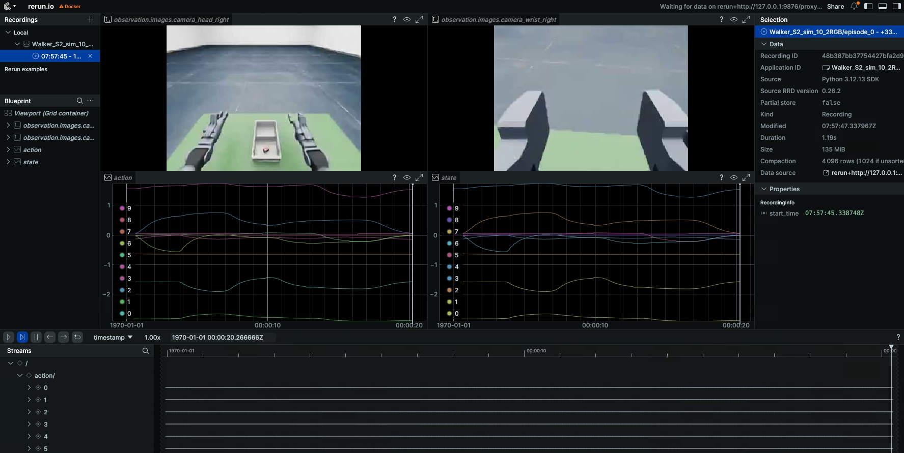

# Walker S2 EDU 探索者 仿真工作流（Simulation Workflow）

> 适用于 **Isaac Sim 仿真 → Walker S2 EDU 探索者 真机** 的完整闭环：仿真采集 → 数据转换 → 模型训练 → 策略评估 → 回注仿真部署。
> 对应的代码位于 `ubt_IL/scripts/{convert,train,deploy}/walker_s2/` 与 `ubt_sim/` 仿真采集工程。

## 目录

- [0. 工作流总览](#0-工作流总览)
- [1. 前置：仿真数据采集](#1-前置仿真数据采集)
- [2. 启动容器](#2-启动容器)
- [3. 数据转换（HDF5 → LeRobot）](#3-数据转换hdf5--lerobot)
  - [3.1 转换命令](#31-转换命令)
  - [3.2 数据可视化](#32-数据可视化)
- [4. 模型训练](#4-模型训练)
- [5. 策略评估（离线 MSE）](#5-策略评估离线-mse)
- [6. 模型部署（回注仿真）](#6-模型部署回注仿真)
  - [6.1 Rollout 部署](#61-rollout-部署)
  - [6.2 推理服务器（常驻预热/外部调用）](#62-推理服务器常驻预热外部调用)
- [7. 常见问题](#7-常见问题)

## 0. 工作流总览

```mermaid
A[仿真数据采集hdf5] --> B[数据转换] --> C[模型训练] --> D[离线 MSE 评估] --> E[仿真部署]
```

## 1. 前置：仿真数据采集

数据来源为 **Isaac Sim 仿真器采集**（`ubt_sim` 项目），详细说明见
[`walker_s2仿真使用文档`](../../../ubt_sim/docs/walker_s2/getting-started.md)。

### 1.1 启动仿真环境与任务

```bash
cd ubt_sim/docker
bash run.sh bash                       # 进入容器（自动 source ROS2 + Walker SDK 环境）
UBT_SIM_TASK=UBTSim-WalkerS2-PickPart-v0 bash /ubt_sim/scripts/start_sim.sh   # 启动仿真 + 自动拉起桥接
```

### 1.2 采集命令

单次采集（`--save` 落盘 + `--reset-scene` 重置场景 + `--robot-init` 初始化位姿）：

```bash
/usr/bin/python3 /ubt_sim/teleoperation/control/walker_s2/pick_part.py --save --reset-scene --robot-init
```

批量采集（默认 400 次）：

```bash
bash /ubt_sim/teleoperation/control/walker_s2/save_data.sh
```

### 1.3 采集产物

- 输出目录：`/ubt_sim/dataset/walker_s2/<时间戳>/trajectory.hdf5`（15 Hz 采样）
- 采集完成后，将 HDF5 数据拷贝到目录`/ubt_IL/dataset/walker-s2-sim-data/`方便容器挂载数据。

## 2. 启动容器

训练 / 转换 / 部署均在容器 `lerobot-tienkung` 内执行：

```bash
cd ubt_IL/docker
bash run.sh build      # 首次
bash run.sh start
bash run.sh bash       # 进入容器，后续转换/训练/评估命令均在容器内执行
```

> 容器内存在双 `python` 环境，ROS相关使用`/usr/bin/python3`,lerobot相关脚本使用 `/lerobot/.venv/bin/python`（默认）。

## 3. 数据转换（HDF5 → LeRobot）

### 3.1 转换命令

转换脚本：[`ubt_IL/scripts/convert/walker_s2/convert.sh`](../../scripts/convert/walker_s2/convert.sh)，转换配置文件路径：在`/ubt_IL/scripts/convert/walker_s2/configs/`，可根据训练需求选择/修改配置文件。

```bash
# 仿真数据转换
CONFIG=/ubt_IL/scripts/convert/walker_s2/configs/walker_s2_sim_10d_2RGB.json \
SRC_ROOT=/ubt_IL/dataset/Walker-s2-pick-part-sim \
HDF5_REL_PATH=trajectory.hdf5 \
TGT_PATH=/ubt_IL/dataset \
REPO_ID=Walker_S2_sim_10_2RGB \
TASK_NAME=walker_s2_sim_pick_part \
bash /ubt_IL/scripts/convert/walker_s2/convert.sh


# 数据集静止帧会影响模型推理，陷入局部静止，可开启TRIM_STATIONARY=1静止帧裁剪对数据集进行处理
TRIM_STATIONARY=1 \
CONFIG=/ubt_IL/scripts/convert/walker_s2/configs/walker_s2_sim_10d_2RGB.json \
SRC_ROOT=/ubt_IL/dataset/Walker-s2-pick-part-sim \
HDF5_REL_PATH=trajectory.hdf5 \
TGT_PATH=/ubt_IL/dataset \
REPO_ID=Walker_S2_sim_10_2RGB \
TASK_NAME=walker_s2_sim_pick_part \
bash /ubt_IL/scripts/convert/walker_s2/convert.sh

```

#### 环境变量

| 变量 | 默认值 | 说明 |
|------|--------|------|
| `SRC_ROOT` | `/ubt_IL/dataset/walker-s2-real-data` | HDF5 源目录（仿真数据请改为 sim 数据目录） |
| `TGT_PATH` | `/ubt_IL/dataset` | LeRobot 数据集输出根目录 |
| `CONFIG` | `configs/walker_s2_real_19d_1RGBD.json` | 转换配置文件（**该默认文件仓库未提供**，仿真/真机请显式指定 `configs/` 下实际存在的配置） |
| `REPO_ID` | `Walker_S2_real_19_1RGBD` | 输出数据集 repo_id（本地目录名 + HF repo 名） |
| `ROBOT_TYPE` | `walker_s2` | 机器人类型（写入 meta） |
| `TASK_NAME` | `walker_s2_real` | 任务名（写入 meta） |
| `FPS` | `13` | 数据集帧率（`auto` 取源 HDF5 频率） |
| `VCODEC` | `h264` | 视频编码（`h264`/`jpeg`/`png`） |
| `HDF5_REL_PATH` | `hdf5/metadata_aligned.hdf5` | 源 HDF5 相对路径 |
| `RESAMPLE_FPS` | 空 | 非空则重采样到目标帧率 |
| `LABEL_ROOT` | 空 | 标签根目录（有任务标签时使用） |
| `TRIM_STATIONARY` | 空 | 非空则裁剪静止帧（`--trim-stationary`） |
| `STATIONARY_KEY` | `action` | 静止判定键名 |
| `STATIONARY_WINDOW` | 自动（`0.3 × fps`） | 静止判定窗口 |
| `STATIONARY_THRESH` | `0.03` | 静止判定阈值 |
| `STATIONARY_CAP` | `8` | 连续静止帧数上限 |
| `STATIONARY_MIN_RUN` | `3` | 有效运行段最短帧数 |
| `STATIONARY_RANGE_EPS` | `1e-3` | 静止区间容差 |

> 其他透传参数：追加 `--overwrite` 覆盖已存在数据集；`--save_one true` 单文件模式。


### 3.2 数据可视化

转换完成后，用 LeRobot 可视化工具检查数据集：

```bash
# 在容器内：
HF_HUB_OFFLINE=1 lerobot-dataset-viz \
  --repo-id <数据集名称> \
  --episode-index 0 \
  --root /ubt_IL/dataset/<数据集名称>
```

示例：

```bash
# 可视化第 3.1 节转换出的数据集
HF_HUB_OFFLINE=1 lerobot-dataset-viz \
  --repo-id Walker_S2_sim_10_2RGB \
  --episode-index 0 \
  --root /ubt_IL/dataset/Walker_S2_sim_10_2RGB
```
示例预览：


> 重点检查：视频帧率、state/action 维度与顺序、grip 量程、是否存在空 episode。

## 4. 模型训练

训练脚本：`/ubt_IL/scripts/train/walker_s2/train.sh`
训练配置：`/ubt_IL/scripts/train/walker_s2/configs/`，根据训练需求选择/修改配置文件。

```bash
# 使用默认配置训练
bash /ubt_IL/scripts/train/walker_s2/train.sh

# 显式指定训练配置文件路径，或覆盖配置文件常用参数
CONFIG=/ubt_IL/scripts/train/walker_s2/configs/train_config_walker_s2_sim_act_10_2RGB.json \
OUTPUT_DIR=/ubt_IL/model/Walker_S2_sim_10_2RGB_act \
STEPS=50000 SAVE_FREQ=5000 BATCH_SIZE=8 \
bash /ubt_IL/scripts/train/walker_s2/train.sh

# 断点续训（CONFIG 指向 checkpoint 内 train_config.json）
CONFIG=/ubt_IL/model/Walker_S2_sim_10_2RGB_act/checkpoints/last/pretrained_model/train_config.json \
RESUME=true \
bash /ubt_IL/scripts/train/walker_s2/train.sh
```

**不使用 train.sh**（直接调用 `lerobot-train`，覆盖参数用 `--xxx=yyy` 形式，需在 `/ubt_IL/lerobot` 目录下执行）：

```bash
# 从头训练
cd /ubt_IL/lerobot
HF_HUB_OFFLINE=1 /lerobot/.venv/bin/lerobot-train \
  --config_path=/ubt_IL/scripts/train/walker_s2/configs/train_config_walker_s2_sim_act_10_2RGB.json \
  --output_dir=/ubt_IL/model/Walker_S2_sim_10_2RGB_act \
  --steps=50000 --save_freq=5000 --batch_size=8

# 断点续训
HF_HUB_OFFLINE=1 /lerobot/.venv/bin/lerobot-train \
  --config_path=/ubt_IL/model/Walker_S2_sim_10_2RGB_act/checkpoints/last/pretrained_model/train_config.json \
  --resume=true
```

#### 覆盖参数

| 变量 | 默认值（config） | 说明 |
|------|--------|------|
| `CONFIG` | `$SCRIPT_DIR/configs/train_config_walker_s2_sim_act_10_2RGB.json` | 训练配置 JSON |
| `DATASET_REPO_ID` | `Walker_S2_sim_10_2RGB` | 数据集 repo_id |
| `DATASET_ROOT` | `/ubt_IL/dataset` | 数据集根目录 |
| `OUTPUT_DIR` | `/ubt_IL/model/Walker_S2_sim_10_2RGB_act` | 模型输出目录 |
| `STEPS` | `50000` | 总训练步数 |
| `SAVE_FREQ` | `5000` | checkpoint 保存频率 |
| `BATCH_SIZE` | `8` | 批大小 |
| `SEED` | `1000` | 随机种子 |
| `DEVICE` | `cuda` | 训练设备（`cuda`/`cpu`） |
| `RESUME` | `false` | `true` 则从 checkpoint 恢复训练 |
| `WANDB_ENABLE` | `false` | wandb 日志开关 |

> `HF_HUB_OFFLINE=1` 默认开启（离线训练）。训练配置仅当对应环境变量**显式设置**时覆盖 config 中的值。


## 5. 策略评估（离线 MSE）

不连机器人，在 LeRobot 数据集上做离线 MSE 评估（预测 vs 真值），并生成逐 episode 对比图。
脚本（与天工行者无疆共用）：[`ubt_IL/scripts/eval/eval_policy.py`](../../scripts/eval/eval_policy.py)。

示例：
```bash
cd /ubt_IL/lerobot

/lerobot/.venv/bin/python /ubt_IL/scripts/eval/eval_policy.py \
  --policy-path /ubt_IL/model/Walker_S2_sim_10_2RGB_act/checkpoints/last/pretrained_model \
  --dataset-path /ubt_IL/dataset/Walker_S2_sim_10_2RGB \
  --episodes 10 \
  --inference-freq 1 \
  --plot \
  --plot-dir /ubt_IL/scripts/eval/output/eval_Walker_S2_sim_10_2RGB_act \
  --output /ubt_IL/scripts/eval/output/eval_Walker_S2_sim_10_2RGB_act/results.json \
  --device cuda
```
示例预览：


| 参数 | 说明 |
|------|------|
| `--policy-path` | pretrained_model 目录（含 `config.json` + `model.safetensors`） |
| `--dataset-path` | LeRobot 数据集根目录（含 `meta/info.json`） |
| `--episodes` | 评估 episode 数（默认全部） |
| `--inference-freq` | 每 N 步推理一次，中间复用预测 chunk（模拟真机部署；`1`=逐步推理） |
| `--plot` / `--plot-dir` | 生成逐 episode 预测-vs-真值图及输出目录 |
| `--output` | 结果 JSON 保存路径 |
| `--device` | `cuda` 或 `cpu`（默认 `cuda`，不可用时自动回退 `cpu`） |

## 6. 模型部署（回注仿真）

仿真部署与真机共用 `rollout.sh` / 推理服务器，差异在于：

- 机器人控制经 **ROS2-ZMQ Bridge** 回注 Isaac Sim，`ZMQ_HOST=127.0.0.1`（本地桥接）；
- 相机来自仿真（四路 RGB 或所选配置相机），无需真机相机；
- 部署前先做安全预检（action 维度匹配），通过后才允许运动。

### 6.1 Rollout 部署

部署脚本：[`ubt_IL/scripts/deploy/walker_s2/rollout.sh`](../../scripts/deploy/walker_s2/rollout.sh)。

**部署步骤**（仿真容器与推理容器分别操作）：

```bash
# 1. 启动仿真——宿主机进仿真容器
cd ubt_sim/docker 
bash run.sh start
bash run.sh bash
UBT_SIM_TASK=UBTSim-WalkerS2-PickPart-v0 bash /ubt_sim/scripts/start_sim.sh      # 启动模型对应的仿真任务

# 2. 启动推理容器——宿主机
cd ubt_IL/docker
bash run.sh start
bash run.sh bash

# 3. 初始化动作（抬起手臂到桌面上）——推理容器内，使用/usr/bin/python3可使用ROS环境
bash /ubt_IL/scripts/deploy/walker_s2/robot_ready.sh

# 部署仿真模型异步推理（以 020000 checkpoint 为例）
ROBOT_MODEL=walker_s2_10d \
POLICY_PATH=/ubt_IL/model/Walker_S2_sim_10_2RGB_act/checkpoints/020000/pretrained_model \
INFERENCE_TYPE=act_async INFERENCE_HZ=2 \
FPS=13 DURATION=60 \
ZMQ_HOST=127.0.0.1 \
bash /ubt_IL/scripts/deploy/walker_s2/rollout.sh

# （可选）验证相机通路,可指定相机话题/机器人配置
/usr/bin/python3 scripts/deploy/walker_s2/preview_camera.py --robot walker_s2_10d 
```
部署效果：
<video controls muted loop width="100%" src="../assets/walker仿真部署效果.mp4"></video>

#### 环境变量

| 变量 | 默认值 | 说明 |
|------|--------|------|
| `POLICY_PATH` | **必填，无默认值** | checkpoint 目录（含 `config.json`） |
| `ROBOT_MODEL` | `walker_s2_31d` | ROBOT_MODELS 注册表键（见下表） |
| `ROBOT_CONFIG` | `configs/<ROBOT_MODEL>.json` | 机器人配置文件完整路径（自定义时覆盖） |
| `ALLOW_DIM_ONLY_POLICY` | `1` | 策略无 action names 时允许仅按维度匹配 |
| `STRATEGY` | `base` | rollout 策略类型 |
| `FPS` | `13` | 控制频率 |
| `DURATION` | `30` | 运行时长（秒） |
| `TASK` | `walker s2 rollout` | 任务描述 |
| `PREVIEW_CAMERA` | `1` | 是否显示相机预览窗口 |
| `RECORD_ACTIONS` | `1` | 是否记录 rollout 动作（`RECORD_OUTPUT_DIR` 指定输出） |
| `INFERENCE_TYPE` | `sync` | 推理引擎类型（`sync` / `act_async`） |
| `INFERENCE_HZ` | `0.6` | act_async 重规划频率 |
| `EXECUTION_HORIZON` | `0` | chunk 截断步数（0=不截断） |
| `ZMQ_HOST` | `127.0.0.1` | 桥接地址（回注仿真为本地） |

> 导出参数：`BLEND_HORIZON=10`、`BODY_PUBLISH_HZ=300`、`BODY_V_MAX=2.0`（桥接动作块融合与发布限速）。

#### 在线评估（记录推理轨迹）
模型部署时，可添加 `RECORD_ACTIONS=1` 参数，记录 rollout 动作，用于模型推理动作分析预测轨迹，机器人执行轨迹，ACT融合轨迹。记录的文件保存目录为 `ubt_IL/scripts/deploy/output` 。


#### 机器人配置（ROBOT_MODELS 注册表）

| 注册表键 | 维度 | 末端执行器 | 对应配置文件 |
|----------|------|-----------|--------------|
| `walker_s2_10d` | 10D（右臂 7 + 头 2 + 右夹爪 1） | PGC 右夹爪 | `walker_s2_gripper_19d.json`（10D 用其子集） |
| `walker_s2_19d` | 19D（17 body + 2 gripper） | PGC 1DOF 夹爪 | [`walker_s2_gripper_19d.json`](../../scripts/deploy/walker_s2/configs/walker_s2_gripper_19d.json) |
| `walker_s2_31d` | 31D（17 body + 14 hands） | V4 灵巧手 7DOF | [`walker_s2_v4_hand_31d.json`](../../scripts/deploy/walker_s2/configs/walker_s2_v4_hand_31d.json) |


### 6.2 推理服务器（常驻预热/外部调用）
推理服务器脚本：[`ubt_IL/scripts/deploy/walker_s2/inference_server.sh`](../../scripts/deploy/walker_s2/inference_server.sh)。
推理服务客户端脚本：[`ubt_IL/scripts/deploy/walker_s2/inference_client.sh`](../../scripts/deploy/walker_s2/inference_client.sh)。

`rollout.sh` 每次冷启动（policy 加载 + 桥接拉起）耗时长。推理服务器**常驻**预热，外部推理客户端可通过 ZMQ 指令使用推理服务，用于切换VLA操作任务和其他任务，如：导航，搬箱。详细使用说明见
[`推理服务器使用文档`](inference-server.md)。

```bash
# 1. 拉起服务（容器内，后台预热到 READY；引擎 paused，不动机器人）
cd /ubt_IL/scripts/deploy/walker_s2
ROBOT_MODEL=walker_s2_10d \
POLICY_PATH=/ubt_IL/model/Walker_S2_sim_10_2RGB_act/checkpoints/last/pretrained_model \
INFERENCE_TYPE=act_async INFERENCE_HZ=2 FPS=13 \
bash inference_server.sh

# 2. 查询推理服务状态是否 READY
bash inference_client.sh status

# 3. 开始 / 停止推理
bash inference_client.sh start
bash inference_client.sh stop

# 4. 回原点 / 关停
bash inference_client.sh home
bash inference_client.sh shutdown
```

> 状态机：`LOADING`(预热/重建) -> `READY`(空闲) ⇄ `RUNNING`(执行)；`home` -> `RETURNING_HOME` -> `READY`。

## 7. 常见问题

| 问题 | 原因 / 解决 |
|------|-------------|
| 转换报"配置不存在" | `convert.sh` 默认 `CONFIG=configs/walker_s2_real_19d_1RGBD.json` 在仓库中未提供；请显式指定 `configs/` 下实际存在的配置（`walker_s2_sim_10d_2RGB.json` / `walker_s2_sim_33d_4RGB.json`） |
| 数据集帧率与预期不符 | 采集 15 Hz，转换默认 `FPS=13`；如需保留原频率用 `FPS=auto`，或 `RESAMPLE_FPS` 重采样 |
| 部署时报维度不匹配 | 安全预检拒绝：policy `output_features.action.shape[0]` 与 robot config `action_order` 维度不一致。确认 `ROBOT_MODEL` 与策略维度对应（10D→`walker_s2_10d`，19D→`walker_s2_19d`，31D→`walker_s2_31d`）；无 action names 的策略需 `ALLOW_DIM_ONLY_POLICY=1` |
| 推理服务器 `start` 报错 | `start/stop` 依赖 act_async 的 pause/resume；`sync` 引擎无此语义，需 `INFERENCE_TYPE=act_async` |
| 仿真相机与真机相机尺寸不同 | 仿真 RGB 为 [3,240,320]（10D）或 [3,480,640]（33D），真机为 [256,320] 等；模型输入需与训练数据一致，勿混用 |
| 重复拉起推理服务器失败 | 单例 pid 文件 `/tmp/walker_inference_server.pid` 存在；`shutdown` 正常退出或手动清理后再拉 |
